# 第七章。当车轮脱落：理解 Django 调试页面

当您的代码在生产中运行时，您最不希望发生的事情之一就是遇到一个错误，这个错误严重到只能向客户端返回“对不起，服务器遇到了一个错误，请稍后再试”的消息。然而，在开发过程中，这些服务器错误情况是最糟糕的结果之一。它们通常表示已经引发了异常，当发生这种情况时，有大量信息可用于弄清楚出了什么问题。当`DEBUG`打开时，这些信息以 Django 调试页面的形式返回，作为导致错误的请求的响应。在本章中，我们将学习如何理解和利用 Django 调试页面提供的信息。

具体来说，在本章中我们将：

+   继续开发示例调查应用程序，沿途犯一些典型的错误

+   看看这些错误如何在 Django 调试页面的形式中表现出来

+   了解这些调试页面提供了哪些信息

+   对于每个错误，深入研究生成的调试页面上可用的信息，看看它如何被用来理解错误并确定如何修复它

# 开始调查投票实施

在第四章中，*变得更加花哨：Django 单元测试扩展*，我们开始开发代码为`survey`应用程序提供页面。我们实现了主页视图。这个视图生成一个页面，列出了活动和最近关闭的调查，并根据需要提供链接，以便参加活动调查或显示关闭调查的结果。这两种链接都路由到同一个视图函数`survey_detail`，该函数根据所请求的`Survey`的状态进一步路由请求：

```py
def survey_detail(request, pk): 
    survey = get_object_or_404(Survey, pk=pk) 
    today = datetime.date.today() 
    if survey.closes < today: 
        return display_completed_survey(request, survey) 
    elif survey.opens > today: 
        raise Http404("%s does not open until %s; it is only %s" %
            (survey.title, survey.opens, today))
    else: 
        return display_active_survey(request, survey) 
```

然而，我们并没有编写代码来实际显示一个活动的`Survey`或显示`Survey`的结果。相反，我们创建了占位符视图和模板，只是简单地说明了这些页面最终打算显示的内容。例如，`display_active_survey`函数仅保留为：

```py
def display_active_survey(request, survey): 
    return render_to_response('survey/active_survey.html', {'survey': survey}) 
```

它引用的模板`active_survey.html`包含：

```py
 
 
<h1>Survey questions for {{ survey.title }}</h1> 
 
```

我们现在将从上次离开的地方继续，并开始用处理显示活动“调查”的真实代码替换这个占位符视图和模板。

这需要什么？首先，当请求显示一个活动调查时，我们希望返回一个页面，显示`Survey`中的问题列表，每个问题都有其相关的可能答案。此外，我们希望以一种方式呈现这些问题和答案数据，以便用户可以参与`Survey`，并提交他们选择的问题答案。因此，我们需要以 HTML 表单的形式呈现问题和答案数据，并且还需要在服务器上编写代码，处理接收、验证、记录和响应发布的`Survey`响应。

这一切一次性解决起来很多。我们可以先实现哪个最小的部分，以便我们开始实验并验证我们是否朝着正确的方向前进？我们将从显示一个允许用户查看单个问题并从其相关答案中选择的表单开始。不过，首先让我们在开发数据库中设置一些合理的测试数据来使用。

## 为投票创建测试数据

由于我们已经有一段时间没有使用这些模型了，我们可能不再有任何活动调查。让我们通过运行`manage.py reset survey`来从头开始。然后，确保开发服务器正在运行，并使用管理应用程序创建一个新的`Survey`，`Question`和`Answers`。这是即将到来的示例中将使用的`Survey`：

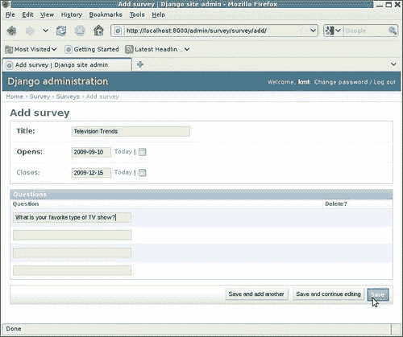

为这个`Survey`中的一个`Question`定义的`Answers`是：

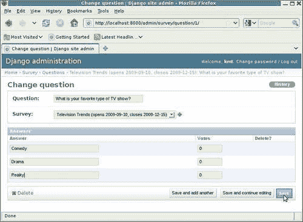

这就足够开始了。我们可以随后返回并根据需要添加更多数据。现在，我们将继续开发用于显示一个`Question`并选择其答案的表单。

## 为投票定义问题表单

Django 的`forms`包提供了一个方便的框架，用于创建、显示、验证和处理 HTML 表单数据。在 forms 包中，`ModelForm`类通常用于自动构建代表模型的表单。我们可能最初认为使用`ModelForm`会对我们的任务有所帮助，但`ModelForm`不会提供我们所需要的。回想一下，`survey`应用程序`Question`模型包含这些字段：

```py
class Question(models.Model): 
    question = models.CharField(max_length=200) 
    survey = models.ForeignKey(Survey) 
```

此外，`Answer`模型是：

```py
class Answer(models.Model): 
    answer = models.CharField(max_length=200) 
    question = models.ForeignKey(Question) 
    votes = models.IntegerField(default=0) 
```

`ModelForm`包含模型中每个字段的 HTML 输入字段。因此，`Question`模型的`ModelForm`将包括一个文本输入，允许用户更改`question`字段的内容，并包括一个选择框，允许用户选择与之关联的`Survey`实例。这并不是我们想要的。从`Answer`模型构建的`ModelForm`也不是我们要找的。

相反，我们想要一个表单，它将显示`question`字段的文本（但不允许用户更改该文本），以及与`Question`实例关联的所有`Answer`实例，以一种允许用户精确选择列出的答案之一的方式。这听起来像是一个 HTML 单选输入组，其中单选按钮的值由与`Question`实例关联的`Answers`集合定义。

我们可以创建一个自定义表单来表示这一点，使用 Django 提供的基本表单字段和小部件类。让我们创建一个新文件，`survey/forms.py`，并在其中尝试实现将用于显示`Question`及其关联答案的表单：

```py
from django import forms
class QuestionVoteForm(forms.Form): 
    answer = forms.ModelChoiceField(widget=forms.RadioSelect) 

    def __init__(self, question, *args, **kwargs): 
        super(QuestionVoteForm, self).__init__(*args, **kwargs) 
        self.fields['answer'].queryset = question.answer_set.all() 
```

这个表单名为`QuestionVoteForm`，只有一个字段`answer`，它是一个`ModelChoiceField`。这种类型的字段允许从`QuerySet`定义的一组选择中进行选择，由其`queryset`属性指定。由于此字段的正确答案集将取决于构建表单的特定`Question`实例，因此我们在字段声明中省略了指定`queryset`，并在`__init__`例程中设置它。但是，我们在字段声明中指定，我们要使用`RadioSelect`小部件进行显示，而不是默认的`Select`小部件（它在 HTML 选择下拉框中呈现选择）。

在单个`answer`字段的声明之后，该表单定义了`__init__`方法的覆盖。这个`__init__`要求在创建表单实例时传入一个`question`参数。在首先使用可能提供的其他参数调用`__init__`超类之后，传递的`question`用于将`answer`字段的`queryset`属性设置为与此`Question`实例关联的答案集。

为了查看这个表单是否按预期显示，我们需要在`display_active_survey`函数中创建一个这样的表单，并将其传递给模板进行显示。现在，我们不想担心显示问题列表；我们只会选择一个传递给模板。因此，我们可以将`display_active_survey`更改为：

```py
from survey.forms import QuestionVoteForm 
def display_active_survey(request, survey): 
    qvf = QuestionVoteForm(survey.question_set.all()[0]) 
    return render_to_response('survey/active_survey.html', {'survey': survey, 'qvf': qvf}) 
```

现在，这个函数为指定调查的一组问题中的第一个问题创建了一个`QuestionVoteForm`的实例，并将该表单传递给模板以作为上下文变量`qvf`进行渲染。

我们还需要修改模板以显示传递的表单。为此，请将`active_survey.html`模板更改为：

```py
 
 
<h1>{{ survey.title }}</h1> 
<form method="post" action="."> 
<div> 
{{ qvf.as_p }} 
<button type="submit">Submit</button> 
</div> 
</form> 
 
```

在这里，我们已经添加了必要的 HTML 元素来包围 Django 表单，并使其成为有效的 HTML 表单。我们使用了`as_p`方法来显示表单，只是因为它很容易。长期来看，我们可能会用自定义输出来替换它，但是在目前，将表单显示在 HTML 段落元素中就足够了。

现在，我们希望能够测试并查看我们的`QuestionVoteForm`是否显示我们想要的内容。我们接下来会尝试。

## 调试页面＃1：/处的 TypeError

为了查看`QuestionVoteForm`目前的样子，我们可以先转到调查主页，然后从那里我们应该能够点击我们拥有的一个活动调查的链接，看看问题和答案选择是如何显示的。效果如何？并不好。由于我们所做的代码更改，我们甚至无法显示主页。相反，尝试访问它会产生一个调试页面：

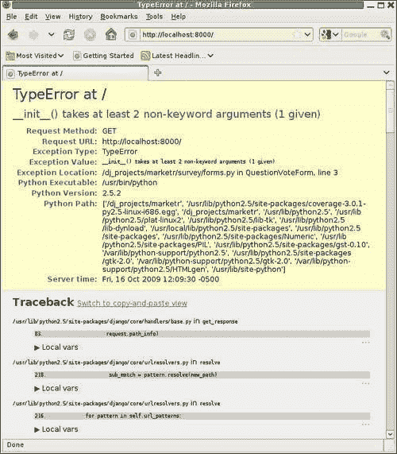

天啊，看起来很糟糕。在我们深入了解页面显示的细节之前，让我们先试着理解这里发生了什么。我们添加了一个新的表单，并且更改了用于显示活动调查的视图，以便创建新定义的表单之一。我们还更改了该视图使用的模板。但我们并没有改变主页视图。那么它怎么会出错呢？

答案是主页视图本身并没有出错，但其他地方出了问题。这个出错的其他地方阻止了主页视图的调用。请注意，为了调用主页视图，包含它的模块（`survey.views`）必须被无错误地导入。因此，`survey.views`本身以及在导入时它引用的任何内容都必须是无错误的。即使主页视图中没有任何错误，甚至整个`survey.views`都没有问题，如果在导入`survey.views`的过程中引入了任何模块的错误，那么在尝试调用主页视图时可能会引发错误。

关键是，在一个地方做出的改变可能会导致最初令人惊讶的故障，而这似乎是完全无关的领域。实际上，另一个领域并不是完全无关的，而是以某种方式（通常通过一系列的导入）与做出改变的领域相连接。在这种情况下，重点放在正确的地方以找到并修复错误是很重要的。

在这种情况下，例如，盯着主页视图代码发呆是没有用的，因为那是我们试图运行的代码，试图弄清楚问题出在哪里也是徒劳的。问题并不在那里。相反，我们需要放下我们对可能在错误发生时运行的代码的任何先入为主的想法，并利用呈现的调试信息来弄清楚实际运行的代码是什么。弄清楚为什么一部分代码最终运行了，而我们本来想运行的是另一些代码，也是有益的，尽管不总是必要的来解决手头的问题。

# 调试页面的元素

现在让我们把注意力转向我们遇到的调试页面。页面上有很多信息，分成四个部分（截图中只能看到第一个部分和第二个部分的开头）。在本节中，我们重点关注调试页面的每个部分中通常包含的信息，注意我们在这个页面上看到的值只是作为示例。在本章的后面，我们将看到如何使用这个调试页面上呈现的具体信息来修复我们所犯的错误。

## 基本错误信息

调试页面的顶部包含基本的错误信息。页面标题和页面正文的第一行都说明了遇到的异常类型，以及触发异常的请求中包含的 URL 路径。在我们的情况下，异常类型是**TypeError**，URL 路径是**/**。因此，我们在页面上看到**TypeError at /**作为第一行。

第二行包含异常值。这通常是对导致错误的具体描述。在这种情况下，我们看到 __init__()至少需要 2 个非关键字参数（给定 1 个）。

在异常值之后是一个包含九个项目的列表：

+   请求方法：请求中指定的 HTTP 方法。在这种情况下，它是 GET。

+   请求 URL：请求的完整 URL。在这种情况下，它是 http://localhost:8000/。其中的路径部分是第一行报告的路径的重复。

+   异常类型：这是在第一行包括的异常类型的重复。

+   异常值：这是在第二行包括的异常值的重复。

+   异常位置：异常发生的代码行。在这种情况下，它是/dj_projects/marketr/survey/forms.py 中的 QuestionVoteForm，第 3 行。

+   Python 可执行文件：发生错误时运行的 Python 可执行文件。在这种情况下，它是/usr/bin/python。除非您正在使用不同的 Python 版本进行测试，否则这些信息通常只是有趣的。

+   Python 版本：这标识正在运行的 Python 版本。同样，除非您正在使用不同的 Python 版本进行测试，否则这通常不会引起兴趣。但是，当查看其他人报告的问题时，如果有任何怀疑问题可能取决于 Python 版本，这可能是非常有用的信息。

+   Python 路径：实际生效的完整 Python 路径。当异常类型涉及导入错误时，这通常是最有用的。当安装了不同版本的附加包时，这也可能会派上用场。这加上不正确的路径规范可能会导致使用意外的版本，这可能会导致错误。有可用的完整 Python 路径有助于跟踪这种情况下发生的情况。

+   服务器时间：这显示了异常发生时服务器的日期、时间和时区。这对于返回与时间相关的结果的任何视图都是有用的。

当出现调试页面时，异常类型、异常值和异常位置是首先要查看的三个项目。这三个项目揭示了出了什么问题，为什么以及发生了什么地方。通常，这就是您需要了解的一切，以便解决问题。但有时，仅凭这些基本信息就不足以理解和解决错误。在这种情况下，了解代码最终运行到哪里可能会有所帮助。对于这一点，调试页面的下一部分是有用的。

## 回溯

调试页面的回溯部分显示了控制线程如何到达遇到错误的地方。在顶部，它从运行以处理请求的代码的最外层级别开始，显示它调用了下一个更低级别，然后显示下一个调用是如何进行的，最终在底部以导致异常的代码行结束。因此，通常是回溯的最底部（在截图中不可见）最有趣，尽管有时代码走过的路径是理解和修复出了问题的关键。

在回溯中显示的每个调用级别，都显示了三个信息：首先标识代码行，然后显示它，然后有一行带有三角形和文本本地变量。

例如，在调试页面上回溯的顶层的第一部分信息标识了代码行为/usr/lib/python2.5/site-packages/django/core/handlers/base.py in get_response。这显示了包含代码的文件以及在该文件中执行代码的函数（或方法或类）的名称。

接下来是一个背景较暗的带有**83\. request.path_info)**的行。这看起来有点奇怪。左边的数字是文件内的行号，右边是该行的内容。在这种情况下，调用语句跨越了多行，我们只看到了调用的最后一行，这并不是很有信息量。我们只能知道**request.path_info**作为最后一个参数传递给了某个东西。看到这一行周围的其他代码行可能会更好，这样会更清楚正在调用什么。事实上，我们可以通过单击该行来做到这一点：

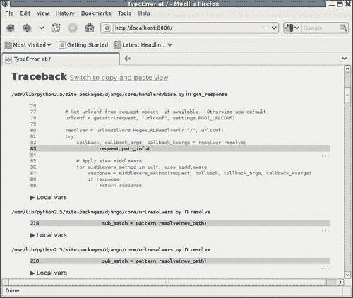

啊哈！现在，我们可以看到有一个名为**resolver.resolve**的东西被调用并传递了**request.path_info**。显然，这个级别的代码是从请求的路径开始，并尝试确定应调用什么代码来处理当前请求。

再次单击显示的代码的任何位置将切换周围代码上下文的显示状态，使得只显示一行。通常，不需要在回溯中看到周围的代码，这就是为什么它最初是隐藏的。但是当需要查看更多内容时，只需单击一下就很方便了。

本地变量包含在每个回溯级别显示的信息的第三个块中。这些变量最初也是隐藏的，因为如果它们被显示出来，可能会占用大量空间并且使页面混乱，从而很难一眼看清控制流是什么样的。单击任何**Local vars**行会展开该块，显示该级别的本地变量列表和每个变量的值。例如：

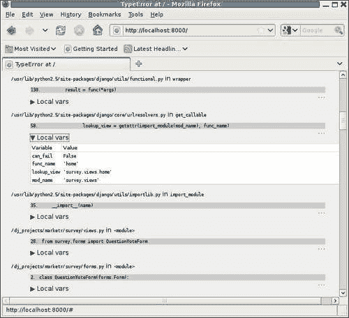

我们不需要完全理解此处运行的 Django 代码，就可以根据显示的变量的名称和值猜测，代码正在尝试查找处理显示主页的视图。再次单击**Local vars**行会将该块切换回隐藏状态。

调试页面的回溯部分还有一个非常有用的功能。在**Traceback**标题旁边有一个链接：**切换到剪切和粘贴视图**。单击该链接会将回溯显示切换为可以有用地复制和粘贴到其他地方的显示。例如，在本页上，单击该链接会产生一个包含以下内容的文本框：

```py
Environment:

Request Method: GET
Request URL: http://localhost:8000/
Django Version: 1.1
Python Version: 2.5.2
Installed Applications:
['django.contrib.auth',
 'django.contrib.contenttypes',
 'django.contrib.sessions',
 'django.contrib.sites',
 'django.contrib.admin',
 'survey',
 'django_coverage']
Installed Middleware:
('django.middleware.common.CommonMiddleware',
 'django.contrib.sessions.middleware.SessionMiddleware',
 'django.contrib.auth.middleware.AuthenticationMiddleware')

Traceback:
File "/usr/lib/python2.5/site-packages/django/core/handlers/base.py" in get_response
 83\.                     request.path_info)
File "/usr/lib/python2.5/site-packages/django/core/urlresolvers.py" in resolve
 218\.                     sub_match = pattern.resolve(new_path)
File "/usr/lib/python2.5/site-packages/django/core/urlresolvers.py" in resolve
 218\.                     sub_match = pattern.resolve(new_path)
File "/usr/lib/python2.5/site-packages/django/core/urlresolvers.py" in resolve
 125\.             return self.callback, args, kwargs
File "/usr/lib/python2.5/site-packages/django/core/urlresolvers.py" in _get_callback
 131\.             self._callback = get_callable(self._callback_str)
File "/usr/lib/python2.5/site-packages/django/utils/functional.py" in wrapper
 130\.         result = func(*args)
File "/usr/lib/python2.5/site-packages/django/core/urlresolvers.py" in get_callable
 58\.                 lookup_view = getattr(import_module(mod_name), func_name)
File "/usr/lib/python2.5/site-packages/django/utils/importlib.py" in import_module
 35\.     __import__(name)
File "/dj_projects/marketr/survey/views.py" in <module>
 24\. from survey.forms import QuestionVoteForm
File "/dj_projects/marketr/survey/forms.py" in <module>
 2\. class QuestionVoteForm(forms.Form):
File "/dj_projects/marketr/survey/forms.py" in QuestionVoteForm
 3\.     answer = forms.ModelChoiceField(widget=forms.RadioSelect)

Exception Type: TypeError at /
Exception Value: __init__() takes at least 2 non-keyword arguments (1 given)

```

正如您所看到的，这一块信息包含了基本的回溯以及从调试页面的其他部分提取的一些其他有用信息。它远不及完整调试页面上提供的信息，但通常足以在解决问题时从他人那里获得帮助。如果您发现自己无法解决问题并希望向他人寻求帮助，那么您想要向他人提供的就是这些信息，而不是调试页面的截图。

事实上，剪切和粘贴视图本身底部有一个按钮：**在公共网站上共享此回溯**。如果您按下该按钮，回溯信息的剪切和粘贴版本将被发布到[dpaste.com](http://dpaste.com)网站，并且您将被带到该网站，在那里您可以记录分配的 URL 以供参考或删除该条目。

显然，只有在您的计算机连接到互联网并且可以访问[dpaste.com](http://dpaste.com)时，此按钮才能正常工作。如果您尝试并且无法连接到该网站，您的浏览器将报告无法连接到[dpaste.com](http://dpaste.com)的错误。单击返回按钮将返回到调试页面。第十章，*当一切都失败时：寻求外部帮助*，将更详细地介绍解决棘手问题时获取额外帮助的技巧。

单击**切换到复制和粘贴视图**链接时，该链接会自动替换为另一个链接：**切换回交互视图**。因此，在回溯信息的两种形式之间切换很容易。

## 请求信息

在调试页面上的回溯信息部分之后是详细的请求信息。通常情况下，您不需要查看这个部分，但是当错误是由正在处理的请求的一些奇怪特征触发时，这个部分就非常有价值。它分为五个小节，每个小节都在下面描述。

### GET

这个部分包含了`request.GET`字典中所有键和它们的值的列表。或者，如果请求没有 GET 数据，则显示字符串**没有 GET 数据**。

### POST

这个部分包含了`request.POST`字典中所有键和它们的值的列表。或者，如果请求没有 POST 数据，则显示字符串**没有 POST 数据**。

### 文件

这个部分包含了`request.FILES`字典中所有键和它们的值的列表。请注意，这里显示的信息只是上传的文件名，而不是实际的文件数据（这可能相当大）。或者，如果请求没有上传文件数据，则显示字符串**没有文件数据**。

### Cookies

这个部分包含了浏览器发送的任何 cookie。例如，如果`contrib.sessions`应用程序在`INSTALLED_APPS`中列出，您将在这里看到它使用的`sessionid` cookie。或者，如果浏览器没有在请求中包含任何 cookie，则显示字符串**没有 cookie 数据**。

### 元数据

这个部分包含了`request.META`字典中所有键和它们的值的列表。这个字典包含了所有的 HTTP 请求头，以及与 HTTP 无关的其他变量。

例如，如果您在运行开发服务器时查看这个部分的内容，您将看到它列出了在开发服务器运行的命令提示符的环境中导出的所有环境变量。这是因为这个字典最初被设置为 Python `os.environ`字典的值，然后添加了其他值。因此，这里可能列出了很多无关紧要的信息，但是如果您需要检查 HTTP 头的值，您可以在这里找到它。

## 设置

调试页面的最后部分是错误发生时生效的所有设置的详尽列表。这是另一个您可能很少需要查看的部分，但当您需要时，将会非常有帮助。

这个部分包括两项内容：安装的应用程序和安装的中间件，它们都包含在前面提到的调试信息的剪切和粘贴版本中，因为它们在分析他人发布的问题时通常是很有帮助的。

如果您浏览调试页面的这个部分，您可能会注意到一些设置的值实际上并没有报告，而是列出了一串星号。这是一种隐藏信息的方式，不应该随意暴露给可能看到调试页面的任何用户。这种隐藏技术适用于任何设置中包含`PASSWORD`或`SECRET`字符串的设置。

请注意，这种隐藏技术仅适用于调试页面设置部分中报告的值。这并不意味着在生产站点中启用`DEBUG`是安全的。仍然有可能从调试页面中检索到敏感信息。例如，如果密码设置的值存储在本地变量中，那么当它被用于建立到数据库或邮件服务器的连接时，典型情况下会发生这种情况。如果在连接尝试期间引发异常，密码值可以从页面的回溯部分的本地变量信息中检索出来。

我们现在已经完成了调试页面上可用信息的一般描述。接下来，我们将看到如何使用我们遇到的页面上的具体信息来追踪并修复代码中的错误。

# 理解和修复 TypeError

导致我们遇到的调试页面出现问题的原因是什么？在这种情况下，基本的错误信息足以识别和修复问题。我们报告了一个**TypeError**，异常值为**__init__()至少需要 2 个非关键字参数（给出了 1 个）**。此外，导致错误的代码的位置是**/dj_projects/marketr/survey/forms.py 中的 QuestionVoteForm，第 3 行**。看看那一行，我们看到：

```py
    answer = forms.ModelChoiceField(widget=forms.RadioSelect) 
```

我们没有指定创建`ModelChoiceField`所需的所有必要参数。如果您是 Python 的新手，错误消息的具体内容可能有点令人困惑，因为代码行中没有引用任何名为`__init__`的东西，也没有传递任何非关键字参数，但错误消息却说给出了一个。其解释是，`__init__`是 Python 在创建对象时调用的方法，它和所有对象实例方法一样，自动接收一个对自身的引用作为其第一个位置参数。

因此，已经提供的一个非关键字参数是`self`。缺少什么？检查文档，我们发现`queryset`是`ModelChoiceField`的一个必需参数。我们省略了它，因为在声明字段时并不知道正确的值，而只有在创建包含该字段的表单的实例时才知道。但我们不能只是将其省略，因此我们需要在声明字段时指定`queryset`值。应该是什么？因为它将在创建表单的任何实例时立即重置，所以`None`可能会起作用。所以让我们尝试将那一行改为：

```py
    answer = forms.ModelChoiceField(widget=forms.RadioSelect, queryset=None) 
```

这样行得通吗？是的，如果我们点击浏览器重新加载页面按钮，我们现在可以得到调查首页：


同样，如果您是 Python 的新手，修复方法的有效性可能会有点令人困惑。错误消息说至少需要两个非关键字参数，但我们没有使用修复方法添加非关键字参数。错误消息似乎表明，唯一正确的修复方法可能是将`queryset`值作为非关键字参数提供：

```py
    answer = forms.ModelChoiceField(None, widget=forms.RadioSelect) 
```

显然情况并非如此，因为上面显示的替代修复方法确实有效。这样解释的原因是，消息并不是指调用者指定了多少个非关键字参数，而是指目标方法的声明中指定了多少个参数（在这种情况下是`ModelChoiceField`的`__init__`方法）。调用者可以自由地使用关键字语法传递参数，即使它们在方法声明中没有列为关键字参数，Python 解释器也会正确地将它们匹配起来。因此，第一个修复方法可以正常工作。

现在我们又让首页正常工作了，我们可以继续看看我们是否能够创建和显示我们的新`QuestionVoteForm`。要做到这一点，请点击**电视趋势**调查的链接。结果将是：

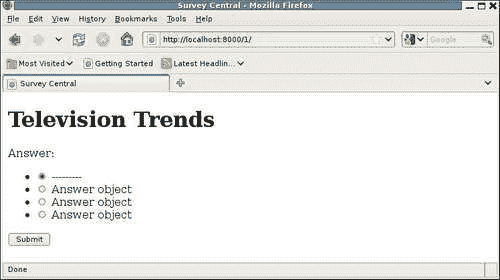

虽然不再出现调试页面很好，但这并不是我们要找的。这里有一些问题。

首先，答案列表的标题是**Answer**，但我们希望它是问题文本。这里显示的值是分配给`ModelChoiceField`的标签。任何表单字段的默认标签都是字段的名称，大写并跟着一个冒号。当我们声明`ModelChoiceField`答案时，我们没有覆盖默认值，所以显示**Answer**。修复方法是手动设置字段的`label`属性。与`queryset`属性一样，特定表单实例的正确值只有在创建表单时才知道，所以我们通过在表单的`__init__`方法中添加这一行来实现这一点：

```py
        self.fields['answer'].label = question.question 
```

其次，答案列表包括一个空的第一个选择，显示为破折号列表。这种默认行为对于选择下拉框非常有帮助，以确保用户被迫选择一个有效的值。然而，在使用单选输入组时是不必要的，因为对于单选输入，当表单显示时我们不需要任何单选按钮被初始选择。因此，我们不需要空的选择。我们可以通过在`ModelChoiceField`声明中指定`empty_label=None`来摆脱它。

第三，列出的所有选项都显示为**Answer object**，而不是实际的答案文本。默认情况下，这里显示的值是模型实例的`__unicode__`方法返回的任何内容。由于我们还没有为`Answer`模型实现`__unicode__`方法，所以我们只能看到**Answer object**。一个修复方法是在`Answer`中实现一个返回`answer`字段值的`__unicode__`方法：

```py
class Answer(models.Model): 
    answer = models.CharField(max_length=200) 
    question = models.ForeignKey(Question) 
    votes = models.IntegerField(default=0) 

    def __unicode__(self): 
        return self.answer 
```

请注意，如果我们希望`Answer`模型的`__unicode__`方法返回其他内容，我们也可以适应。要做到这一点，我们可以对`ModelChoiceField`进行子类化，并提供`label_from_instance`方法的覆盖。这是用于在列表中显示选择值的方法，默认实现使用实例的文本表示。因此，如果我们需要在选择列表中显示除模型的默认文本表示之外的其他内容，我们可以采取这种方法，但对于我们的目的，只需让`Answer`模型的`__unicode__`方法返回答案文本即可。

第四，答案选择显示为无序列表，并且该列表显示为带有项目符号，这有点丑陋。有各种方法可以解决这个问题，可以通过添加 CSS 样式规范或更改选择列表的呈现方式来解决。然而，项目符号并不是一个功能性问题，去掉它们并不能进一步帮助我们了解 Django 调试页面的任务，所以现在我们将让它们存在。

先前对`QuestionVoteForm`所做的修复，导致代码现在看起来像这样：

```py
class QuestionVoteForm(forms.Form): 
    answer = forms.ModelChoiceField(widget=forms.RadioSelect, queryset=None, empty_label=None) 

    def __init__(self, question, *args, **kwargs): 
        super(QuestionVoteForm, self).__init__(*args, **kwargs) 
        self.fields['answer'].queryset = question.answer_set.all() 
        self.fields['answer'].label = question.question 
```

有了这个表单，并在 Answer 模型中实现了`__unicode__`方法，重新加载我们的调查详情页面会产生一个看起来更好的结果：


现在我们有一个显示得相当好的表单，并准备继续实施调查投票的下一步。

# 处理多个调查问题

我们已经让单个问题表单的显示工作了，还剩下什么要做？首先，我们需要处理与调查相关的任意数量的问题的显示，而不仅仅是一个单独的问题。其次，我们需要处理接收、验证和处理结果。在本节中，我们将专注于第一个任务。

## 创建多个问题的数据

在编写处理多个问题的代码之前，让我们在我们的测试调查中添加另一个问题，这样我们就能看到新代码的运行情况。接下来的示例将显示这个额外的问题：

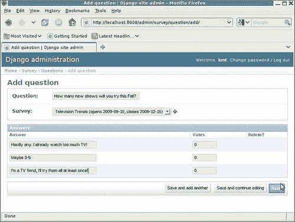

## 支持多个问题的编码

接下来，更改视图以创建`QuestionVoteForms`的列表，并将此列表传递到模板上下文中：

```py
def display_active_survey(request, survey): 
    qforms = [] 
    for i, q in enumerate(survey.question_set.all()): 
        if q.answer_set.count() > 1: 
            qforms.append(QuestionVoteForm(q, prefix=i)) 
    return render_to_response('survey/active_survey.html', {'survey': survey, 'qforms': qforms})
```

我们从一个名为`qforms`的空列表开始。然后，我们循环遍历与传递的`survey`相关联的所有问题，并为每个具有多个答案的问题创建一个表单。（具有少于两个答案的`Question`可能是设置错误。由于最好避免向一般用户呈现他们实际上无法选择答案的问题，我们选择在活动`Survey`的显示中略过这样的问题。）

请注意，我们在表单创建时添加了传递`prefix`参数，并将值设置为调查的全部问题集中当前问题的位置。这为每个表单实例提供了一个唯一的`prefix`值。如果表单中存在`prefix`值，则在生成 HTML 表单元素的`id`和`name`属性时将使用它。指定唯一的`prefix`是必要的，以确保在页面上存在相同类型的多个表单时生成的 HTML 是有效的，就像我们在这里实现的情况一样。

最后，每个创建的`QuestionVoteForm`都被附加到`qforms`列表中，并且在函数结束时，`qforms`列表被传递到上下文中以在模板中呈现。

因此，最后一步是更改模板以支持显示多个问题而不仅仅是一个。为此，我们可以像这样更改`active_survey.html`模板：

```py
 
 
<h1>{{ survey.title }}</h1> 
<form method="post" action="."> 
<div> 
 
    {{ qform.as_p }} 
<button type="submit">Submit</button> 
</div> 
</form> 
 
```

与上一个版本唯一的变化是用循环遍历`qforms`上下文变量中的表单列表的``块替换了显示单个表单的`{{ qvf.as_p }}`。每个表单依次显示，仍然使用`as_p`便利方法。

## 调试页面＃2：TemplateSyntaxError at /1/

这样做效果如何？效果不太好。如果我们尝试重新加载显示此调查问题的页面，我们将看到：

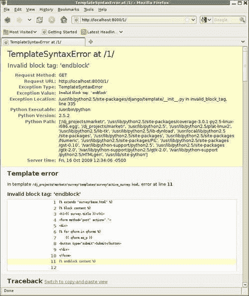

我们犯了一个错误，并触发了一个略有不同的调试页面。我们看到一个**模板错误**部分，而不是基本的异常信息后面紧接着回溯部分。对于`TemplateSyntaxError`类型的异常，当`TEMPLATE_DEBUG`为`True`时，将包括此部分。它显示了导致异常的模板的一些上下文，并突出显示了被识别为导致错误的行。通常对于`TemplateSyntaxError`，问题是在模板本身中找到的，而不是尝试呈现模板的代码（这将是回溯部分显示的内容），因此调试页面突出显示模板内容是有帮助的。

## 理解和修复 TemplateSyntaxError

在这种情况下，被识别为导致错误的行可能有些令人困惑。``行自上一个工作版本的模板以来并没有改变；它肯定不是一个无效的块标签。为什么模板引擎现在报告它是无效的？答案是，模板语法错误，就像许多编程语言中报告的语法错误一样，有时在试图指出错误位置时会产生误导。被识别为错误的点实际上是在识别错误时，而实际上错误可能发生得更早一些。

当漏掉了某些必需的内容时，经常会发生这种误导性的识别。解析器继续处理输入，但最终达到了当前状态下不允许的内容。此时，应该有缺失部分的地方可能相距几行。这就是这里发生的情况。``被报告为无效，因为在模板中仍然有一个未关闭的``标签。

在为支持多个问题进行模板更改时，我们添加了一个``标签，但忽略了关闭它。Django 模板语言不是 Python，它不认为缩进很重要。因此，它不认为``块是通过返回到先前的缩进级别终止的。相反，我们必须使用``显式关闭新的``块：

```py
 
 
<h1>{{ survey.title }}</h1> 
<form method="post" action="."> 
<div> 
 
    {{ qform.as_p }} 
 
<button type="submit">Submit</button> 
</div> 
</form> 
 
```

一旦我们做出了这个改变，我们可以重新加载页面，看到我们现在在页面上显示了多个问题：


随着多个问题的显示，我们可以继续添加处理提交的回答的代码。

# 记录调查回答

我们已经有测试数据可以用来练习处理调查回答，因此我们不需要为下一步向开发数据库添加任何数据。此外，模板不需要更改以支持提交回答。它已经在 HTML 表单中包含了一个提交按钮，并指定在提交表单时应将表单数据提交为 HTTP POST。现在**提交**按钮将起作用，因为它可以被按下而不会出现错误，但唯一的结果是页面被重新显示。这是因为视图代码不尝试区分 GET 和 POST，并且将所有请求都视为 GET 请求。因此，我们需要更改视图代码以添加对处理 POST 请求和 GET 请求的支持。

## 记录调查回答的编码支持

然后，视图代码需要更改以检查请求中指定的方法。处理 GET 请求的方式应该保持不变。然而，如果请求是 POST，那么应该使用提交的 POST 数据构建`QuestionVoteForms`。然后可以对其进行验证，如果所有的回答都是有效的（在这种情况下，这意味着用户为每个问题选择了一个选项），那么可以记录投票并向用户发送适当的响应。如果有任何验证错误，构建的表单应该重新显示带有错误消息。这方面的初始实现如下：

```py
def display_active_survey(request, survey): 
    if request.method == 'POST': 
        data = request.POST 
    else: 
        data = None 

    qforms = []
    for i, q in enumerate(survey.question_set.all()): 
        if q.answer_set.count() > 1: 
            qforms.append(QuestionVoteForm(q, prefix=i, data=data)) 

    if request.method == 'POST': 
        chosen_answers = [] 
        for qf in qforms: 
            if not qf.is_valid(): 
                break; 
            chosen_answers.append(qf.cleaned_data['answer']) 
        else: 
            from django.http import HttpResponse
            response = "" 
            for answer in chosen_answers: 
                answer.votes += 1 
                response += "Votes for %s is now %d<br/>" % (answer.answer, answer.votes) 
                answer.save() 
            return HttpResponse(response) 

    return render_to_response('survey/active_survey.html', {'survey': survey, 'qforms': qforms})
```

在这里，我们首先将本地变量`data`设置为`request.POST`字典，如果请求方法是`POST`，或者为`None`。我们将在表单构建过程中使用它，并且它必须是`None`（而不是空字典），以便创建未绑定的表单，这是用户在获取页面时所需的。

然后像以前一样构建`qforms`列表。这里唯一的区别是我们传入`data`参数，以便在请求为 POST 时将创建的表单绑定到已发布的数据。将数据绑定到表单允许我们稍后检查提交的数据是否有效。

然后我们有一段新的代码块来处理请求为 POST 的情况。我们创建一个空列表来保存选择的答案，然后循环遍历表单，检查每个表单是否有效。如果有任何无效的表单，我们立即跳出`for`循环。这将导致跳过与循环相关联的`else`子句（因为只有在`for`循环中的项目列表耗尽时才执行）。因此，一旦遇到无效的表单，这个程序将跳到`return render_to_response`行，这将导致页面重新显示，并在无效的表单上显示错误注释。

但是等等——一旦找到第一个无效的表单，我们就会跳出`for`循环。如果有多个无效的表单，我们不是想在所有表单上显示错误，而不仅仅是第一个吗？答案是是，但我们不需要在视图中显式调用`is_valid`来实现这一点。当表单在模板中呈现时，如果它被绑定并且尚未经过验证，`is_valid`将在其值呈现之前被调用。因此，无论视图代码是否显式调用`is_valid`，模板中都将显示任何表单中的错误。

如果所有表单都有效，`for`循环将耗尽其列表，并且`for`循环上的`else`子句将运行。在这里，我们想记录投票并向用户返回适当的响应。我们已经完成了第一个，通过增加每个选择答案实例的投票数。但是，对于第二个，我们实现了一个开发版本，该版本构建了一个响应，指示所有问题的当前投票值。这不是我们希望一般用户看到的，但我们可以将其用作快速验证答案记录代码是否符合我们的期望。

如果我们现在选择**戏剧**和**几乎没有：我已经看了太多电视了！**作为答案并提交表单，我们会看到：


看起来不错：没有调试页面，所选的投票值是正确的，所以投票记录代码正在工作。现在我们可以用适用于一般用户的生成响应的开发版本替换开发版本。

在响应成功的 POST 请求时，最佳做法是重定向到其他页面，这样用户按下浏览器的重新加载按钮不会导致已发布的数据被重新提交和重新处理。为此，我们可以将 else 块更改为：

```py
        else: 
            from django.http import HttpResponseRedirect 
            from django.core.urlresolvers import reverse 
            for answer in chosen_answers:
                answer.votes += 1
                answer.save()
            return HttpResponseRedirect(reverse('survey_thanks', args=(survey.pk,)))
```

请注意，这里包含了导入，只是为了显示需要导入的内容；通常情况下，这些内容会放在文件顶部，而不是嵌套在函数中。现在，这段代码不再构建一个注释所有新答案投票值的响应，而是发送一个 HTTP 重定向。为了避免在实际的 `urls.py` 文件之外的任何地方硬编码 URL 配置，我们在这里使用了 reverse 来生成与新命名的 URL 模式 `survey_thanks` 对应的 URL 路径。我们传递调查的主键值作为参数，以便生成的页面可以根据提交的调查进行定制。

在`reverse`调用之前，我们需要在`survey/urls.py`文件中添加一个名为`survey_thanks`的新模式。我们可以这样添加，以便`survey/urls.py`中的完整`urlpatterns`是：

```py
urlpatterns = patterns('survey.views', 
    url(r'^$', 'home', name='survey_home'), 
    url(r'^(?P<pk>\d+)/$', 'survey_detail', name='survey_detail'),
    url(r'^thanks/(?P<pk>\d+/)$', 'survey_thanks', name='survey_thanks'),
) 
```

添加的`survey_thanks`模式与`survey_detail`模式非常相似，只是相关的 URL 路径在包含调查的主键值的段之前有字符串`thanks`。

另外，我们需要在 `survey/views.py` 中添加一个 `survey_thanks` 视图函数：

```py
def survey_thanks(request, pk): 
    survey = get_object_or_404(Survey, pk=pk) 
    return render_to_response('survey/thanks.html', {'survey': survey}) 

```

这个视图使用`get_object_or_404`查找指定的调查。如果找不到匹配的调查，那么将引发`Http404`错误，并返回一个未找到页面的响应。如果找到了调查，那么将使用一个新的模板`survey/thanks.html`来渲染响应。调查被传递到模板中，允许根据提交的调查定制响应。

## 调试页面＃3：/1/处的 NoReverseMatch

在编写新模板之前，让我们检查一下重定向是否有效，因为它只需要对`survey/urls.py`和视图实现进行更改。如果我们在`views.py`中提交了带有新重定向代码的响应，会发生什么？并不是我们所希望的：

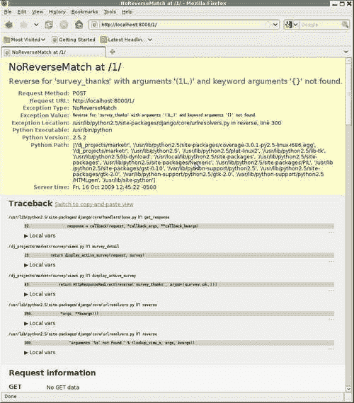

`NoReverseMatch`异常可能是最令人沮丧的异常之一。与正向匹配失败时不同，调试页面不会提供尝试的模式列表以及匹配尝试的顺序。这有时会让我们认为适当的模式甚至没有被考虑。请放心，它已经被考虑了。问题不是适当的模式没有被考虑，而是它没有匹配。

## 理解和修复 NoReverseMatch 异常

如何找出预期匹配的模式为何不匹配？猜测可能出错的地方并根据这些猜测进行更改有可能奏效，但也很可能会使情况变得更糟。更好的方法是有条不紊地逐一检查事物，通常会导致问题根源的发现。以下是一系列要检查的事物。我们将按顺序进行检查，并考虑它如何适用于我们的模式，其中`reverse`出现意外失败：

```py
    url(r'^thanks/(?P<pk>\d+/)$', 'survey_thanks', name='survey_thanks'), 
```

首先，验证异常中标识的名称是否与 URL 模式规范中的名称匹配。在这种情况下，异常引用了`survey_thanks`，而我们期望匹配的 URL 模式中指定了`name='survey_thanks'`，所以它们是匹配的。

请注意，如果 URL 模式省略了`name`参数，并且`patterns`调用是指定了视图`prefix`的参数，则在指定要反转的名称时，`reverse`的调用者也必须包括视图`prefix`。例如，在这种情况下，如果我们没有为`survey_thanks`视图指定名称，那么成功的`reverse`调用将需要指定`survey.views.survey_thanks`作为要反转的名称，因为在`survey/urls.py`中指定了`survey.views`作为`patterns prefix`。

其次，确保异常消息中列出的参数数量与 URL 模式中的正则表达式组数量相匹配。在这种情况下，异常中列出了一个参数`1L`，一个正则表达式组`(?P<pk>\d+/)`，所以数字是匹配的。

第三，如果异常显示指定了关键字参数，请验证正则表达式组是否具有名称。此外，请验证组的名称是否与关键字参数的名称匹配。在这种情况下，`reverse`调用没有指定关键字参数，因此在这一步没有什么可检查的。

请注意，当在异常中显示了位置参数时，不需要确保 URL 模式中使用了非命名组，因为位置参数可以与 URL 模式中的命名组匹配。因此，在我们的情况下，URL 模式使用了命名组，而`reverse`调用者指定了位置参数时，就没有问题。

第四，对于每个参数，验证异常中列出的实际参数值的字符串表示是否与 URL 模式中关联的正则表达式组匹配。请注意，异常中显示的值是对参数调用`repr`的结果，因此它们可能不完全匹配参数的字符串表示。例如，在这里，异常报告参数值为`1L`，表示 Python 长整型值（该值是长整型，因为这是本例中使用的数据库 MySQL 对整数值的返回方式）。后缀`L`用于清晰地表示`repr`中的类型，但它不会出现在值的字符串表示中，它只是简单的`1`。

因此，对于我们的例子，异常消息中显示的参数的字符串表示形式是`1`。这是否与 URL 模式中关联的正则表达式组匹配？请记住，该组是`(?P<pk>\d+/)`。括号标识了它是一个组。`?P<pk>`为该组分配了名称`pk`。其余部分`\d+/`是我们试图与`1`匹配的正则表达式。这些不匹配。正则表达式指定了一个或多个数字，后跟一个斜杠，然而我们实际拥有的值是一个单个数字，没有尾随斜杠。我们在这里犯了一个错别字，并在组内部包括了斜杠，而不是在其后。我们新的`survey_thanks`视图的正确规范是：

```py
    url(r'^thanks/(?P<pk>\d+)/$', 'survey_thanks', name='survey_thanks'), 
```

这样的错别字很容易出现在 URL 模式规范中，因为模式规范往往很长，而且充满了具有特殊含义的标点符号。将它们分解成组件，并验证每个组件是否正确，将为您节省大量麻烦。然而，如果这样做不起作用，当所有部分看起来都正确但仍然出现`NoReverseMatch`异常时，也许是时候从另一个方向解决问题了。

从整体模式的最简单部分开始，并验证`reverse`是否有效。例如，您可以从`reverse`调用中删除所有参数以及 URL 模式规范中的所有组，并验证是否可以按名称`reverse` URL。然后添加一个参数及其相关的 URL 规范中的模式组，并验证是否有效。继续直到出现错误。然后切换回尝试最简单的版本，除了仅导致错误的参数之外。如果有效，则整体模式中将该参数与其他参数组合在一起存在问题，这是一个线索，因此您可以开始调查可能导致该问题的原因。

这种方法是一种通用的调试技术，可以在遇到复杂代码集中的神秘问题时应用。首先，退回到非常简单的有效内容。然后逐一添加内容，直到再次失败。现在您已经确定了与失败有关的一个部分，并且可以开始调查它是否是单独的问题，或者它在隔离状态下是否有效，但仅在与其他部分组合时才会出现问题。

## 调试页面＃4：/thanks/1/处的 TemplateDoesNotExist

现在，让我们回到我们的例子。现在我们已经解决了`reverse`问题，重定向到我们的调查感谢页面是否有效？还不够。如果我们再次尝试提交我们的调查结果，我们会看到：

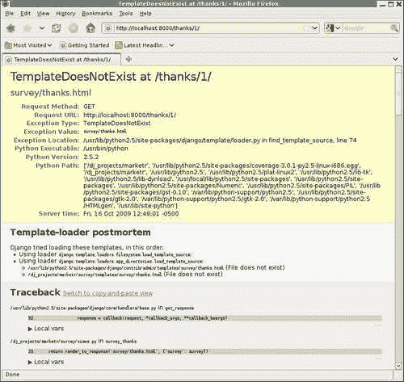

这个很容易理解；在追踪`NoReverseMatch`错误时，我们忘记了我们还没有写新视图的模板。修复将很容易，但首先需要注意这个调试页面的一个部分：**模板加载程序事后分析**。这是另一个可选部分，就像`TemplateSyntaxError`调试页面中包含的**模板错误**部分一样，它提供了有助于确定错误确切原因的额外信息。

**模板加载程序事后分析**部分具体列出了尝试定位模板时尝试的所有模板加载程序。对于每个加载程序，它列出了该加载程序搜索的完整文件名，以及结果。

在这个页面上，我们可以看到 `filesystem` 模板加载器被首先调用。但是没有任何文件被该加载器尝试加载。`filesystem` 加载器包含在我们的 `settings.py` 文件中，因为它是由 `django-admin.py startproject` 生成的 `settings.py` 文件中 `TEMPLATE_LOADERS` 中的第一个加载器，并且我们没有更改该设置。它会在设置 `TEMPLATE_DIRS` 的所有指定目录中查找。然而，默认情况下 `TEMPLATE_DIRS` 是空的，我们也没有更改该设置，因此 `filesystem` 加载器没有地方可以查找以尝试找到 `survey/thanks.html`。

第二个尝试的加载器是 `app_directories` 加载器。这是我们迄今为止一直依赖的加载器，用于加载我们调查应用程序的模板。它从每个应用程序目录下的 `templates` 目录加载模板。调试页面显示，它首先尝试在 `admin` 应用程序的 `templates` 目录下找到 `survey/thanks.html` 文件，然后在 `survey` 应用程序的 `templates` 目录下找到。在文件名后面，显示了搜索指定文件的结果；在这两种情况下，我们都看到了 **文件不存在**，这并不奇怪。

有时，这个消息会显示 **文件存在**，这可能有点令人困惑。如果文件存在，加载器也能看到它存在，为什么加载器没有加载它呢？这经常发生在像 Apache 这样的 Web 服务器上运行时，问题在于 Web 服务器进程没有必要的权限来读取文件。在这种情况下的解决方法是让 Web 服务器进程可以读取文件。处理这种生产时问题将在第十一章中更详细地讨论，*当是时候上线：转向生产*。

## 理解和修复 TemplateDoesNotExist

在我们的情况下，修复很简单，我们甚至不需要仔细查看错误消息就知道需要做什么，但请注意，本节提供了追踪 `TemplateDoesNotExist` 错误所需的一切。您将知道您依赖于哪个加载器来加载模板。如果在 **Template-loader postmortem** 中没有显示该加载器，那么问题很可能是 `settings.py` 中 `TEMPLATE_LOADERS` 设置不正确。

如果加载器被列出，但没有列出尝试加载预期文件，则下一步是弄清楚原因。这一步取决于加载器，因为每个加载器都有自己的规则来查找模板文件。例如，`app_directories` 加载器会在 `INSTALLED_APPS` 中列出的每个应用程序的 `templates` 目录下查找。因此，确保应用程序在 `INSTALLED_APPS` 中，并且有一个 `templates` 目录，是在 `app_directories` 加载器没有按预期搜索文件时要检查的两件事情。

如果加载器被列出，并且预期的文件被列为尝试加载，那么加载器列出的文件状态所暗示的问题。**文件不存在**是一个明确的状态，有一个简单的解决方法。如果 **文件不存在** 出现得出乎意料，那么请仔细检查文件名。从调试页面复制并粘贴到命令提示符中，尝试显示文件可能会有所帮助，因为它可能有助于澄清加载器尝试加载的文件名与实际存在的文件名之间的差异。其他状态消息，比如 **文件存在**，可能不那么直接，但仍然暗示了问题的性质，并指向了解决问题的方向。

对于我们的示例案例，修复很简单：创建我们之前忘记创建的 `survey/thanks.html` 模板文件。这个模板返回一个基本页面，其中包含一条感谢用户参与调查的消息：

```py
 
 
<h1>Thanks</h1> 
<p>Thanks for completing our {{ survey.title }} survey.  Come back soon and check out the full results!</p> 
 
```

在`survey/templates`目录下放置了这个模板后，我们现在可以提交一个调查而不会出错。相反，我们看到：


好！我们现在是否已经完成了显示调查和处理结果？还没有。我们还没有测试提交无效的调查响应会发生什么。接下来我们将尝试。

# 处理无效的调查提交

我们已经编写了处理调查提交的视图，以便在提交的表单中发现任何错误时，重新显示页面并显示错误，而不是处理结果。在显示方面，由于我们使用了`as_p`方便的方法来显示表单，它将负责显示表单中的任何错误。因此，我们不需要进行任何代码或模板更改，就可以看到当提交无效的调查时会发生什么。

什么情况下会使调查提交无效？对于我们的`QuestionVoteForm`来说，唯一可能的错误情况是没有选择答案。那么，如果我们尝试提交一个缺少答案的调查，会发生什么？如果我们尝试，我们会发现结果并不理想：


这里至少有两个问题。首先，错误消息的放置位置在调查问题上方，这很令人困惑。很难知道页面上的第一个错误消息指的是什么，第二个错误看起来像是与第一个问题相关联的。最好将错误消息移到实际进行选择的地方附近，例如在问题和答案选择列表之间。

其次，错误消息的文本对于这个特定的表单来说并不是很好。从技术上讲，答案选择列表是一个单一的表单字段，但对于一般用户来说，将**字段**用于选择列表的引用听起来很奇怪。接下来我们将纠正这两个错误。

## 编写自定义错误消息和放置

更改错误消息很容易，因为 Django 提供了一个钩子。为了覆盖当未提供必填字段时发出的错误消息的值，我们可以在字段声明中作为参数传递的`error_messages`字典中，指定`required`键的值作为我们想要的消息。因此，`QuestionVoteForm`中`answer`字段的新定义将把错误消息更改为`请在下面选择一个答案`：

```py
class QuestionVoteForm(forms.Form): 
    answer = forms.ModelChoiceField(widget=forms.RadioSelect, 
        queryset=None, 
        empty_label=None, 
        error_messages={'required': 'Please select an answer below:'}) 
```

更改错误消息的放置位置需要更改模板。我们将尝试显示答案字段的标签、答案字段的错误以及显示选择的答案字段，而不是使用`as_p`方便的方法。然后在`survey/active_survey.html`模板中显示调查表单的``块变为：

```py
 
    {{ qform.answer.label }} 
    {{ qform.answer.errors }} 
    {{ qform.answer }} 
 
```

这样做有什么效果？比以前好。如果我们现在尝试提交无效的表单，我们会看到：


虽然错误消息本身得到了改进，放置位置也更好了，但显示的确切形式并不理想。默认情况下，错误显示为 HTML 无序列表。我们可以使用 CSS 样式来去除出现的项目符号（就像我们最终会对选择列表做的那样），但 Django 也提供了一种实现自定义错误显示的简单方法，因此我们可以尝试使用它。

为了覆盖错误消息的显示，我们可以为`QuestionVoteForm`指定一个替代的`error_class`属性，并在该类中实现一个`__unicode__`方法，以返回我们期望的格式的错误消息。对`QuestionVoteForm`和新类进行这一更改的初始实现可能是：

```py
class QuestionVoteForm(forms.Form): 
    answer = forms.ModelChoiceField(widget=forms.RadioSelect, 
        queryset=None,                            
        empty_label=None,                            
        error_messages={'required': 'Please select an answer below:'}) 

    def __init__(self, question, *args, **kwargs): 
        super(QuestionVoteForm, self).__init__(*args, **kwargs) 
        self.fields['answer'].queryset = question.answer_set.all() 
        self.fields['answer'].label = question.question 
        self.error_class = PlainErrorList 

from django.forms.util import ErrorList 
class PlainErrorList(ErrorList): 
    def __unicode__(self): 
        return u'%s' % ' '.join([e for e in sefl]) 
```

对`QuestionVoteForm`的唯一更改是在其`__init__`方法中将其`error_class`属性设置为`PlainErrorList`。`PlainErrorList`类基于`django.form.util.ErrorList`类，并简单地重写`__unicode__`方法，以字符串形式返回错误，而不进行特殊的 HTML 格式化。这里的实现利用了基本的`ErrorList`类继承自`list`，因此对实例本身进行迭代会依次返回各个错误。然后这些错误用空格连接在一起，并返回整个字符串。

请注意，我们只希望这里只会有一个错误，但以防万一我们对这个假设是错误的，最安全的做法是编写多个错误存在的代码。尽管在这种情况下我们的假设可能永远不会错，但可能我们会决定在其他情况下重用这个自定义错误类，而单个可能的错误预期不成立。如果我们根据我们的假设编写代码，并简单地返回列表中的第一个错误，这可能会导致在某些情况下出现混乱的错误显示，因为我们将阻止报告除第一个错误之外的所有错误。如果我们到达那一点，我们可能还会发现，仅用空格分隔的错误列表格式不是一个好的展示方式，但我们可以稍后处理。首先，我们只想简单验证我们对错误列表显示的自定义是否被使用。

## 调试页面＃5：另一个 TemplateSyntaxError

现在我们指定了自定义错误类，如果我们尝试提交一个无效的调查会发生什么？现在尝试提交一个无效的调查会返回：


哎呀，我们又犯了一个错误。第二行显示的异常值非常清楚地表明我们将`self`误输入为`sefl`，由于我们刚刚做的代码更改总共只影响了五行，所以我们不需要花太多时间来找到这个拼写错误。但让我们仔细看看这个页面，因为它看起来与我们遇到的其他`TemplateSyntaxError`有些不同。

这一页与其他`TemplateSyntaxError`相比有什么不同？实际上，在结构上并没有什么不同；它包含了所有相同的部分和相同的内容。显著的区别在于异常值不是单行的，而是一个包含**原始回溯**的多行消息。那是什么？如果我们看一下调试页面的回溯部分，我们会发现它相当长、重复且无信息。通常最有趣的部分是结尾部分，它是：

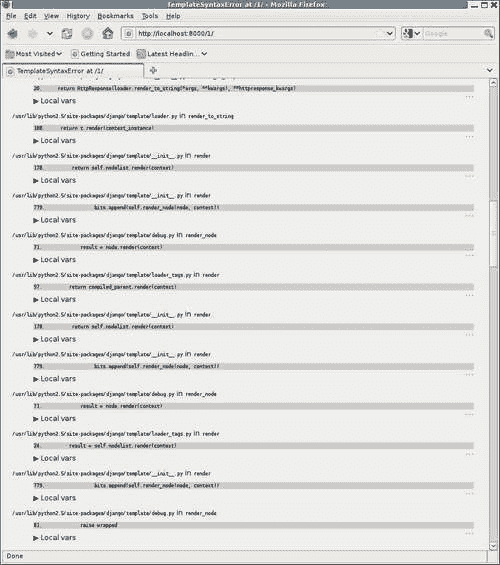

在那个回溯中引用的每一行代码都是 Django 代码，而不是我们的应用程序代码。然而，我们可以非常确定这里的问题不是由 Django 模板处理代码引起的，而是由我们刚刚对`QuestionVoteForm`进行的更改引起的。发生了什么？

这里发生的是在渲染模板时引发了一个异常。渲染期间的异常会被捕获并转换为`TemplateSyntaxErrors`。异常的大部分堆栈跟踪可能不会对解决问题有趣或有帮助。更有信息的是原始异常的堆栈跟踪，在被捕获并转换为`TemplateSyntaxError`之前。这个堆栈跟踪作为最终引发的`TemplateSyntaxError`的异常值的**原始回溯**部分提供。

这种行为的一个好处是，很可能是非常长的回溯的重要部分在调试页面的顶部被突出显示。一个不幸的方面是，回溯的重要部分在回溯部分本身不再可用，因此调试页面的回溯部分的特殊功能对其不可用。不可能扩展原始回溯中标识的行周围的上下文，也无法看到原始回溯每个级别的局部变量。这些限制不会导致解决这个特定问题时出现任何困难，但对于更晦涩的错误可能会很烦人。

### 注意

请注意，Python 2.6 对基本的`Exception`类进行了更改，导致在显示`TemplateSyntaxError`异常值时省略了此处提到的**原始回溯**信息。因此，如果您使用的是 Python 2.6 和 Django 1.1.1，您将看不到调试页面上包括**原始回溯**。这可能会在 Django 的新版本中得到纠正，因为丢失**原始回溯**中的信息会使调试错误变得非常困难。这个问题的解决方案也可能解决先前提到的一些烦人的问题，与`TemplateSyntaxErrors`包装其他异常有关。

## 修复第二个 TemplateSyntaxError

修复这个第二个`TemplateSyntaxError`很简单：只需在原始回溯中指出的行上纠正`sefl`拼写错误。当我们这样做并再次尝试提交无效的调查时，我们会看到响应：


那不是一个调试页面，所以很好。此外，错误消息不再显示为 HTML 无序列表，这是我们对此更改的目标，所以很好。它们的确切位置可能不完全是我们想要的，我们可能希望添加一些 CSS 样式，使它们更加突出，但现在它们会做到这一点。

# 总结

我们现在已经完成了调查投票的实施，并对 Django 调试页面进行了深入的覆盖。在本章中，我们：

+   着手用真正的实现替换活动调查的占位符视图和模板以进行显示

+   在实施过程中犯了一些典型的错误，导致我们看到了五个不同的 Django 调试页面。

+   在遇到第一个调试页面时，了解了调试页面的所有不同部分以及每个部分包含的信息

+   对于每个遇到的调试页面，使用呈现的信息来定位和纠正编码错误

在下一章中，我们将继续学习即使代码没有导致调试页面显示也能收集调试信息的技术。
