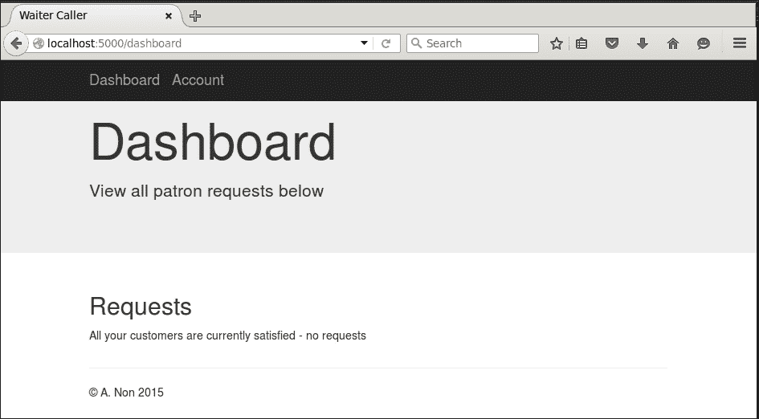
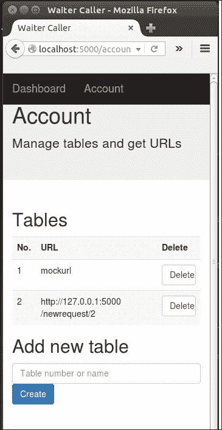
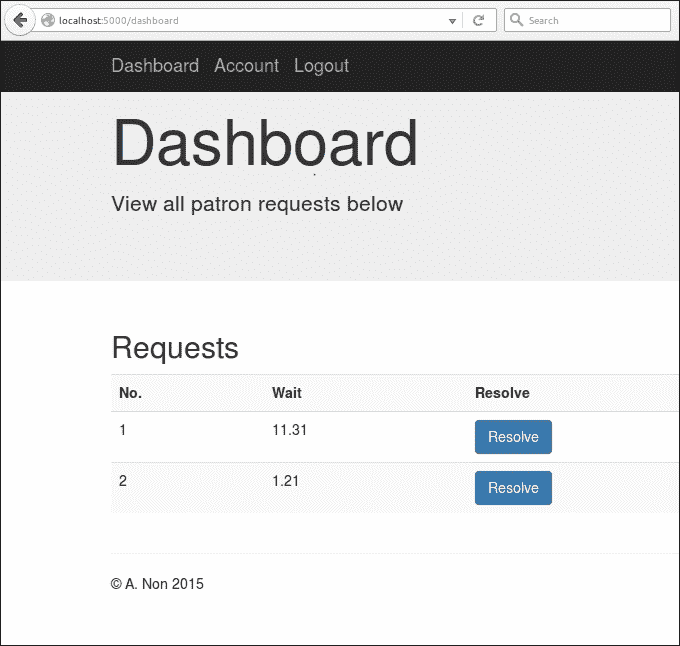
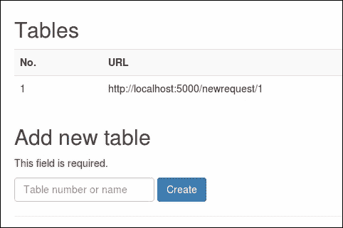

# 第十章。在服务员呼叫项目中使用模板继承和 WTForms

在上一章中，我们创建了一个基本的用户账户系统。然而，我们只是做了一个非常简单的路由访问控制——只是简单地显示字符串“您已登录”。在本章中，我们将添加一些更多的期望功能，并允许已登录用户添加餐厅桌子，查看与这些桌子相关的 URL，并查看顾客的关注请求。我们将遇到的一个问题是希望在我们的应用程序的不同页面上重用相同的元素。您将看到如何通过使用 Jinja 的继承系统来解决这个问题，而不会出现代码重复。正如在上一章中提到的，当出现错误时，比如输入了错误的密码，我们与用户的沟通并不是很好。为了解决这个问题，我们将看一下另一个 Flask 扩展，WTForms，并看看它如何简化创建和验证表单。

在这一章中，我们将涵盖以下主题：

+   将账户和仪表板页面添加到我们的应用程序中

+   使用 bitly API 缩短 URL

+   添加处理关注请求的功能

+   通过 WTForms 添加用户反馈

# 添加账户和仪表板页面

我们想要在我们的应用程序中添加两个新页面：'仪表板'，在这里可以看到特定餐厅的所有顾客请求，以及'账户'，在这里餐厅可以管理他们的桌子并查看他们需要在桌子上提供的 URL。

我们可以简单地在我们的`templates`目录中创建两个新的`.html`文件，并从头开始编写 HTML。但很快我们会发现，我们需要从我们的主页中使用许多相同的元素（至少包括和配置 Bootstrap 的部分）。然后我们会忍不住只是复制粘贴主页的 HTML，并从那里开始处理我们的新页面。

## 介绍 Jinja 模板

复制和粘贴代码通常意味着有些地方出了问题。在应用程序代码中，这意味着您没有很好地模块化您的代码，并且需要创建一些更多的类，并可能添加一些`import`语句来包含重用的代码。使用 Jinja，我们可以遵循一个非常相似的模式，通过使用*模板继承*。我们首先将我们的主页分成两个单独的模板文件，`base.html`和`home.html`，其中包含我们想要在基本文件中重用的所有元素。然后我们可以让我们的其他三个页面（主页、账户和仪表板）都继承自*基本模板*，并且只编写在这三个页面之间有所不同的代码。

Jinja 通过使用*blocks*的概念来处理继承。每个父模板都可以有命名块，而扩展父模板的子模板可以用自己的自定义内容填充这些块。Jinja 继承系统非常强大，可以处理嵌套块和覆盖现有块。然而，我们只会浅尝其功能。我们的基本模板将包含所有可重用的代码，并包含一个名为`content`的空块和一个名为`navbar`的块。我们的三个页面将从基本模板扩展，提供它们自己版本的内容块（用于主页面内容）和导航栏。我们需要使导航栏动态化，因为页面顶部的**登录**字段只有在用户未登录时才会出现。

### 创建基本模板

在您的`templates`目录中创建一个名为`base.html`的新文件，并插入以下代码：

```py
<!DOCTYPE html>
<html lang="en">
  <head>
    <meta charset="utf-8">
    <meta http-equiv="X-UA-Compatible" content="IE=edge">
    <meta name="viewport" content="width=device-width, initial-scale=1">

    <title>Waiter Caller</title>

    <!-- Bootstrap core CSS -->
    <link href="../static/css/bootstrap.min.css" rel="stylesheet">

    <!-- HTML5 shim and Respond.js for IE8 support of HTML5 elements and media queries -->
    <!--[if lt IE 9]>
      <script src="img/html5shiv.min.js"></script>
      <script src="img/respond.min.js"></script>
    <![endif]-->

  </head>
  <body>

    
    <nav class="navbar navbar-inverse navbar-fixed-top">
      <div class="container">
        <div class="navbar-header">
          <a class="navbar-brand" href="/dashboard">Dashboard</a>
          <a class="navbar-brand" href="/account">Account</a>
        </div>
      </div>
    </nav>
    

    
    

    <div class="container">

      <hr>
      <footer>
        <p>&copy; A. Non 2015</p>
      </footer>
    </div>
  <!-- Bootstrap core JavaScript
    ================================================== -->
    <!-- Placed at the end of the document so the pages load faster -->
    <script   src="img/jquery.min.js"></script>
    <script src="img/bootstrap.min.js"></script>
  </body>
</html>
```

在上面的代码中，我们在一个文件中拥有所有的页眉和页脚代码——这些元素将在所有页面中共同存在。我们使用 Jinja 语法定义了两个块，这与我们之前看到的其他 Jinja 语句类似，即：

```py


```

和

```py

[...]

```

在这个例子中，`content`和`navbar`是我们块的名称，我们可以自由选择这些名称，而`block`和`endblock`是 Jinja 关键字，``符号用于指示 Jinja 语句，就像之前的例子中一样。这本身就是一个完全有效的 Jinja 模板；即使内容块是空的，我们也可以直接从我们的 Flask 应用程序中呈现模板，我们会看到一个页面，它只是假装内容块不存在。

我们还可以扩展这个模板；也就是说，我们可以使用它作为父模板创建子模板。子模板可以通过再次声明来*覆盖*任何指定的块。我们将`navbar`声明为一个块，因为我们的主页将使用我们之前编写的导航栏——包括登录表单。然而，一旦登录，我们的仪表板和账户页面将具有完全相同的导航栏——这是我们在基本模板中定义的导航栏。

### 创建仪表板模板

我们的仪表板页面最终将显示所有客户的服务请求，以便服务员可以轻松地看到哪些桌子需要关注。不过，现在我们只是创建页面的大纲。在您的`templates`目录中创建一个名为`dashboard.html`的新文件，并添加以下代码：

```py



    <div class="jumbotron">
      <div class="container">
        <h1>Dashboard</h1>
        <p>View all patron requests below</p>
      </div>
    </div>

    <div class="container">
      <div class="row">
        <div class="col-md-12">
          <h2>Requests</h2>
          <p>All your customers are currently satisfied - no requests</p>
        </div>    
      </div>
    </div>

```

在前面的代码片段中，最重要的一行是第一行——我们使用 Jinja 的`extends`关键字来指示这个模板应该继承另一个模板中包含的所有代码。关键字后面跟着要继承的模板的文件名，包含在引号中。

接下来，我们只需以与基本模板相同的方式创建内容块。这一次，我们不是留空，而是添加一些 HTML 来显示在我们的仪表板页面上。

### 创建账户模板

账户页面将是用户可以添加新表格、删除表格或获取现有表格的 URL 的页面。同样，由于我们还没有任何应用程序代码来表示表格，我们将只是创建页面的大纲。在您的`templates`目录中创建一个名为`account.html`的文件，并添加以下代码：

```py



    <div class="jumbotron">
      <div class="container">
        <h1>Account</h1>
        <p>Manage tables and get URLs</p>
      </div>
    </div>

    <div class="container">
      <div class="row">
        <div class="col-md-12">
          <h2>Tables</h2>

        </div>    
      </div>
    </div>

```

### 创建主页模板

`home.html`模板包含了我们主页的整个特定代码，它不是基本模板的一部分。代码可以在代码包中的`templates/home_1.html`中看到，但这里没有包含，因为它太长了。看一下它，看看我们如何定义一个包含`login`表单的新`navbar`块，并覆盖了基本模板中提供的默认块。同样，它定义了内容块，替换了我们在基本模板中定义的空内容块。最终结果并没有改变——我们仍然会看到完全相同的主页，但现在代码分为`base.html`和`home.html`文件，允许我们重用它的大部分内容，用于我们之前创建的新页面。

### 添加路由代码

当访问`/account`和`/dashboard`时，我们需要我们的 Python 代码返回新的模板文件。在您的`waitercaller.py`文件中添加`dashboard()`函数，并修改账户`function()`如下：

```py
@app.route("/dashboard")
@login_required
def dashboard():
  return render_template("dashboard.html")

@app.route("/account")
@login_required
def account():
  return render_template("account.html")
```

尝试新页面！像以前一样在本地运行应用程序：

```py
python waitercaller.py

```

转到`http://localhost:5000`查看主页。使用表单登录，现在，您应该看到一个更漂亮的**账户**页面的骨架，如下图所示：


在顶部的导航栏中点击**仪表板**链接，您也应该看到该页面的骨架，如下图所示：



## 创建餐厅桌子

现在我们需要向我们的应用程序引入*表*的概念，并且能够在我们的数据库和应用程序代码中表示它。一个表应该具有以下属性：

+   唯一标识我们应用程序所有用户中的该表的 ID 号

+   一个用户可定义且在特定用户的表格中唯一的名称

+   一个所有者，以便我们知道表格属于哪个用户

如果我们严格遵循面向对象编程的风格，我们将创建一个`Table`类，其中包含这些属性。然后，我们还将为应用程序中的所有内容创建一堆其他类。按照这种方法，我们还将创建方法来将我们的每个对象序列化为可以存储在数据库中的内容，并创建更多的方法来*反序列化*它们，从数据库中恢复为对象。

为了简洁起见，并且因为我们的模型足够简单，我们将采取一种捷径，这肯定会冒犯一些人，简单地使用 Python 字典来表示我们大部分的对象。当我们将 MongoDB 添加到我们的应用程序时，我们将看到这些字典将很容易地写入和从数据库中读取。

### 编写餐厅表格代码

让我们简要看一下我们的表需要做什么。首先，我们的应用用户需要能够在“账户”页面上添加和删除新表格，无论是最初注册账户时还是以后需要进行更改时。其次，用户应该能够查看与每个表格相关联的 URL，以便这些 URL 可以被打印并在实际表格上提供。当添加新表格时，我们需要创建一个模拟数据库。

我们将从在“账户”页面上为用户提供一个输入框开始，他们可以在其中输入新表格的名称或编号以创建它。创建新表格时，我们将创建一个唯一的 ID 号，并使用它来创建一个新的 URL。然后，我们将使用 bitly API 来创建 URL 的缩短版本，这样我们的用户的顾客将更容易地在智能手机上输入。然后，我们将在我们的模拟数据库中存储表格名称、ID 和缩短的 URL。

#### 添加创建表单

在`account.html`模板中，在`<h2>Tables</h2>`下面直接添加以下内容：

```py
<h2>Add new table</h2>
<form class="form-inline" action="/account/createtable" method="POST">
  <input type="text" name="tablenumber" placeholder="Table number or name" class="form-control">
  <input type="submit" value="Create" class="btn btn-primary">
</form>
```

这是一个非常基本的表单，只有一个输入框用于输入新表格的名称和一个提交表单的按钮。如果您加载应用程序并导航到“账户”页面，您现在应该看到类似以下图片的东西：


#### 添加创建表路由

创建表格后端并不太复杂，但有一些重要的细节需要理解。首先，我们的用户可以给表格任何他们想要的名称。对于大多数用户，这些名称可能只是从 1 开始递增的数字，以餐厅中的表格数量结束，因为这是餐厅命名表格的常见方式。因为许多餐厅经理将使用我们的应用程序，我们不能假设这些名称在所有账户中是唯一的。我们应用程序的大多数用户可能会有一个名为`1`的表格。因此，当餐厅顾客表示他或她在 1 号桌上并需要服务时，我们必须能够从潜在的许多餐厅中选择正确的 1 号桌。为了解决这个问题，我们数据库中的每个表格都将有一个唯一的 ID，我们将使用它来在 URL 中标识表格，但我们将在“账户”页面上显示用户选择的名称（例如`1`），以便我们的用户可以轻松管理他们的个人表格列表。

当我们向数据库中插入新项目时，我们将获得该项目的唯一 ID。但是，因为我们想要将 ID 作为 URL 的一部分使用，我们陷入了一种先有鸡还是先有蛋的情况，我们需要将表格插入数据库以获得 ID，但我们也需要 ID 以便在正确地将表格插入数据库之前创建 URL。

为了解决这个问题，我们必须将一个半创建的表格插入到我们的数据库中以获得 ID，然后使用 ID 创建 URL，然后更新我们刚刚创建的表格以将其与 URL 关联起来。

将以下路由添加到`waitercaller.py`文件中，以执行此操作（或者说，一旦我们在数据库代码中创建了所需的函数，它将执行此操作）：

```py
@app.route("/account/createtable", methods=["POST"])
@login_required
def account_createtable():
  tablename = request.form.get("tablenumber")
  tableid = DB.add_table(tablename, current_user.get_id())
  new_url = config.base_url + "newrequest/" + tableid
  DB.update_table(tableid, new_url)
  return redirect(url_for('account'))
```

请注意，我们将与账户页面相关的应用程序功能结构化为`子路由/account/`。我们在属于账户的路由的函数名称前加上`account_`。这有助于我们在应用程序代码中拥有更清晰的部分，随着我们添加更多路由，代码可能会变得混乱和难以维护。

我们必须将每个表与所有者关联起来，因此我们使用`FlaskLogin current_user`功能来获取当前登录用户的 ID。我们还将使用我们的`config.py`文件来定义要与表关联的基本 URL。

将以下导入添加到`waitercaller.py`中，以使用`current_user`功能并访问我们的`config`：

```py
from flask.ext.login import current_user
import config
```

将以下内容添加到`config.py`文件中（请记住，这不是 Git 存储库的一部分，因此此值仅用于本地开发）：

```py
base_url = "http://127.0.0.1:5000/"
```

上述 URL 与我们一直在使用的`localhost:5000`完全相同，因为`127.0.0.1`是一个特殊的 IP 地址，总是指向自己的机器。但是，我们将在`config`中使用 IP 地址而不是`localhost`，以保持与我们将在本章的下一节中使用的 Bitly API 的兼容性，即缩短 URL。

#### 添加创建表数据库代码

我们的表的模拟数据库代码类似于我们的用户和密码的模拟数据库代码。在`mockdbhelper.py`文件的顶部创建以下字典列表，用于存储您的表：

```py
MOCK_TABLES = [{"_id": "1", "number": "1", "owner": "test@example.com","url": "mockurl"}]
```

上述代码还创建了一个单一的表`1`，并将其分配给我们的模拟用户。请注意，`1`是`_id`键的值，对于我们的生产系统，它将是所有用户帐户中唯一的 ID 号。`number`键的值为`1`是用户选择的值，可能会在系统的不同用户之间重复。因为我们只有一个测试用户，我们将简化我们的模拟代码，并始终为唯一 ID 和用户选择的数字使用相同的值。

对于我们的模拟数据库，添加表就是简单地将代表表的新字典附加到现有的模拟表列表中。将以下方法添加到`mockdbhelper.py`文件中：

```py
def add_table(self, number, owner):
    MOCK_TABLES.append({"_id": number, "number": number, "owner":owner})
    return number
```

我们从此函数返回`number`，这是模拟 ID。在我们的测试代码中，这是输入到此函数的相同值。在我们的真实代码中，这个数字将是生成的 ID，并且将与输入不同。

最后，我们需要添加`update_table()`方法，这将允许我们将 URL 与表关联起来。将以下方法添加到`mockdbhelper.py`中：

```py
def update_table(self, _id, url):
    for table in MOCK_TABLES:
        if table.get("_id") == _id:
            table["url"] = url
            break
```

我们的应用程序代码为上述方法提供了由`add_table()`方法生成的表 ID 以及要与表关联的 URL。然后，`update_table()`方法找到正确的表并将 URL 与表关联起来。再次强调，通过列表进行循环可能看起来效率低下，而不是使用字典，但对于我们的模拟数据库代码来说，使用与我们将在下一章中编写的真实数据库代码相同的思想是很重要的。因为我们的真实数据库将存储一系列表，我们的模拟代码通过将它们存储在列表中来模拟这一点。

#### 添加查看表数据库代码

我们现在已经具备了添加新表的功能，但我们还看不到它们。我们希望在账户页面上列出所有现有的表，以便我们可以看到存在哪些表，有能力删除它们，并查看它们的 URL。

将以下方法添加到`mockdbhelper.py`中，将允许我们访问特定用户的现有表：

```py
  def get_tables(self, owner_id):
    return MOCK_TABLES
```

再次简化并让我们的测试代码忽略`owner_id`参数并返回所有表（因为我们只有一个测试用户）。但是，我们的模拟方法必须接受与我们真实方法相同的输入和输出，因为我们不希望我们的应用程序代码知道它是在运行生产代码还是测试代码。

#### 修改账户路由以传递表格数据

我们应该从数据库中获取有关表的最新信息，并在每次加载我们的账户页面时向用户显示这些表。修改`waitercaller.py`中的`/account`路由如下：

```py
@app.route("/account")
@login_required
def account():
    tables = DB.get_tables(current_user.get_id())
    return render_template("account.html", tables=tables)
```

上述方法现在从数据库获取表，并将数据传递给模板。

#### 修改模板以显示表格

我们的模板现在可以访问表格数据，所以我们只需要循环遍历每个表并显示相关信息。此时使用的术语可能会有点令人困惑，因为我们将使用 HTML 表来显示有关我们虚拟餐厅桌子的信息，即使表的用法是不相关的。HTML 表是一种显示表格数据的方式，在我们的情况下是有关餐厅桌子的数据。

在`account.html`文件中，在`<h2>tables</h2>`行下面添加以下代码：

```py
<table class="table table-striped">
  <tr>
    <th>No.</th>
    <th>URL</th>
    <th>Delete</th>
  </tr>
  
    <form class="form-inline" action="/account/deletetable">
      <tr>
        <td>{{table.number}}</td>
        <td>{{table.url}}</td>
        <td><input type="submit" value="Delete" class="form-control"></td>
        <input type="text" name="tableid" value="{{table._id}}" hidden>
      </tr>
    </form>
  
</table>
```

上述代码创建了一个简单的表格，显示了表格编号（用户选择）、URL 和每个表的删除按钮。实际上，每个表都是一个提交请求以删除特定表的表单。为了做到这一点，我们还使用了包含每个表的唯一 ID 的隐藏输入。此 ID 将随着`delete`请求一起传递，以便我们的应用程序代码知道从数据库中删除哪个表。

#### 在后端代码中添加删除表路由

在您的`waitercaller.py`文件中添加以下路由，它只接受需要删除的表 ID，然后要求数据库删除它：

```py
@app.route("/account/deletetable")
@login_required
def account_deletetable():
  tableid = request.args.get("tableid")
  DB.delete_table(tableid)
  return redirect(url_for('account'))
```

在`mockdbhelper.py`中创建以下方法，它接受一个表 ID 并删除该表：

```py
    def delete_table(self, table_id):
        for i, table in enumerate(MOCK_TABLES):
            if table.get("_id") == table_id:
                del MOCK_TABLES[i]
             break
```

与我们之前编写的更新代码类似，必须在删除之前循环遍历模拟表以找到具有正确 ID 的表。

### 测试餐厅桌子代码

我们已经在我们的应用程序中添加了相当多的代码。由于我们添加的许多不同代码部分彼此依赖，因此在编写代码时实际运行代码是困难的。但是，现在我们有了创建、查看和删除表的功能，所以我们现在可以再次测试我们的应用程序。启动应用程序，登录，并导航到**账户**页面。您应该看到单个模拟表，并能够使用创建表单添加更多表。通过添加新表和删除现有表来进行操作。当您添加表时，它们应该根据其编号获得与它们相关联的 URL（请记住，对于我们的生产应用程序，此编号将是一个长的唯一标识符，而不仅仅是我们为表选择的编号）。界面应该如下图所示：


还要通过调整浏览器窗口的大小来再次查看此页面的移动视图，使其变窄以触发布局切换。请注意，由于我们使用了 Bootstrap 的响应式布局功能，**删除**按钮会靠近 URL，**创建**按钮会移动到文本输入下方，如下图所示：



这可能看起来不如全尺寸视图那么好，但对于我们的访问者来说肯定会很有帮助，他们想要从手机上使用我们的网站，因为他们不需要担心放大或横向滚动来访问我们网站的所有功能。

# 使用 bitly API 缩短 URL

我们的用户不想输入我们目前提供的长 URL 来呼叫服务员到他们的桌子。我们现在将使用 bitly API 来创建我们已经创建的 URL 的更短的等价物。这些更短的 URL 可以更容易地输入到地址栏中（特别是在移动设备上），然后将显示为与当前更长的 URL 相关联的相应桌子。

## 介绍 Bitly

Bitly 及许多类似服务背后的原理很简单。给定任意长度的 URL，该服务返回形式为`bit.ly/XySDj72`的更短 URL。Bitly 和类似服务通常具有非常短的根域（bit.ly 是五个字母），它们只是维护一个数据库，将用户输入的长 URL 链接到它们创建的短 URL。因为它们使用大小写字母和数字的组合来创建缩短的 URL，所以即使保持 URL 的总长度非常短，也不会缺乏组合。

## 使用 bitly API

与我们使用过的其他 API 一样，bitly 是免费使用的，但在一定的限制内需要注册才能获得 API 令牌。bitly API 通过 HTTPS 访问，并返回 JSON 响应（与我们之前看到的类似）。为了与 API 进行交互，我们将使用几行 Python 代码以及`urllib2`和`json`标准库。

## 获取 bitly oauth 令牌

在撰写本文时，bitly 提供了两种验证其 API 的方式。第一种是在注册时给你的 API 令牌。第二种方式是使用 oauth 令牌。由于 bitly 正在淘汰 API 令牌，我们将使用 oauth 令牌。

第一步是在[bitly.com](http://bitly.com)上注册一个帐户并确认您的电子邮件地址。只需转到[bitly.com](http://bitly.com)，点击**注册**按钮，然后提供用户名、电子邮件地址和密码。点击他们发送到提供的电子邮件的确认链接，并登录到您的 bitly 帐户。

要注册 oauth 令牌，请转到[`bitly.com/a/oauth_apps`](https://bitly.com/a/oauth_apps)，并在提示时再次输入密码。现在您应该在屏幕上看到您的新 oauth 令牌。复制这个，因为我们将在接下来要编写的 Python 代码中需要它。它应该看起来像这样：`ad922578a7a1c6065a3bb91bd62b02e52199afdb`

## 创建 bitlyhelper 文件

按照我们在构建这个 Web 应用程序的整个过程中使用的模式，我们将创建一个`BitlyHelper`类来缩短 URL。同样，这是一个很好的做法，因为它允许我们在需要时轻松地用另一个链接缩短服务替换这个模块。在您的`waitercaller`目录中创建一个名为`bitlyhelper.py`的文件，并添加以下代码，根据需要替换您的 bitly oauth 令牌。以下代码片段中的令牌对于此 Waiter Caller 应用程序是有效的。您应该按照上述步骤获得的令牌进行替换。

```py
import urllib2
import json

TOKEN = "cc922578a7a1c6065a2aa91bc62b02e41a99afdb"
ROOT_URL = "https://api-ssl.bitly.com"
SHORTEN = "/v3/shorten?access_token={}&longUrl={}"

class BitlyHelper:

    def shorten_url(self, longurl):
        try:
            url = ROOT_URL + SHORTEN.format(TOKEN, longurl)
            response = urllib2.urlopen(url).read()
            jr = json.loads(response)
            return jr['data']['url']
        except Exception as e:
            print e
```

这个`BitlyHelper`类提供了一个方法，它接受一个长 URL 并返回一个短 URL。关于最后一个代码片段没有什么难以理解的地方，因为它只是使用了我们在使用基于 JSON 的 API 通过 HTTP 时已经看到的想法。

## 使用 bitly 模块

要使用我们的 bitly 代码，我们只需要在我们的主应用程序代码中创建一个`BitlyHelper`对象，然后在每次创建新的餐厅桌子时使用它来创建一个短 URL。修改`waitercaller.py`的全局部分如下：

```py
DB = DBHelper()
PH = PasswordHelper()
BH = BitlyHelper()

```

并将`BitlyHelper()`的导入添加到`waitercaller.py`的导入部分：

```py
from bitlyhelper import BitlyHelper
```

现在修改`createtable`方法如下：

```py
@app.route("/account/createtable", methods=["POST"])
@login_required
def account_createtable():
  tablename = request.form.get("tablenumber")
  tableid = DB.add_table(tablename, current_user.get_id())
 new_url = BH.shorten_url(config.base_url + "newrequest/" + tableid)
  DB.update_table(tableid, new_url)
  return redirect(url_for('account'))
```

启动应用程序并再次转到账户页面。创建一个新表，你会看到新表的 URL 是一个 bitly URL。如果你在浏览器中访问这个 URL，你会发现它会自动重定向到类似`http://127.0.0.1/newrequest/2`的东西（这时应该会抛出服务器错误）。

现在我们可以将短网址与每个新创建的表关联起来，我们需要在我们的应用程序中添加*请求*的概念，这样当我们的用户的顾客访问这些网址时，我们就会通知餐厅需要关注的请求。

# 添加处理关注请求的功能

我们需要处理关注请求的两个方面。第一个，正如前面讨论的，是当用户访问 URL 时创建新的请求。第二个是允许餐厅的服务员查看这些请求并将它们标记为已解决。

## 编写关注请求代码

当用户访问 URL 时，我们应该创建一个关注请求并将其存储在数据库中。这个关注请求应该包含：

+   请求发出的时间

+   发出请求的桌子

和以前一样，我们将使用 Python 字典来表示*关注请求对象*。我们需要让我们的应用程序代码创建新的关注请求，并允许这些请求被添加、检索和从数据库中删除。

### 添加关注请求路由

在`waitercaller.py`中添加以下路由：

```py
@app.route("/newrequest/<tid>")
def new_request(tid):
  DB.add_request(tid, datetime.datetime.now())
  return "Your request has been logged and a waiter will be withyou shortly"
```

这个路由匹配一个动态的表 ID。由于我们的 URL 使用全局唯一的表 ID 而不是用户选择的表号，我们不需要担心哪个餐厅拥有这张桌子。我们告诉我们的数据库创建一个新的请求，其中包含表 ID 和当前时间。然后我们向顾客显示一条消息，通知他或她请求已成功发出。请注意，这是我们的用户的顾客将使用的应用程序的唯一路由。其余的路由都只用于餐厅经理或服务员自己使用。

我们还需要 Python 的`datetime`模块来获取当前时间。在`waitercaller.py`的导入部分添加以下行：

```py
import datetime
```

### 添加关注请求数据库代码

关注请求的数据库代码使用了与我们最近添加的处理餐厅桌子的代码相同的思想。在`mockdbhelper.py`的顶部添加以下全局变量：

```py
MOCK_REQUESTS = [{"_id": "1", "table_number": "1","table_id": "1", "time": datetime.datetime.now()}]
```

前面的全局变量为表号 1（现有的模拟表）创建了一个单独的模拟关注请求，并将请求时间设置为我们启动`waitercaller`应用程序时的时间。

```py
python waitercaller.py

```

每当我们在开发过程中对我们的应用程序进行更改时，服务器都会重新启动，这时的时间也会更新为当前时间。

我们还需要在`dbconfig.py`文件的顶部添加`datetime`模块的导入：

```py
import datetime
```

对于实际的`add_request()`方法，重要的是要区分表号（用户选择的）和表 ID（在我们所有用户中全局唯一）。用于创建请求的 URL 使用了全局唯一 ID，但服务员希望在请求通知旁边看到可读的表名。因此，在添加请求时，我们找到与表 ID 相关联的表号，并将其包含在存储的请求中。

在`mockdbhelper.py`中添加以下方法：

```py
    def add_table(self, number, owner):
        MOCK_TABLES.append(
            {"_id": str(number), "number": number, "owner": owner})
        return number
```

同样，我们使用`table_id`作为表示请求的字典的唯一 ID。和以前一样，当我们添加一个真正的数据库时，我们会在这里生成一个新的请求 ID，这个 ID 不会和我们的表 ID 相同。

### 添加关注请求的获取和删除方法

在编辑数据库代码的同时，也添加以下方法：

```py
def get_requests(self, owner_id):
    return MOCK_REQUESTS

def delete_request(self, request_id):
    for i, request [...]
        if requests [...]
            del MOCK_REQUESTS[i]
            break
```

第一个方法获取特定用户的所有关注请求，将用于在我们的仪表板页面上填充所有需要服务员关注的未解决请求。第二个删除特定的请求，并将用于（同样是从仪表板页面）当服务员标记请求为已解决时。

### 注意

如果我们的 Waiter Caller 应用旨在提供更高级的功能，我们可能会向请求添加一个属性，将它们标记为已解决，而不是直接删除它们。如果我们想要提供有关有多少请求正在进行，平均需要多长时间才能解决等分析，那么保留已解决的请求将是必不可少的。对于我们简单的实现来说，已解决的请求没有进一步的用处，我们只是删除它们。

### 修改仪表板路由以使用关注请求

当餐厅经理或服务员打开应用程序的仪表板时，他们应该看到所有当前的关注请求以及请求被发出的时间（以便可以优先处理等待时间更长的顾客）。我们有请求被记录的时间，所以我们将计算自请求被发出以来经过的时间。

修改`waitercaller.py`中的`dashboard()`路由如下所示：

```py
@app.route("/dashboard")
@login_required
def dashboard():
    now = datetime.datetime.now()
    requests = DB.get_requests(current_user.get_id())
    for req in requests:
        deltaseconds = (now - req['time']).seconds
        req['wait_minutes'] = "{}.{}".format((deltaseconds/60), str(deltaseconds % 60).zfill(2))
    return render_template("dashboard.html", requests=requests)
```

修改后的`dashboard()`路由会获取属于当前登录用户的所有关注请求，使用`current_user.get_id()`和以前一样。我们为每个请求计算一个*时间差*（当前时间减去请求时间），并将其添加为我们请求列表中每个请求的属性。然后我们将更新后的列表传递到模板中。

### 修改模板代码以显示关注请求

我们希望我们的仪表板代码检查是否存在任何关注请求，然后以类似于账户页面上显示表格的方式显示每个请求。每个关注请求都应该有一个**解决**按钮，允许服务员指示他已处理该请求。

如果不存在关注请求，我们应该显示与之前在仪表板页面上显示的相同消息，指示当前所有顾客都满意。

将以下代码添加到`dashboard.html`的主体中，删除我们之前添加的占位符语句：

```py
<h2>Requests</h2>

  <table class="table table-striped">
    <tr>
      <th>No.</th>
      <th>Wait</th>
      <th>Resolve</th>
    </tr>
    
      <tr>
        <form class="form-inline" action="/dashboard/resolve">
          <td>{{request.table_number}}</td>
          <td>{{request.wait_minutes}}</td> 
          <input type="text" name="request_id" value="{{request._id}}" hidden>
          <td><input type="submit" value="Resolve" class="btn btn-primary"></td>
        </form>
      </tr>
    
  </table>

  <p>All your customers are currently satisfied - no requests</p>

```

上述代码与我们在`accounts`模板中看到的表格代码非常相似。我们没有**删除**按钮，而是有一个**解决**按钮，类似地使用包含请求 ID 的隐藏文本输入来解决正确的关注请求。

### 添加解决请求应用程序代码

让我们添加应用程序代码来处理解决请求。类似于我们在所有账户功能中使用子路由`/account`的方式，我们在`/dashboard`中使用了前面讨论过的形式。将以下路由添加到`waitercaller.py`中：

```py
@app.route("/dashboard/resolve")
@login_required
def dashboard_resolve():
  request_id = request.args.get("request_id")
  DB.delete_request(request_id)
  return redirect(url_for('dashboard'))
```

我们已经添加了数据库代码来删除关注请求，所以在这里我们只需要使用正确的请求 ID 调用该代码，我们可以从模板中的隐藏字段中获取。

有了这个，我们应用程序的大部分功能应该是可测试的。让我们试试看！

### 测试关注请求代码

启动应用程序，测试所有新功能。首先，导航到**账户**页面，然后在新标签中导航到测试表格的 URL（或添加新表格并使用新 URL 重新测试先前的代码）。您应该看到'**您的请求已被记录，服务员将很快与您联系**'的消息，如下图所示：


现在返回应用程序并导航到**仪表板**页面。您应该看到模拟请求以及您刚刚通过访问 URL 创建的新请求，如下截图所示：



刷新页面并注意'**等待**'列中的值适当增加（每次刷新都会重新计算应用程序代码中的时间差）。

### 自动刷新仪表板页面

服务员不希望不断刷新仪表板以检查新请求并更新现有请求的等待时间。我们将添加一个元 HTML 标签，告诉浏览器页面应定期刷新。我们将在基本模板中添加一个通用的元标签占位符，然后在我们的`dashboard.html`模板中用刷新标签覆盖它。

在`dashboard.html`文件中，添加一个包含元 HTML 标签的 Jinja 块，位于内容块上方：

```py

 <meta http-equiv="refresh" content="10" > 

```

元 HTML 标签指示与我们提供的内容没有直接关系的消息。它们也可以用来添加关于页面作者的信息，或者给出搜索引擎在索引页面时可能使用的关键词列表。在我们的情况下，我们正在指定一个要求浏览器每十秒刷新一次的元标签。

在`base.html`文件中，创建一个等效的空占位符：

```py
  
    <title>Waiter Caller</title>
```

现在再次在浏览器中打开应用程序并导航到仪表板页面。每 10 秒，您应该看到页面刷新并等待时间更新。如果您创建新的关注请求，您还将在自动刷新后看到这些请求。

# 使用 WTForms 添加用户反馈

现在我们有一个基本上功能齐全的 Web 应用程序，但在提交 Web 表单时仍未能为用户提供有用的反馈。让我们看看如何通过在用户成功或失败完成各种操作时提供反馈来使我们的应用程序更直观。

为了让我们的生活更轻松，我们将使用另一个 Flask 附加组件 WTForms，它让我们通过使用预定义模式或创建自己的模式来验证输入。我们将使用 WTForms 来实现所有我们的 Web 表单，即：

+   注册表格

+   登录表格

+   创建表格表单

## 引入 WTForms

您可能已经注意到，为新用户创建注册表格以注册我们的 Web 应用程序有点麻烦。我们不得不在模板文件中创建 HTML 表单，然后在表单提交时在我们的 Python 后端代码中获取所有输入数据。为了做到这一点，我们不得不在我们的 HTML 代码（用于`name`属性）和我们的 Python 代码（将数据从各个字段加载到变量中）中使用相同的字符串，如`email`和`password`。这些字符串`email`和`password`是有时被称为*魔术字符串*的例子。对于我们来说，创建应用程序时，这些字符串必须在两个文件中相同可能是显而易见的，但对于将来可能需要维护应用程序的另一个开发人员，甚至对于我们自己的未来，这种隐含的联系可能会变得不那么明显和更加令人困惑。

此外，我们不得不在应用程序代码中使用相当丑陋的`if`语句来确保密码匹配。事实证明，我们希望对用户输入进行更多验证，而不仅仅是检查密码是否匹配。我们可能还希望验证电子邮件地址是否看起来像电子邮件地址，密码是否不太短，以及可能还有其他验证。随着用户输入表单变得越来越长，验证规则变得更加复杂，我们可以看到，如果我们继续像迄今为止那样开发表单，我们的应用程序代码很快就会变得非常混乱。

最后，正如前面提到的，当事情出错时，我们的表单未能为用户提供有用的反馈。

WTForms 以一种简单直观的方式解决了所有这些问题。我们很快将解释如何创建代表表单的 Python 类。这些类将包含验证规则、字段类型、字段名称和反馈消息，所有这些都在同一个地方。然后我们的 Jinja 模板和应用程序代码可以使用*相同的对象*来呈现表单（当用户查看页面时）和处理输入（当用户提交表单时）。因此，使用 WTForms 可以使我们的代码更清晰，并加快开发速度。在深入了解如何使用它来改进我们的应用程序之前，我们将快速了解如何为 Flask 安装 WTForms。

请注意，WTForms 是一个通用的 Python Web 开发附加组件，可以与许多不同的 Python Web 开发框架（如 Flask、Django 等）和模板管理器（如 Jinja2、Mako 等）一起使用。我们将安装一个特定于 Flask 的扩展，该扩展将安装 WTForms 并使其易于与我们的 Flask 应用程序进行交互。

## 安装 Flask-WTF

我们需要为 Flask 安装 WTForms 附加组件。这与我们之前的扩展相同。只需运行以下命令（如往常一样，请记住在本地和 VPS 上都要运行）：

```py
pip install --user Flask-WTF

```

## 创建注册表单

现在让我们来看看如何构建表单。我们将构建一些表单，因此我们将在项目中创建一个新的 Python 文件来保存所有这些内容。在您的`waitercaller`目录中，创建一个名为`forms.py`的文件，并添加以下代码：

```py
from flask_wtf import Form
from wtforms import PasswordField
from wtforms import SubmitField
from wtforms.fields.html5 import EmailField
from wtforms import validators

class RegistrationForm(Form):
    email = EmailField('email', validators=[validators.DataRequired(), validators.Email()])
    password = PasswordField('password', validators=[validators.DataRequired(), validators.Length(min=8, message="Please choose a password of at least 8 characters")])
    password2 = PasswordField('password2', validators=[validators.DataRequired(), validators.EqualTo('password', message='Passwords must match')])
    submit = SubmitField('submit', [validators.DataRequired()])
```

类`RegistrationForm`继承自`Form`，这是我们在`flask_wtf`扩展中找到的通用表单对象。其他所有内容都直接来自`wtforms`模块（而不是来自特定于 Flask 的扩展）。表单由许多不同的字段构建 - 在我们的情况下，一个`EmailField`，两个`PasswordField`和一个`Submit`字段。所有这些都将在我们的模板中呈现为它们的 HTML 等效项。我们将每个所需字段分配给变量。

我们将使用这些变量来呈现字段并从字段中检索数据。每次创建字段时，我们传入一些参数。第一个是一个字符串参数，用于命名表单。第二个参数是验证器列表。**验证器**是一组规则，我们可以使用它们来区分有效输入和无效输入。WTForms 提供了我们需要的所有验证器，但编写自定义验证器也很容易。我们使用以下验证器：

+   `DataRequired`：这意味着如果字段为空，表单对所有字段都无效。

+   `Email`：这使用正则表达式来确保电子邮件地址由字母数字字符组成，并且@符号和句点在适当的位置。（有趣的事实：这是一个令人惊讶地复杂的问题！请参阅[`www.regular-expressions.info/email.html`](http://www.regular-expressions.info/email.html)。）

+   `EqualTo`：这确保在字段中输入的数据与输入到另一个字段中的数据相同。

+   `Length`：此验证器采用可选的最小和最大参数来定义数据应包含的字符数。我们将其设置为最小 8 个以确保我们的用户不选择非常弱的密码。

回想一下我们对后端和前端验证之间的权衡讨论，并注意这些都是后端验证方法，完成在服务器端。因此，即使用户的浏览器支持 HTML5，仍然值得添加`Email`验证器；它是一个`email`字段将阻止用户提交无效的电子邮件地址（使用前端验证检查）。

关于验证器的另一点是，我们可以为每个验证器添加一个消息参数，而不仅仅是为每个字段，每个字段可以有多个验证器。稍后我们将看到如何在特定的验证检查失败时向用户显示此消息。

重要的是要注意，您为每个表单字段选择的变量名（在我们之前创建的注册表单中为`email`，`password`和`password2`）比大多数变量名更重要，因为最终 HTML 字段的`name`和`id`属性将从变量名中获取。

## 渲染注册表单

下一步是使用我们的表单对象来呈现一个空的注册表单，当用户加载我们的主页时。为此，我们必须修改我们的应用程序代码（创建注册表单类的实例并将其传递给模板）和我们的前端代码（从类的变量中呈现我们的字段，而不是在 HTML 中硬编码它们）。

### 更新应用程序代码

在我们的`waitercaller.py`文件中，我们需要导入我们创建的表单，实例化它，并将其传递给我们的模板。

添加我们的注册表单的导入：

```py
from forms import RegistrationForm
```

现在在我们的`home()`函数中实例化表单并将表单传递给模板。最终的`home()`函数应该如下所示：

```py
@app.route("/")
def home():
  registrationform = RegistrationForm()
  return render_template("home.html", registrationform=registrationform)
```

### 更新模板代码

现在，我们的模板可以访问一个实例化的`RegistrationForm`对象，我们可以使用 Jinja 来呈现我们表单的字段。更新`home.html`中的注册表单如下：

```py
<h2>Register now</h2>
<form class="form-horizontal" action="/register" method="POST">
  {{ registrationform.csrf_token }}
    <div class="form-group">
      <div class="col-sm-9">
        {{ registrationform.email(class="form-control", placeholder="Email Address" )}}
      </div>
    </div>
    <div class="form-group">
      <div class="col-sm-9">
        {{ registrationform.password(class="form-control", placeholder="Password" )}}
      </div>
    </div>
    <div class="form-group">
      <div class="col-sm-9">
        {{ registrationform.password2(class="form-control", placeholder="Confirm Password" )}}
      </div>
    </div>
    <div class="form-group">
      <div class="col-sm-9">
        {{ registrationform.submit(class="btn btn-primary btn-block")}}
      </div>
    </div>
</form>
```

Bootstrap 样板（指定 Bootstrap 类的 div 标签）保持不变，但现在，我们不再在 HTML 中创建输入字段，而是调用属于从`home()`路由传入的`registrationform`变量的函数。我们在`RegistrationForm`类中声明的每个变量（`email`，`password`，`password2`和`submit`）都可以作为函数使用，我们可以将额外的 HTML 属性作为参数传递给这些函数。`name`和`id`属性将根据我们在编写表单时提供的变量名自动设置，我们还可以通过在这里传递它们来添加其他属性，例如`class`和`placeholder`。与以前一样，我们使用“`form-control`”作为输入的类，并指定“`placeholder`”值以提示用户输入信息。

我们还在新代码的开头呈现了`csrf_token`字段。这是 WTForms 提供的一个非常有用的安全默认值。其中一个更常见的 Web 应用程序漏洞称为**跨站请求伪造**（**CSRF**）。虽然对这种漏洞的详细描述超出了本书的范围，但简而言之，它利用了 cookie 是在浏览器级别而不是在网页级别实现的事实。因为 cookie 用于身份验证，如果您登录到一个容易受到 CSRF 攻击的站点，然后在新标签页中导航到一个可以利用 CSRF 漏洞的恶意站点，那么恶意站点可以代表您在易受攻击的站点上执行操作。这是通过发送合法的 cookie（您在登录到易受攻击的站点时创建的）以及需要身份验证的操作来实现的。在最坏的情况下，易受攻击的站点是您的在线银行，而恶意站点会利用 CSRF 漏洞代表您执行财务交易，而您并不知情。CSRF 令牌通过向每个表单添加一个隐藏字段，其中包含一组加密安全的随机生成的字符，来减轻这种漏洞。因为恶意站点无法访问这个隐藏字段（即使它可以访问我们的 cookie），我们知道包含这些字符的 POST 请求来自我们的站点，而不是来自恶意的第三方站点。如果您对这种级别的 Web 应用程序安全感兴趣，请在**开放 Web 应用程序安全项目**（**OWASP**）网站上阅读有关 CSRF 漏洞的更多信息（[`www.owasp.org/index.php/Cross-Site_Request_Forgery_(CSRF)`](https://www.owasp.org/index.php/Cross-Site_Request_Forgery_(CSRF)））。无论如何，您应该始终在所有表单中包含 CSRF 字段，事实上，如果您省略它，验证步骤将失败。

### 测试新表单

因为我们在表单中使用了与之前相同的 Id 和 name 属性，所以当表单提交时处理数据的应用程序代码仍然有效。因此，启动应用程序，确保在这一点上一切仍然正常工作。如果一切顺利，应用程序的主页将与我们上次测试应用程序时看到的完全相同。您还可以使用浏览器的“查看源代码”功能来检查各种表单字段是否按预期转换为各种 HTML 输入类型。

### 在我们的应用程序代码中使用 WTForms

下一步是更新我们的应用程序代码，使用 WTForms 来捕获通过表单输入的数据。现在，我们不必记住使用了哪些“name”属性，而是可以简单地实例化一个新的`RegistrationForm`对象，并从后端接收的 post 数据填充它。我们还可以轻松运行所有的验证规则，并获得每个字段的错误列表。

在`waitercaller.py`中，修改`register()`函数如下：

```py
@app.route("/register", methods=["POST"])
def register():
  form = RegistrationForm(request.form)
  if form.validate():
    if DB.get_user(form.email.data):
      form.email.errors.append("Email address already registered")
      return render_template('home.html', registrationform=form)
    salt = PH.get_salt()
    hashed = PH.get_hash(form.password2.data + salt)
    DB.add_user(form.email.data, salt, hashed)
    return redirect(url_for("home"))
  return render_template("home.html", registrationform=form)
```

在上述代码中，第一个更改是函数的第一行。我们实例化了一个新的`RegistrationForm`，并通过传入`request.form`对象来填充它，以前我们是从中逐个提取每个字段的。如前所述，现在我们不必硬编码字段名称了！相反，我们可以通过表单属性访问用户的输入数据，比如`form.email.data`。

第二行也是一个重大变化。我们可以调用`form.validate()`来运行所有的验证规则，只有当所有规则通过时它才会返回`True`，否则它将填充表单对象的所有相关失败消息。因此，函数的最后一行只有在有验证错误时才会被调用。在这种情况下，我们现在重新渲染我们的主页模板，传递一个新的表单副本（现在有一个指向错误的引用。我们将看到如何在下一步中显示这些错误）。

如果在我们的数据库中找到电子邮件地址，我们现在会向电子邮件字段的错误消息中追加一个错误消息，并重新渲染模板以将此错误传递回前端。

请注意，以前，我们的三个返回选项都只是简单地重定向到主页，使用了 Flask 的`redirect()`函数。现在我们已经用`render_template()`调用替换了它们所有，因为我们需要将新的表单（带有添加的错误消息）传递到前端。

### 向用户显示错误

新注册表单的最后一步是向用户显示任何错误，以便用户可以修复它们并重新提交表单。为此，我们将在我们的模板中添加一些 Jinja `if`语句，检查表单对象中是否存在任何错误，并在存在时显示它们。然后我们将添加一些 CSS 使这些错误显示为红色。最后，我们将看看如果我们有更多和更大的表单，我们如何更简洁地完成所有这些（如果我们有更多和更大的表单，我们肯定会希望如此）。

#### 在我们的模板中显示错误

要显示错误，我们只需要在每个输入字段上方添加一个`if`语句，检查是否有任何错误要显示在该字段上（记住 WTForms 在我们运行`validate()`方法时会自动填充表单对象的错误列表）。如果我们发现要显示在该字段上的错误，我们需要循环遍历所有错误并显示每一个。虽然在我们的情况下，每个字段只能有一个错误，但请记住我们可以为每个字段添加多个验证器，因此每个字段可能有多个错误。我们不希望用户修复一个错误并重新提交，然后发现仍然有其他错误，而是希望用户在一次提交表单后就被告知所有错误。

修改`home.html`中的注册表单如下：

```py
<div class="form-group">
  <div class="col-sm-9">
 
 <ul class="errors"><li>{{ error }}</li></ul>
 
    {{ registrationform.email(class="form-control", placeholder="Email Address" )}}
  </div>
</div>
<div class="form-group">
  <div class="col-sm-9">
 
 <ul class="errors"><li>{{ error }}</li></ul>
 
    {{ registrationform.password(class="form-control", placeholder="Password" )}}
  </div>
</div>
<div class="form-group">
  <div class="col-sm-9">
 
 <ul class="errors"><li>{{ error }}</li></ul>
 
    {{ registrationform.password2(class="form-control", placeholder="Confirm Password" )}}
  </div>
</div>
```

请注意，我们通过构建列表（在`<ul>`标签内），并将这些列表分配给`errors`类属性来显示我们的错误。我们还没有任何 CSS 代码来定义错误列表的外观，所以让我们快速解决这个问题。

#### 为错误添加 CSS

错误的 CSS 代码是我们在项目中将使用的唯一自定义 CSS 代码（我们的其余 CSS 都是使用 Bootstrap 免费提供的）。因此，将我们的 CSS 直接添加到`base.html`模板文件中是可以的（我们将在其他模板中也使用它），而不是创建一个新的外部 CSS 文件或编辑 Bootstrap 文件。

如果您感兴趣，请查看`static/css`目录中的`bootstrap.min.css`文件，并注意它非常难以阅读和修改（它全部都在一行中！）。这是为了使页面加载更快——每个空格和换行符都会使文件变得稍微更大，这意味着我们的用户的浏览器需要更长时间来下载显示网页所需的 CSS 文件。这就是为什么大型 CSS 和 JavaScript 库（如 Bootstrap）都带有*minified*版本（这就是`bootstrap.min.css`中的'min'代表的含义）。如果我们想要将新的 CSS 代码添加到 Bootstrap 文件中，我们可能会将其添加到非 minified 版本中，然后重新 minify 它以创建我们在生产中使用的 minified 版本。

在`base.html`文件的`<head>`标签之间添加以下样式：

```py
<style type="text/css">
  ul.errors {
    list-style-type: none;
    padding: 0;
    color: red;
  }
</style>
```

上述样式代码中的第一行意味着它只适用于具有错误类的`<ul>`元素（即我们刚刚添加到主页的反馈消息）。接下来的三行删除了默认使用的列表项目符号，删除了默认使用的缩进，并将字体颜色设置为红色。

### 测试最终的注册表单

我们的注册表现在已经完成。现在它使用了 WTForms，因此更清洁，更容易维护，我们不必依赖开发人员知道 HTML 的`name`属性必须与 Python 代码匹配。让我们来看看确保一切仍然正常工作，并且我们的新错误消息在我们期望它们显示时显示，并且在我们不希望它们显示时不显示。

再次运行应用程序，尝试注册一个新帐户。尝试各种错误组合，例如使用已注册的电子邮件地址（请记住，我们的测试数据库在每次重新启动应用程序时都会被清除），使用太短的密码，使用两个`password`字段的不匹配字符串，或使用无效的电子邮件地址。如果一切按计划进行，您的带有错误的表单应该看起来与下面的表单类似：


关于最后一张图片有几件有趣的事情需要注意。首先，请注意 HTML5 输入框将电子邮件地址`g@1`视为有效（前端验证），但`Email()`验证器不认为它是有效的（后端验证）。这就是为什么我可以提交表单，即使我使用支持 HTML5 电子邮件字段的浏览器，只有在数据传输到后端后才被告知电子邮件地址无效。其次，请注意在提交表单后，电子邮件地址会自动重新填充，而密码字段现在为空。这是大多数浏览器的有用默认设置。我们可能希望在第二次提交类似的信息时，修复错误后，但出于安全原因，我们总是希望尽快摆脱密码。

请注意上图中的“**无效的电子邮件地址**”消息。在我们的`forms.py`文件中，我们只为密码太短的情况指定了错误消息，但 WTForms 为其内置验证器提供了默认消息。同样，如果您将密码字段留空，您将看到消息“**此字段为必填项**”——这是另一个有用的默认消息，我们不需要编写。

这是表单验证和用户反馈的大部分工作。现在你已经对所有东西的工作原理有了很好的概念，我们将快速地再次概述一下：

+   在用户注册成功时显示反馈（目前，我们似乎只确认失败，但用户会想知道如果一切顺利地注册了一个帐户）。

+   将我们的登录表单移动到 WTForms，并在用户登录失败时添加反馈。

+   将我们的“新表格”表单移动到 WTForms，并在必要时添加反馈。

### 添加成功的注册通知

通常，我们会在成功注册后向用户显示一个新页面，感谢他们注册并告知他们一切都成功了（如果我们是为生产环境编写此应用程序，而不是将其用作教育项目，我们将在下一章中列出我们可以改进的更完整的事项列表）。为了使我们的应用程序尽可能少地使用页面，并防止本书变得太长，我们将向用户显示一个 JavaScript 弹出框。通常，在创建用户界面时，我们希望尽可能避免使用弹出框，因为用户会觉得它们很烦人。然而，有时是必要的，所以在这里使用一个将有助于使我们的应用程序简单，并给我们一个机会学习更多 JavaScript。

JavaScript 是基于事件的。这意味着我们可以编写由用户操作（如鼠标点击）或其他事件（如`onload`事件，当特定资源在用户的浏览器中加载时触发）触发的代码。在我们的犯罪地图项目中，我们曾经使用它在`<body>`标签加载后初始化 JavaScript Google 地图小部件。现在我们将做类似的事情，但使用它来显示 JavaScript 警报框。我们还将使我们的消息动态化，并从后端代码传递到前端。

#### 从应用程序代码传递消息

这方面的后端更改很容易。只需将`register()`函数更改为在处理所有输入数据时传递适当的消息。在`waitercaller.py`中，更新`register()`函数如下：

```py
hashed = PH.get_hash(form.password2.data + salt)
DB.add_user(form.email.data, salt, hashed)
return render_template("home.html", registrationform=form, onloadmessage="Registration successful. Please log in.")
return render_template("home.html", registrationform=form)
```

#### 在模板代码中使用消息

更改在我们的模板中实现起来稍微棘手，因为我们实际上没有访问`<body>`标签（我们希望在其中指定 JavaScript 警报）在我们的`home.html`模板中。相反，我们的`<body>`是在我们的`base.html`骨架模板中定义的，所有其他模板都继承自它。

要仅在我们的`home.html`模板中修改`<body>`标签，我们需要使`<body>`标签出现在可继承的 Jinja 块内，类似于我们的内容块。为此，我们需要对我们的`base.html`模板和我们的`home.html`模板进行更改。

在`base.html`中，当创建`<body>`标签时进行以下更改：

```py
  </head>
 
  <body>
 

```

现在`<body>`标签可以被子模板覆盖，因为它出现在一个可配置的块内。在`home.html`中，如果指定了警报消息，我们将在第一行后直接覆盖`<body>`块。请记住，如果没有指定此消息，`home.html`模板将简单地继承`base.html`模板的默认`<body>`标签。在`home.html`中，在第一行后直接添加以下代码：

```py

  <body  onload="alert('{{onloadmessage}}');" >

```

唯一稍微棘手的部分是匹配`onload`属性中的所有引号和括号。整个`alert`函数（我们要运行的 JavaScript）应该出现在双引号内。`alert`函数内的字符串（实际显示给用户的消息）应该在单引号内。最后，`onloadmessage`变量应该在双括号内，这样我们可以得到变量的内容而不是变量名的字符串。

现在，在成功注册后，用户将看到一个确认一切顺利进行并且可以登录的警报，如下图所示。最好添加一个新页面，以便向用户正确地通知成功注册，但为了保持我们的应用程序简单（因此我们可以引入通常有用的 onload 功能），我们选择了一种稍微混乱的通信方式。


## 修改登录表单

将登录表单移动到 WTForms 所需的更改与我们为注册表单所做的更改非常相似，因此我们将提供最少讨论的代码。如果您不确定在哪里插入代码或进行更改，请参考代码包。

### 在应用程序代码中创建新的 LoginForm

在`forms.py`中，添加`LoginForm`类：

```py
class LoginForm(Form):
    loginemail = EmailField('email', validators=[validators.DataRequired(), validators.Email()])
    loginpassword = PasswordField('password', validators=[validators.DataRequired(message="Password field is required")])
    submit = SubmitField('submit', [validators.DataRequired()])
```

在这里，我们为密码字段的`DataRequired`验证器指定了自定义消息，因为错误消息与注册表单的字段不会像注册表单那样对齐。我们还使用变量名`loginemail`和`loginpassword`，因为这些将成为 HTML 元素的`id`和`name`属性，最好不要被同一页上注册表单中的`login`和`password`字段覆盖。

在`waitercaller.py`中，添加登录表单的导入：

```py
from forms import LoginForm
```

并将`login()`函数重写如下：

```py
@app.route("/login", methods=["POST"])
def login():
    form = LoginForm(request.form)
    if form.validate():
        stored_user = DB.get_user(form.loginemail.data)
        if stored_user and PH.validate_password(form.loginpassword.data, stored_user['salt'], stored_user['hashed']):
            user = User(form.loginemail.data)
            login_user(user, remember=True)
            return redirect(url_for('account'))
        form.loginemail.errors.append("Email or password invalid")
    return render_template("home.html", loginform=form, registrationform=RegistrationForm())
```

“**电子邮件或密码无效**”错误似乎相当模糊，可能需要更具体。用户可能会发现知道错误所在很有帮助，因为许多人使用许多不同的电子邮件地址和不同的密码。因此，知道您作为用户是输入了错误的电子邮件并需要尝试记住您注册的电子邮件地址，还是您输入了正确的电子邮件地址但是错误地记住了您的纪念日或出生日期或您用来记住密码的任何助记符，这将是方便的。然而，这种便利性又会带来另一个安全问题。如果用户输入了正确的电子邮件地址但是错误的密码，我们显示“**无效密码**”，这将允许恶意攻击者对我们的网站尝试大量的电子邮件地址，并慢慢建立属于我们用户的电子邮件地址列表。攻击者随后可以利用这些用户是我们的客户的知识，对这些用户进行网络钓鱼攻击。这是另一个案例，显示了开发人员必须不断警惕他们可能允许攻击者推断出的信息，即使这些信息并不是直接提供的。

我们需要进行的最后一个后端更改是在每次呈现`home.html`模板时初始化并传递一个新的`LoginForm`对象。必须进行以下更改：

+   一旦在`home()`函数中

+   在`register()`函数中三次

将`home()`函数更改为如下所示：

```py
@app.route("/")
def home():
  return render_template("home.html", loginform=LoginForm(), registrationform=RegistrationForm())
```

将`register()`函数的最后两行更改为：

```py
  return render_template("home.html", loginform=LoginForm(), registrationform=form, onloadmessage="Registration successful. Please log in.")
  return render_template("home.html", loginform=LoginForm(), registrationform=form)
```

并且在`register()`函数中间的`return`语句为：

```py
  return render_template("home.html", loginform=LoginForm(), registrationform=form)
```

### 在模板中使用新的 LoginForm

对于模板更改，`home.html`现在应该使用以下`login`表单：

```py
<form class="navbar-form navbar-right" action="/login" method="POST">
  
    <ul class="errors">
      
        
          <li>{{ error }}</li>
        
      
    </ul>
  
  {{ loginform.csrf_token}}
  <div class="form-group">
    {{ loginform.email(class="form-control", placeholder="Email Address")}}
  </div>
  <div class="form-group">
    {{ loginform.password(class="form-control", placeholder="Password")}}
  </div>
  <div class="form-group">
    {{ loginform.submit(value="Sign in", class="btn btn-success")}}
  </div>
</form>
```

与我们为注册表单所做的方式不同，我们不会在每个字段上方显示错误，而是只会在登录表单上方显示所有错误。为此，我们可以使用`loginform.errors`属性，它是每个字段到其错误列表的映射字典。因此，错误显示代码稍微更冗长，因为它必须循环遍历此字典的所有键和值，并且我们使用`convenient |dictsort` Jinja 标记在显示错误之前对字典进行排序。

## 修改创建表单

我们需要进行的最后一个表单更改是创建表单表单，当已登录用户向其帐户添加新的餐厅桌子时。要添加到`forms.py`的新表单如下所示：

```py
class CreateTableForm(Form):
  tablenumber = TextField('tablenumber', validators=[validators.DataRequired()])
  submit = SubmitField('createtablesubmit', validators=[validators.DataRequired()])
```

这也需要在`forms.py`中进行新的导入：

```py
from wtforms import TextField
```

在`waitercaller.py`中，我们需要导入新的表单：

```py
from forms import CreateTableForm
```

更新`account_createtable()`函数为：

```py
@app.route("/account/createtable", methods=["POST"])
@login_required
def account_createtable():
  form = CreateTableForm(request.form)
  if form.validate():
    tableid = DB.add_table(form.tablenumber.data, current_user.get_id())
    new_url = BH.shorten_url(config.base_url + "newrequest/" + tableid)
    DB.update_table(tableid, new_url)
    return redirect(url_for('account'))

  return render_template("account.html", createtableform=form, tables=DB.get_tables(current_user.get_id()))
```

`account()`路由变为：

```py
@app.route("/account")
@login_required
def account():
    tables = DB.get_tables(current_user.get_id())
    return render_template("account.html", createtableform=CreateTableForm(), tables=tables)
```

最后，`account.html`模板中的表单应该更改为：

```py
<form class="form-inline" action="/account/createtable" method="POST">
  <div class="form-group">
    
      <ul class="errors"> 
        
          <li>{{error}}</li> 
         
      </ul> 
    
    {{ createtableform.csrf_token}}
    {{ createtableform.tablenumber(class="form-control", placeholder="Table number or name")}}
    {{ createtableform.submit(value="Create", class="btn btn-primary") }}
  </div>
</form>
```

目前，如果用户将字段留空并点击**创建**按钮，我们在`创建表格`表单上只能显示一个错误，即“**此字段为必填项**”，如下截图所示：



考虑到这一点，可以讨论的是 for 循环是否应该循环遍历所有错误消息。一方面，过度“未来证明”是不好的，因为你会留下一个包含大量不必要且过于复杂的代码的代码库。另一方面，我们可能会向 WTForm 添加更多的错误消息（例如，如果用户尝试使用已经存在的数字创建表），因此，可以说值得添加 for 循环。

我们还没有将 WTForms 转换为的最后一个表单是`删除表格`表单。由于这只是一个单独的**提交**按钮，因此留作练习（将此表单移至 WTForms 仍然是一个值得的收获）。

# 总结

我们完善了应用程序的功能，现在它更加强大。我们添加了**仪表板**和**账户**页面，并编写了处理我们需求的所有应用程序代码、数据库代码和前端代码。

我们研究了 Jinja 模板作为避免重复前端代码的一种方法，还学习了如何使用 bitly API 来缩短链接。

然后我们添加了 WTForms，并看到这如何使我们的用户反馈更容易，我们的表单更容易验证，我们的 Web 应用程序更安全。我们的用户现在可以随时了解他们的注册、登录和应用程序的使用情况。

在下一章中，我们将为我们的代码添加一个真正的数据库，然后进行一些最后的润色。
