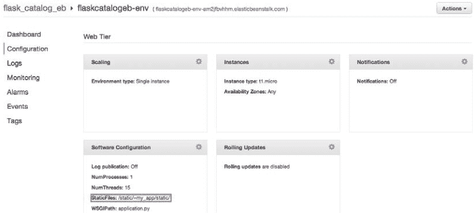
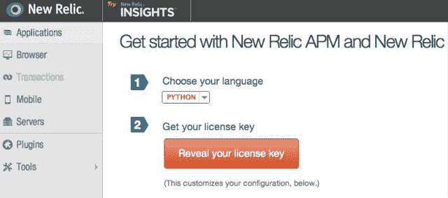

# 第十一章：部署

现在，我们已经知道了如何使用不同的方法去编写 Flask 应用。部署一个应用和管理部署和开发应用一样重要。有许多部署应用的方式，需要去选择一个最合适的方式。从安全和性能角度来说，合理正确的部署是非常重要的。有许多方式来监控部署之后的应用，其中一些是收费的，也有一些是免费的。根据提供的需求和特性来决定是否使用。

这一章将包含下面小节：

*   使用 Apache 部署
*   使用 uWSGI 和 Nginx 部署
*   使用 Gunicorn 和 Supervisor 部署
*   使用 Tornado 部署
*   使用 Fabric 进行部署
*   S3 文件上传
*   使用 Heroku 部署
*   使用 AWS Elastic Beanstalk 部署
*   使用 Pingdom 监控应用
*   使用 New Relic 进行应用性能管理和监控

## 介绍

这一章，我们将讨论多种应用部署技术和监控技术。
每种工具和技术有它自己的特性。举个例子，给应用添加太多的监控事实证明是对应用的额外负担，对开发者同样如此。相似的，如果不使用监控，会错过未被检测出来的用户错误和引起用户不满。
所以，应该选择恰当的工具，这样才能让生活和谐。
部署监控工具中，我们将讨论 Pingdom 和 New Relic。Sentry 是另一个从开发人员的角度来看,被证明是最有益的工具。我们已经在第十章讨论过它了。

## 使用 Apache 部署

首先，我们将学习怎么使用 Apache 部署 Flask 应用。对于 Python web 应用来说，我将使用 mod_wsgi，它实现了一个简单的 Apache 模块，可以托管（host）任何 Python 应用，也支持 WSGI 接口。

###### 提示

mod_wsgi 不同于 Apache，需要被单独安装。

#### 准备

我们将从商品应用程序开始，对其进行适当的调整，使用 Apache HTTP 服务器部署它。
首先，使得我们的应用可安装，那样我们的应用和所有的依赖都会在 Python 加载路径上。可以使用第一章的 setup.py 脚本完成功能。对于这个应用稍微修改了 script 脚本:

```py
packages=[
    'my_app',
    'my_app.catalog',
],
include_package_data=True,
zip_safe = False, 
```

首先，我们列出了所有需要作为应用程序一部分的安装包。它们每个都需要一个`__init__.py`文件。zip_safe 标记告诉安装者不要将这个应用作为 ZIP 文件进行安装。include_package_data 从相同目录下的 MANIFEST.in 文件里读取内容，包含提到的所有包。MANIFEST.in 看起来像这样：

```py
recursive-include my_app/templates *
recursive-include my_app/static *
recursive-include my_app/translations * 
```

现在，安装应用只需使用下面的命令：

```py
$ python setup.py install 
```

###### 提示

mod_wsgi 的安装跟操作系统有关系。在 Debian 系列系统里安装很简单，使用安装工具即可，比如 apt 或者 aptitude。更多细节，参见`https://code.google.com/p/modwsgi/wiki/InstallationInstructions and https://github.com/GrahamDumpleton/mod_wsgi`。

#### 怎么做

我们需要新建一些文件，第一个是 app.wsgi。这将使我们的应用作为 WSGI 应用进行加载：

```py
activate_this = '<Path to virtualenv>/bin/activate_this.py'
execfile(activate_this, dict(__file__=activate_this))

from my_app import app as application
import sys, logging
logging.basicConfig(stream = sys.stderr) 
```

如果是在 virtualenv 下执行的安装，需要在应用加载前激活虚拟环境。如果是在系统下进行的安装，前两句不需要。然后把 app 对象作为 application 导入。最下面两句是可选的，它们用标准 lgger 进行输出，默认情况下 mod_wsgi 是没开启的。

###### 提示

app 对象需要作为 application 进行导入，因为 mod_wsgi 期望 application 这样的关键字。

接下来是一个配置文件被 Apache HTTP 服务器用来服务应用。这个文件命名为 apache_wsgi.conf:

```py
<VirtualHost *>
        WSGIScriptAlias / <Path to application>/flask_catalog_deployment/app.wsgi
        <Directory <Path to application>/flask_catalog_deployment>
            Order allow,deny
            Allow from all
        </Directory>
</VirtualHost> 
```

前面的代码是 Apache 配置，这个告诉 HTTP 服务器需要加载应用的目录。

最后一步是在 apache2/httpd.conf 文件添加 apache_wsgi.conf 文件的路径，使用服务器运行的时候加载我们的应用：

```py
Include <Path to application>/flask_catalog_deployment/apache_wsgi.conf 
```

#### 原理

使用下面命令重启 Apache 服务器服务：

```py
$ sudo apachectl restart 
```

在浏览器打开`http://127.0.0.1/`会看到应用的主页。任何错误发生的时候可以通过`/var/log/apache2/error_log`（不同操作系统该文件路径不一样）文件查看。

#### 更多

我们可能会发现商品图片可能会失效。为此，需要对应用配置做一个小的修改：

```py
app.config['UPLOAD_FOLDER'] = '<Some static absolutepath>/flask_test_uploads' 
```

我们选择了一个 static 路径，因为我们不希望每次应用修改或安装的时候都进行修改。
现在，包括这个路径到 apache_wsgi.conf 中：

```py
Alias /static/uploads/ "<Some static absolutepath>/flask_test_uploads/"
<Directory "<Some static absolute path>/flask_test_uploads">
    Order allow,deny
    Options Indexes
    Allow from all
    IndexOptions FancyIndexing
</Directory> 
```

之后，安装应用和重启 apachectl。

#### 其他

*   [http://httpd.apache.org/](http://httpd.apache.org/)
*   [https://code.google.com/p/modwsgi/](https://code.google.com/p/modwsgi/)
*   [http://wsgi.readthedocs.org/en/latest/](http://wsgi.readthedocs.org/en/latest/)
*   [https://pythonhosted.org/setuptools/setuptools.html#setting-the-zip-safe-flag](https://pythonhosted.org/setuptools/setuptools.html#setting-the-zip-safe-flag)

## 使用 uWSGI 和 Nginx 部署

对于那些已经知道 uWSGI 和 Nginx 的人来说，没有更多需要解释的了。uWSGI 是和服务器的一个协议，提供了一个完整的 stack 托管服务。Nginx 是一个反向代理和 HTTP 服务器，它非常的轻便，几乎可以处理无限量的请求。Nginx 能够无缝的使用 uWSGI，并为了更好的性能提供了许多底层的优化。

#### 准备

我们将使用上一小节的应用，还有 app.wsgi，setup.py，MANIFEST.ini 文件。同样，上一小节对应用配置文件的修改同样适用于这一小节。

###### 提示

关闭可能在运行的 HTTP 服务器，比如 Apache 等等。

#### 怎么做

首先，需要安装 uWSGI 和 Nginx。在 Debian 发行版比如 Ubuntu 上，安装很容易，可以使用：

```py
# sudo apt-get install nginx
# sudo apt-get install uWSGI 
```

###### 提示

你可以在 virtualenv 里使用 pip install uWSGI 安装 uWSGI。

不同的操作系统，各个软件安装方法不同，需参见各自文档。

确保有一个用于 uWSGI 的文件夹 apps-enabled，这里将放置应用特定的 uWSGI 配置文件。也要确保有一个供 Nginx 使用的 sites-enabled 文件夹，这里放置网站特定的配置文件。通常安装好软件后他们都在/etc/文件下已经存在了。如何没有根据不同操作系统进行相应的创建。

接下来，我们将在应用里创建一个叫做 uwsgi.ini 的文件：

```py
[uwsgi]
http-socket = :9090
plugin = python
wsgi-file = <Path to application>/flask_catalog_deployment/app.wsgi
processes = 3 
```

为了测试 uWSGI 是否正常工作，需运行下面命令：

```py
$ uwsgi --ini uwsgi.ini 
```

前面命令相对于运行下面命令：

```py
$ uwsgi --http-socket :9090 --plugin python --wsgi-file app.wsgi 
```

现在，在浏览器输入`http://127.0.0.1:9090/`。这将打开应用主页。

创建一个软链接到 apps-enabled 文件夹：

```py
$ ln -s <path/to/uwsgi.ini> <path/to/apps-enabled> 
```

在向下继续之前，编辑前面的文件，使用 socket 替换 http-socket。这将协议从 HTTP 改为 uWSGI（更多参见`http://uwsgi-docs.readthedocs.org/en/latest/Protocol.html`）。现在，创建一个新的文件叫做 nginx-wsgi.conf。这包含用于服务应用的 Nginx 配置和静态文件：

```py
location / {
    include uwsgi_params;
    uwsgi_pass 127.0.0.1:9090;
}
location /static/uploads/{
    alias <Some static absolute path>/flask_test_uploads/;
} 
```

前面代码块，uwsgi_pass 指定 uWSGI 服务器需要被映射到的指定位置。
创建一个软连接到 sites-enabled 文件夹：

```py
$ ln -s <path/to/nginx-wsgi.conf> <path/to/sites-enabled> 
```

编辑 nginx.conf 文件（通常位置是/etc/nginx/nginx.conf），增加下面行：

```py
include <path/to/sites-enabled>/*; 
```

做好这些之后，重启 Nginx：

```py
$ sudo nginx -s reload 
```

浏览器输入`http://127.0.0.1/`来看通过 Nginx 和 uWSGI 服务的程序。

###### 提示

这一小节的一些指令会根据操作系统的不同而不同。不同包的安装方法也不一样。

#### 其他

*   了解更多 uWSGI，参见`http://uwsgi-docs.readthedocs.org/en/latest/`。
*   了解更多 Nginx，参见`http://nginx.com/`
*   DigitalOcean 写了一篇很好的文章关于这个话题。参见`https://www.digitalocean.com/community/tutorials/how-to-deploy-python-wsgi-applications-using-uwsgi-web-server-with-nginx`
*   了解 Apache 和 Nginx 的不同，参见 Anturis 的文章，`https://anturis.com/blog/nginx-vs-apache/`

## 使用 Gunicorn 和 Supervisor 部署

Gunicorn 是一个为了 Unix 的 WSGI HTTP 的服务器。它非常的轻便，快速。它的简单性在于它与各种 web 框架的广泛兼容性。
Supervisor 是一个监控工具能够控制各种进程，处理这些进程的启动，并且在这些进程异常退出的时候重启它们。它能够被扩展到使用 XML-RPC API 控制远程位置上的程序，而不用登录远程服务器（我们不会在这里讨论这，因为已经超出了本书的范围）。
需要记住的一件事是这些工具能够和之前章节提到的工具比如 Nginx 一起配合。

#### 准备

我们将从 gunicorn 和 supervisor 安装开始：

```py
$ pip install gunicorn
$ pip install supervisor 
```

#### 怎么做

检查 gunicorn 是否正常工作，需在应用文件夹里运行下面命令：

```py
$ gunicorn -w 4 -b 127.0.0.1:8000 my_app:app 
```

之后，在浏览器输入`http://127.0.0.1:8000/`可以看到应用的主页。
现在需要使用 Supervisor 去做相同的事情，让应用作为后台进程运行，这将让 Supervisor 自身控制进程而不是人为控制。首先，需要一个 Supervisor 配置文件。在 virtualenv 里运行下面命令可以获得配置文件。Supervisor 通常会寻找 etc 文件夹，里面存在一个 supervisord.conf 文件。在系统层面的安装下，这个文件夹是/etc，但在 virtualenv 里，会在 virtualenv 里寻找 etc，然后返回到/etc/：

```py
$ echo_supervisord_conf > etc/supervisord.conf 
```

###### 提示

echo_supervisord_conf 是由 Supervisor 提供的，它向特定位置输出一个配置文件。

下面命令将会在 etc 文件夹里创建一个叫做 supervisord.conf 的文件。在这个文件里添加下面代码块：

```py
[program:flask_catalog]
command=<path/to/virtualenv>/bin/gunicorn -w 4 -b 127.0.0.1:8000 my_
app:app
directory=<path/to/virtualenv>/flask_catalog_deployment
user=someuser # Relevant user
autostart=true
autorestart=true
stdout_logfile=/tmp/app.log
stderr_logfile=/tmp/error.log 
```

###### 提示

注意不应该使用 root 权限去运行这个应用。当应用程序崩溃时是一个巨大的安全漏洞，可能会伤害操作系统本身。

#### 原理

现在运行下面命令：

```py
$ supervisord
$ supervisorctl status
flask_catalog RUNNING pid 40466, uptime 0:00:03 
```

第一个命令启动 supervisord 服务器，接下来查看所有进程的状态。

###### 提示

这一小节提到的工具可以和 Nginx 配合，其中 Ninx 作为代理服务器。建议你自己尝试一下。
每次当修改应用的时候，都需要重启 Gunicorn，以便让这些修改生效，运行下面命令：

```py
$ supervisorctl restart all 
```

你可以重启特定程序而不是所有：

```py
$ supervisorctl restart flask_catalog 
```

#### 其他

*   [http://gunicorn-docs.readthedocs.org/en/latest/index.html](http://gunicorn-docs.readthedocs.org/en/latest/index.html)
*   [http://supervisord.org/index.html](http://supervisord.org/index.html)

## 使用 Tornado 部署

Tornado 是一个完整的 web 框架，它本身也是一个 web 服务器。这里，我们将使用 Flask 去创建应用，包含一个基本的 URL 路由和模板，服务器部分由 Tornado 完成。Tornado 是为了支持上千的并发请求而创建的。

###### 提示

Tornado 在配合使用 WSGI 应用的时候会存在一些限制。所以慎重选择。阅读更多，参见`http://www.tornadoweb.org/en/stable/wsgi.html#running-wsgi-apps-on-tornado-servers`。

#### 准备

安装 Tornado 使用：

```py
$ pip install tornado 
```

#### 怎么做

接下来，创建一个叫做 tornado_server.py 的文件，填写下面的内容：

```py
from tornado.wsgi import WSGIContainer
from tornado.httpserver import HTTPServer
from tornado.ioloop import IOLoop
from my_app import app

http_server = HTTPServer(WSGIContainer(app))
http_server.listen(5000)
IOLoop.instance().start() 
```

这里，我们为应用创建了一个 WSGT 容器；这个容器被用来创建一个 HTTP 服务器，端口是 5000。

#### 原理

使用下面命令运行前一小节创建的 Python 文件：

```py
$ python tornado_server.py 
```

浏览器输入`http://127.0.0.1:5000/`可以看见主页。

###### 提示

Tornado 可以和 Nginx（作为代理服务器），Supervisor（进程管理）一起使用为了最好的效果。这留给你们自己完成。

## 使用 Fabric 进行部署

Fabric 是 Python 的一个命令行工具；它简化了使用 SSH 部署应用或系统管理任务的过程。同时它允许执行远程服务器的 shell 命令，使得部署简化了，因为所有操作现在可以被压缩到一个 Python 文件里，在需要的时候运行即可。因此，它减轻了每次都得登录进服务器然后手动输入命令行升级程序的痛苦。

#### 准备

安装 Fabric：

```py
$ pip install fabric 
```

我们将使用上一小节的应用。创建一个 Fabric 文件对远程服务器进行部署。

相似的，假设远程服务器已经创建好了，所有 virtualenv 环境里的依赖包都安装好了。

#### 怎么做

首先在应用里创建一个叫做 fabfile.py 的文件， 最好在应用根目录下，即和 setup.py，run.py 同一层目录。Fabric 通常期望文件的名字是 fabfile.py。如果使用了一个不同的名字，在执行的时候需要明确的指定。
一个基本的 Fabric 文件看起来像这样：

```py
from fabric.api import sudo, cd, prefix, run

def deploy_app():
    "Deploy to the server specified"
    root_path = '/usr/local/my_env'
    with cd(root_path):
        with prefix("source %s/bin/activate" % root_path):
            with cd('flask_catalog_deployment'):
                run('git pull')
                run('python setup.py install')
            sudo('bin/supervisorctl restart all') 
```

这里，首先进入 virtualenv，然后使能它，然后进入应用程序。然后从 Git 导入代码，然后使用 setup.py install 更新应用。之后，重启 supervisor 进行，这样修改可以生效。

###### 提示

这里使用的大多数命令是很简单的。除了 prefix，它将后续所有的命令封装在它的块中。这意味着，先激活 virtualenv，然后在 with 块中所有的命令将会在 virtualenv 激活状态下运行的。在离开 with 块的时候，会离开 virtualenv 环境。

#### 原理

运行这个文件，需要提供脚本所要执行的远程服务器。所以命令看起来是：

```py
$ fab -H my.remote.server deploy_app 
```

#### 更多

我们可以在 fab 脚本里指定远程地址，这可能是个好主意。因为部署服务器在大多数情况下是相同的。
为了做到这些，fab 脚本看起来像这样：

```py
from fabric.api import settings

def deploy_app_to_server():
    "Deploy to the server hardcoded"
    with settings(host_string='my.remote.server'):
        deploy_app() 
```

这里，我们硬编码了 host 然后调用了之前创建好的方法进行部署。

## S3 文件上传

Amazon 将 S3 解释为存储，是为了让开发者使用大规模的计算更容易。S3 通过 web 接口提供了一个非常简单的接口，这使得存储和在大量数据里的检索变得简单。直到现在，在我们的商品目录应用中，我们看到在创建商品过程中图片管理存在问题。如果这些图像存储在某个地方，并且可以从任何地方访问，这些问题将消失。我们将使用 S3 解决这个问题。

#### 准备

Amazon 提供 boto，一个完整的 Python 库，提供了和 Amazon Web Service 之间的接口。大部分的 AWS 特性可以使用 boto 完成。安装 boto：

```py
$ pip install boto 
```

#### 怎么做

现在对已经存在的商品目录程序做一些修改，来使用 S3 上传文件。
首先，做配置，来允许 boto 访问 S3。在应用配置文件里增加下面语句，即，`my_app/__init__.py`：

```py
app.config['AWS_ACCESS_KEY'] = 'Amazon Access Key'
app.config['AWS_SECRET_KEY'] = 'Amazon Secret Key'
app.config['AWS_BUCKET'] = 'flask-cookbook' 
```

接下来，对 views.py 文件做些修改：

```py
from boto.s3.connection import S3Connection 
```

上面从 boto 导入了需要的东西。接下来，替换 create_product()里面的两行：

```py
filename = secure_filename(image.filename)
image.save(os.path.join(app.config['UPLOAD_FOLDER'], filename)) 
```

使用下面这些替换这两行：

```py
filename = image.filename
conn = S3Connection(
    app.config['AWS_ACCESS_KEY'], app.config['AWS_SECRET_KEY']
)
bucket = conn.create_bucket(app.config['AWS_BUCKET'])
key = bucket.new_key(filename)
key.set_contents_from_file(image)
key.make_public()
key.set_metadata(
    'Content-Type', 'image/' + filename.split('.')[-1].lower()
) 
```

最后需要修改 product.html，这里修改图片 src 路径。使用下面语句提供之前的 img src:

```py
 
```

#### 原理

现在，像平常一样运行这个应用，然后创建一个商品。当创建好的商品进行渲染时，商品图像会花一点时间才出来，因为现在图片是由 S3 提供的（而不是本地机器）。如果出现这个现象，说明 S3 集成成功了。

## 使用 Heroku 部署

Heroku 是一个云应用平台，提供了一个简单的快速的方式去构建和部署 web 应用。Heroku 管理服务器，部署，和开发者开发应用时的操作。使用 Heroku toolbelt 来部署 Heroku 是相当简单。

#### 准备

我们将使用上一小节的应用。
第一步需下载 Heroku toolbelt，可以通过`https://toolbelt.heroku.com/`下载。
一旦 toolbelt 被安装了，就可以在终端中使用一系列命令了。我们在这一小节后面会见到。

###### 提示

建议使用一个新的 virtualenv 执行 Heroku 部署，以便为应用只安装需要的包。这将使得部署应用更快更容易。

现在，运行下面命令登录 Heroku 账户，并且和服务器同步 SSH key：

```py
$ heroku login
Enter your Heroku credentials.
Email: shalabh7777@gmail.com
Password (typing will be hidden):
Authentication successful. 
```

如果不存在，将提示您创建新的 SSH 密钥。根据具体情况进行操作。

#### 怎么做

现在，我们已经有了一个需要被部署到 Heroku 的应用了。首先，Heroku 需要知道部署时候需要运行的命令 。在 Procfile 里面添加下面内容：

```py
web: gunicorn -w 4 my_app:app 
```

这里，我们将告诉 Heroku 去运行这个命令来启动应用。

###### 提示

Profile 里面还可以做很多许多其他的配置和命令。更多细节，参见 Heroku 文档。

Heroku 需要知道需要被安装的依赖包。通过 requirements.txt 文件完成：

```py
Flask==0.10.1
Flask-Restless==0.14.0
Flask-SQLAlchemy==1.0
Flask-WTF==0.10.0
Jinja2==2.7.3
MarkupSafe==0.23
SQLAlchemy==0.9.7
WTForms==2.0.1
Werkzeug==0.9.6
boto==2.32.1
gunicorn==19.1.1
itsdangerous==0.24
mimerender==0.5.4
python-dateutil==2.2
python-geoip==1.2
python-geoip-geolite2==2014.0207
python-mimeparse==0.1.4
six==1.7.3
wsgiref==0.1.2 
```

这个文件包含应用所有的依赖，还有依赖的依赖。产生这个文件的一个简单方式是使用下面命令：

```py
$ pip freeze > requirements.txt 
```

这将用 virtualenv 里被安装的所有包来创建/更新 requirements.txt 文件。
现在，需要创建应用的 Git 仓库。为此，需运行下面命令：

```py
$ git init
$ git add .
$ git commit -m "First Commit" 
```

现在，有了一个 Git 仓库，并且添加了所有的文件。

###### 提示

确保在仓库里有一个.gitignore 文件来保证不添加临时文件比如.pyc 到仓库里。

现在，创建一个 Heroku 应用，然后添加应用到 Heroku：

```py
$ heroku create
Creating damp-tor-6795... done, stack is cedar
http://damp-tor-6795.herokuapp.com/ | git@heroku.com:damp-tor-6795.git
Git remote heroku added
$ git push heroku master 
```

最后一个命令之后，许多东西会打印在终端上。这些表面了所有正在安装的包和最终启动的应用程序。

#### 原理

在前面命令成功完成之后，仅仅需要在浏览器打开部署最后 Heroku 提供的 URL 或者运行下面命令：

```py
$ heroku open 
```

这将打开应用主页。尝试创建一个新的商品并上传图片，之后会看到由 Amazon S3 提供的图片了。
为了看到应用的日志，运行下面命令：

```py
$ heroku logs 
```

#### 更多

我们刚刚做的部署有一个小故障。每次通过 git push 命令更新部署时，SQLite 都会被重写。解决办法是使用 Heroku 提供的 Postgres。建议你们自己去做一下。

## 使用 AWS Elastic Beanstalk 部署

上一小节，我们看到如何将应用部署到服务器，使用 Heroku 是很容易做到这个的。相似的，Amazon 有一个服务叫做 Elastic Beanstalk，允许开发者很容易的部署他们的应用到 Amazon EC2。仅仅需要一些配置，一个 Flask 应用使用 Elastic Beanstalk 就可以在几分钟类就部署到 AWS。

#### 准备

我们将使用上一小节的应用。唯一保持一样的文件是 requirement.txt。上一小节其余添加的文件就可以被忽略，这一小节不会用到。

现在，首先要做的是从 Amazon 网站下载 AWS Elastic Beanstalk 命令行工具库。地址是`http://aws.amazon.com/code/6752709412171743`。这将下载一个 ZIP 包，需要进行解压然后放置在适当的位置。
这个工具的路径应该被添加进环境变量 PATH 中，这样这个命令才可以全局使用。这个可以通过 export 命令实现：

```py
$ export PATH=$PATH:<path to unzipped EB CLI package>/eb/linux/python2.7/ 
```

同样需要添加路径到~/.profile 或者~./bash_profile 文件：

```py
$ export PATH=$PATH:<path to unzipped EB CLI package>/eb/linux/python2.7/ 
```

#### 怎么做

使用 Beanstalk 进行部署时，有一些惯例需要去遵守。Beanstalk 假设存在一个文件叫做 application.py，它包含了应用对象（我们的例子中就是 app 对象）。Beanstalk 把这个文件视为 WSGI 文件，它将用在部署中。

###### 提示

在使用 Apache 部署一节中，有一个文件叫做 app.wsgi，在这个文件中我们导入 app 对象为 application，因为 apache/mod_wsgi 需要这样做。Amazon 也需要这样做，因为通常情况下，Amazon 背后使用的是 Apache 进行的部署。

application.py 文件内容看起来像这样：

```py
from my_app import app as application
import sys, logging
logging.basicConfig(stream = sys.stderr) 
```

现在，在应用里创建一个 Git 仓库，提交这些文件：

```py
$ git init
$ git add .
$ git commit -m "First Commit" 
```

###### 提示

确保在仓库里有一个.gitignore 文件，防止添加临时文件进仓库，比如.pyc。
现在需要到 Elastic Beanstalk 运行下面命令：

```py
$ eb init 
```

前面命令表示初始化 Elastic Beanstalk 实例。为了创建 EC2 实例，它将要求 AWS 凭据以及其他许多配置选项，这些可以根据需要进行选择。更多细节参见`http://docs.aws.amazon.com/elasticbeanstalk/latest/dg/create_deploy_Python_flask.html`。

做完这些之后，运行下面命令触发服务器的创建，然后部署应用：

```py
$ eb start 
```

###### 提示

上面命令背后的事情是，先创建了 EC2 实例(一卷)，分配一个弹性 IP，然后运行下面命令将我们的应用程序 push 到新创建的服务器，以便进行部署: $ git aws.push

这将花一点时间完成。当完成的时候，你可以使用下面命令检查应用的状态：

```py
$ eb status –verbose 
```

当需要升级应用的时候，仅仅需要使用 git 提交修改，然后使用 push:

```py
$ git aws.push 
```

#### 原理

当部署进程完成的时候，它会给你一个应用 URL。在浏览器输入 URL，就可以看见应用了。
然后你会发现一些问题。静态文件比如 CSS，JS 工作不正常。这是因为 Beanstalk 里的 static 路径没有配置正确。这可以通过 AWS 管理控制台里的应用监控/配置页面修改应用配置进行修复。看下面截图进行更好的理解：


点击左边选项中的 Configuration 选项。



注意到前面截屏中高亮的部分。这是每个应用中需要改变的地方。打开 Software Settings。


修改 virtual path 的/static/，如上图截屏所示。

在这些修改完成之后，Elastic Beanstalk 创建的环境会自动更新，将花一点时间。当处理结束的时候，再一次检查应用看 static 文件是否正确工作了。

## 使用 Pingdom 监控应用

Pingdom 是一个网站监控工具，当你网站宕机的时候能够快速通知你。这个工具背后的思想是每一个间隔 ping 一下网站，比如 30s。如果 ping 失败了，它将通过 e-mail，SMS 等通知你。它将保持一个更快的频率来 ping 网站，直到网站恢复。还有其他一些监控特性，但这里我们会不涉及。

#### 准备

因为 Pingdom 是一个 Saa 服务，第一步得注册一个账号。Pingdom 提供了一个月的免费试用，如果你想尝试的话。网站是：`https://www.pingdom.com`。
我们使用上一小节的应用做演示。

#### 怎么做

成功注册之后，创建一个时间检查。看一下下面的截图：


如你所见，我已经为 AWS 实例添加了一个检查。为了创建一个新的检查，点击 ADD NEW 按钮。填写弹出来的表单。

#### 原理

在成功创建检查之后，有意的在代码里引发一个错误来破坏应用，然后部署到 AWS。当有错误的应用部署的时候，你将收到一封邮件。邮件看起来像这样：


一旦，你的应用修复了，然后重新部署了，下一封邮件将看起来像这样：


## 使用 New Relic 进行应用性能管理和监控

New Relic 是一个分析软件，提供了接近实时的操作和应用分析。它提供了应用各个方面的分析。它可以完成分析器的工作。事实上工作起来的情形是，我们的应用发送数据给 New Relic，而不是 New Relic 向我们应用请求分析。

#### 准备

我们将使用上一小节的应用，使用 AWS 部署的。
第一步注册 New Relic 账号。在简单注册流程和邮件验证完成后，将登陆主页。这里，可以显示 license key，这会用来连接应用到这个账户。主页看起来像这样：



这里点击 Reveal your license key。

#### 怎么做

一旦你获得了 license key，我们需要去安装 newrelic 库：

```py
$ pip install newrelic 
```

现在，需要产生一个叫做 newrelic.ini 的文件，它将包含关于许可密钥，我们的应用程序的名称，等等这些细节。使用下面命令完成：

```py
$ newrelic-admin generate-config LICENSE-KEY newrelic.ini 
```

前面命令中，用你账户真实的 license key 替换 LICENSE-KEY。现在有了一个新的文件叫做 newrelic.ini。打开并进行编辑应用的名字或其他东西。

为了验证 newrelic.ini 是否可用正常使用，运行下面命令：

```py
$ newrelic-admin validate-config newrelic.ini 
```

这将告诉我们验证是否成功。如果不，检查 license key 是否正确。

现在，在应用配置文件`my_app/__init__.py`最上面添加下面几行。确保下面几行添加在其他行之前：

```py
import newrelic.agent
newrelic.agent.initialize('newrelic.ini') 
```

现在，需要更新 requirements.txt 文件。运行下面命令：

```py
$ pip freeze > requirements.txt 
```

之后，提交修改，然后部署到应用到 AWS 使用下面命令：

```py
$ git aws.push 
```

#### 原理

一旦你的应用成果部署到 AWS，它将发送分析数据到 New Relic，并且主页有了一个新的应用可以添加。


打开应用分析页面，大量的统计数据将会出现。它还将显示哪些调用花费了最长的时间，以及应用是如何处理的。你同样可以看到多个选项卡对应于不同类型的监控。