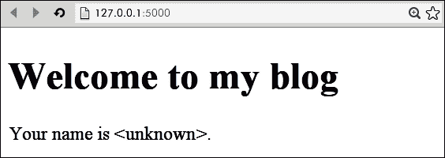
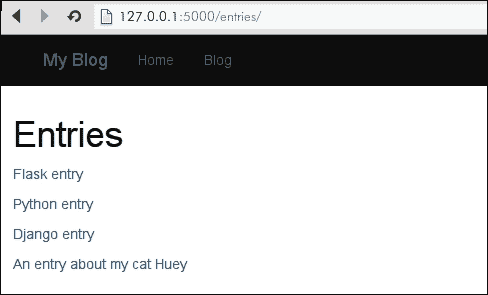
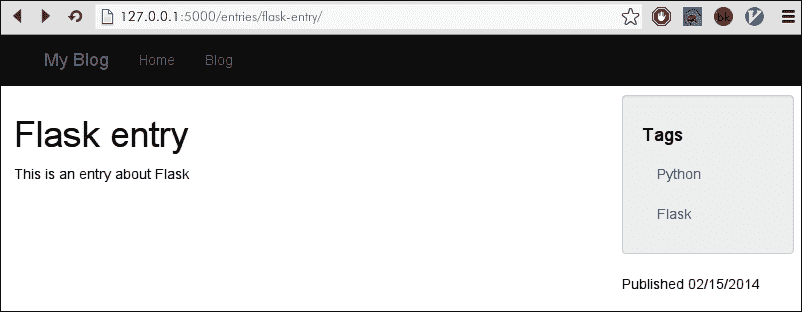
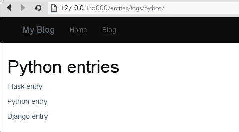
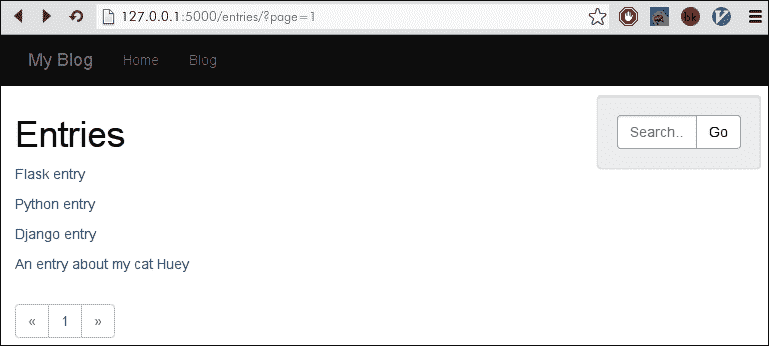

# 第三章。模板和视图

这一章也可以被称为*Flask 章节*，因为我们将涵盖框架中最具代表性的两个组件：Jinja2 模板语言和 URL 路由框架。到目前为止，我们一直在为博客应用奠定基础，但实际上我们几乎没有涉及到 Flask 的开发。在这一章中，我们将深入了解 Flask，并看到我们的应用最终开始成形。我们将把单调的数据库模型转换为动态呈现的 HTML 页面，使用模板。我们将设计一个 URL 方案，反映我们希望组织博客条目的方式。随着我们在本章的进展，我们的博客应用将开始看起来像一个真正的网站。

在本章中，我们将：

+   学习如何使用 Jinja2 呈现 HTML 模板

+   学习如何使用 Jinja2 模板语言提供的循环、控制结构和过滤器

+   使用模板继承来消除重复的编码

+   为我们的博客应用创建一个清晰的 URL 方案，并设置从 URL 到视图的路由

+   使用 Jinja2 模板呈现博客条目列表

+   为网站添加全文搜索

# 介绍 Jinja2

Jinja2 是一个快速、灵活和安全的模板引擎。它允许您将网站定义为小块，这些小块被拼凑在一起形成完整的页面。例如，在我们的博客中，我们将为标题、侧边栏、页脚以及用于呈现博客文章的模板创建块。这种方法是 DRY（不要重复自己），这意味着每个块中包含的标记不应该被复制或粘贴到其他地方。由于站点的每个部分的 HTML 只存在于一个地方，因此更改和修复错误变得更容易。Jinja2 还允许您在模板中嵌入显示逻辑。例如，我们可能希望向已登录的用户显示注销按钮，但向匿名浏览的用户显示登录表单。正如您将看到的，使用一些模板逻辑来实现这些类型的事情非常容易。

从一开始，Flask 就是以 Jinja2 为核心构建的，因此在 Flask 应用中使用模板非常容易。由于 Jinja2 是 Flask 框架的要求，它已经安装在我们的虚拟环境中，所以我们可以立即开始使用。

在博客项目的`app`目录中创建一个名为`templates`的新文件夹。在模板文件夹中创建一个名为`homepage.html`的单个文件，并添加以下 HTML 代码：

```py
<!doctype html>
<html>
  <head>
    <title>Blog</title>
  </head>
  <body>
    <h1>Welcome to my blog</h1>
  </body>
</html>
```

现在在博客项目的`app`目录中打开`views.py`。我们将修改我们的`homepage`视图以呈现新的`homepage.html`模板。为此，我们将使用 Flask 的`render_template()`函数，将我们的模板名称作为第一个参数传递进去。呈现模板是一个非常常见的操作，所以 Flask 尽可能地简化了这部分内容：

```py
from flask import render_template

from app import app

@app.route('/')
def homepage():
    return render_template('homepage.html')
```

使用我们在上一章中创建的`manage.py`助手，启动开发服务器并导航到`http://127.0.0.1:5000/`以查看呈现的模板，如下面的屏幕截图所示：

```py
(blog) $ python manage.py runserver
* Running on http://127.0.0.1:5000/
* Restarting with reloader

```


## 基本的模板操作

前面的例子可能看起来并不那么令人印象深刻，因为我们所做的不过是提供一个简单的 HTML 文档。为了使事情变得有趣，我们需要给我们的模板提供上下文。让我们修改我们的主页，显示一个简单的问候语来说明这一点。打开`views.py`并进行以下修改：

```py
from flask import render_template, request

from app import app

@app.route('/')
def homepage():
    name = request.args.get('name')
 if not name:
 name = '<unknown>'
    return render_template('homepage.html', name=name)
```

在视图代码中，我们将`name`传递到模板上下文中。下一步是在实际模板中对`name`做一些操作。在这个例子中，我们将简单地打印`name`的值。打开`homepage.html`并进行以下添加：

```py
<!doctype html>
<html>
  <head>
    <title>Blog</title>
  </head>
  <body>
    <h1>Welcome to my blog</h1>
    <p>Your name is {{ name }}.</p>
  </body>
</html>
```

启动开发服务器并导航到根 URL。你应该看到类似下面图片的东西：



传递给`render_template`函数的任何关键字参数都可以在模板上下文中使用。在 Jinja2 的模板语言中，双大括号类似于`print`语句。我们使用`{{ name }}`操作来输出`name`的值，该值设置为`<unknown>`。

### 提示

注重安全的读者可能已经注意到，当我们在浏览器中查看我们的模板时，括号被转义了。通常，括号被浏览器视为 HTML 标记，但是如您所见，Jinja2 已经自动转义了括号，用`&lt;`和`&gt;`替换了它们。

尝试导航到诸如`http://127.0.0.1:5000/?name=Charlie`之类的 URL。无论您指定什么值，Jinja2 都会自动为我们呈现，如下图所示

基本模板操作

假设有人恶意访问您的网站并想要制造一些麻烦。注意到查询字符串中的值直接传递到模板中，这个人决定尝试注入一个脚本标记来玩一些恶作剧。幸运的是，Jinja2 在将值插入渲染页面之前会自动转义这些值。

基本模板操作

## 循环、控制结构和模板编程

Jinja2 支持一种微型编程语言，可用于在上下文中对数据执行操作。如果我们只能将值打印到上下文中，那么实际上就没有太多令人兴奋的事情了。当我们将上下文数据与循环和控制结构等内容结合在一起时，事情就变得有趣起来了。

让我们再次修改我们的主页视图。这次我们将从`request.args`中接受一个数字，以及一个名称，并显示 0 到该数字之间的所有偶数。好处是我们几乎可以在模板中完成所有这些工作。对`views.py`进行以下更改：

```py
from flask import render_template, request

from app import app

@app.route('/')
def homepage():
    name = request.args.get('name')
 number = request.args.get('number')
 return render_template('homepage.html', name=name, number=number)

```

现在打开`hompage.html`模板并添加以下代码。如果看起来奇怪，不用担心。我们将逐行讲解。

```py
<!doctype html>
<html>
  <head>
    <title>Blog</title>
  </head>
  <body>
    <h1>Welcome to my blog</h1>
    
 <p>Your number is {{ number|int }}</p>
 <ul>
 
 
 <li>{{ i }}</li>
 
 
 </ul>
 
 <p>No number specified.</p>
 

    <p>Your name is {{ name|default('<unknown>', True) }}.</p>
  </body>
</html>
```

启动 runserver 并通过查询字符串传递一些值进行实验。还要注意当传递非数字值或负值时会发生什么。

循环、控制结构和模板编程

让我们逐行讲解我们的新模板代码，从``语句开始。与使用双大括号的打印标记不同，逻辑标记使用``。我们只是检查上下文中是否传递了一个数字。如果数字是`None`或空字符串，则此测试将失败，就像在 Python 中一样。

下一行打印了我们数字的整数表示，并使用了一个新的语法`|int`。竖线符号（`|`）在 Jinja2 中用于表示对过滤器的调用。**过滤器**对位于竖线符号左侧的值执行某种操作，并返回一个新值。在这种情况下，我们使用了内置的`int`过滤器，将字符串转换为整数，在无法确定数字时默认为`0`。Jinja2 内置了许多过滤器；我们将在本章后面讨论它们。

``语句用于创建一个*for*循环，看起来非常接近 Python。我们使用 Jinja2 的`range`辅助函数生成一个数字序列`[0，number)`。请注意，我们再次通过`int`过滤器在调用`range`时将`number`上下文值传递给`range`。还要注意，我们将一个值赋给一个新的上下文变量`i`。在循环体内，我们可以像使用任何其他上下文变量一样使用`i`。

### 提示

当然，就像在普通的 Python 中一样，我们也可以在 for 循环上使用``语句，用于在没有要执行的循环时运行一些代码。

现在我们正在循环遍历数字，我们需要检查`i`是否为偶数，如果是，则打印出来。Jinja2 提供了几种方法可以做到这一点，但我选择展示了一种名为**tests**的 Jinja2 特性的使用。与过滤器和控制结构一样，Jinja2 还提供了许多有用的工具来测试上下文值的属性。测试与``语句一起使用，并通过关键字`is`表示。因此，我们有``，这非常容易阅读。如果`if`语句评估为`True`，那么我们将使用双大括号打印`i`的值：`{{ i }}`。

### 提示

Jinja2 提供了许多有用的测试；要了解更多，请查阅项目文档[`jinja.pocoo.org/docs/templates/#tests`](http://jinja.pocoo.org/docs/templates/#tests)。

由于 Jinja2 不知道重要的空格，我们需要明确关闭所有逻辑标记。这就是为什么您看到了一个``标记，表示`divisibleby 2`检查的关闭，以及一个``标记，表示`for i in range`循环的关闭。在`for`循环之后，我们现在处于最外层的`if`语句中，该语句测试是否将数字传递到上下文中。如果没有数字存在，我们希望向用户显示一条消息，因此在调用``之前，我们将使用``标记来显示此消息。

最后，我们已将打印向用户问候语的行更改为`{{ name|default('<unknown>', True) }}`。在视图代码中，我们删除了将其设置为默认值`<unknown>`的逻辑。相反，我们将该逻辑移到了模板中。在这里，我们看到了`default`过滤器（由`|`字符表示），但与`int`不同的是，我们传递了多个参数。在 Jinja2 中，过滤器可以接受多个参数。按照惯例，第一个参数出现在管道符号的左侧，因为过滤器经常操作单个值。如果有多个参数，则这些参数在过滤器名称之后的括号中指定。在`default`过滤器的情况下，我们已指定在未指定名称时使用的值。

## Jinja2 内置过滤器

在前面的示例中，我们看到了如何使用`int`过滤器将上下文值强制转换为整数。除了`int`之外，Jinja2 还提供了大量有用的内置过滤器。出于空间原因（列表非常长），我只包含了我经验中最常用的过滤器，但整个列表可以在网上找到[`jinja.pocoo.org/docs/templates/#list-of-builtin-filters`](http://jinja.pocoo.org/docs/templates/#list-of-builtin-filters)。

### 提示

在以下示例中，参数列表中的第一个参数将出现在管道符号的左侧。因此，即使我写了`abs(number)`，使用的过滤器将是`number|abs`。当过滤器接受多个参数时，剩余的参数将在过滤器名称后的括号中显示。

| 过滤器和参数 | 描述和返回值 |
| --- | --- |
| abs(number) | 返回数字的绝对值。 |

| default(value, default_value='', boolean=False) | 如果`value`未定义（即上下文中不存在该名称），则使用提供的`default_value`。如果您只想测试`value`是否评估为布尔值`True`（即不是空字符串，数字零，None 等），则将第三个参数传递为`True`：

```py
{{ not_in_context&#124;default:"The value was not in the context" }}

{{ ''&#124;default('An empty string.', True) }}
```

|

| dictsort(value, case_sensitive=False, by='key') | 按键对字典进行排序，产生`(key, value)`对。但您也可以按值排序。

```py
<p>Alphabetically by name.</p>

    {{ name }} is {{ age }} years old.


<p>Youngest to oldest.</p>

    {{ name }} is {{ age }} years old.

```

|

| int(value, default=0) | 将`value`转换为整数。如果无法转换该值，则使用指定的默认值。 |
| --- | --- |
| length(object) | 返回集合中的项目数。 |
| reverse(sequence) | 反转序列。 |

| safe(value) | 输出未转义的值。当您有信任的 HTML 希望打印时，此过滤器非常有用。例如，如果 `value = "<b>"`：

```py
{{ value }} --> outputs &lt;b&gt;

{{ value&#124;safe }} --> outputs <b>
```

|

| sort(value, reverse=False, case_sensitive=False, attribute=None) | 对可迭代的值进行排序。如果指定了 `reverse`，则项目将以相反顺序排序。如果使用了 `attribute` 参数，该属性将被视为排序的值。 |
| --- | --- |
| striptags(value) | 删除任何 HTML 标签，用于清理和输出不受信任的用户输入。 |
| truncate(value, length=255, killwords=False, end='...') | 返回字符串的截断副本。长度参数指定要保留多少个字符。如果`killwords`为`False`，则一个单词可能会被切成一半；如果为`True`，则 Jinja2 将在前一个单词边界截断。如果值超过长度并且需要被截断，将自动附加`end`中的值。 |
| urlize(value, trim_url_limit=None, nofollow=False, target=None) | 将纯文本中的 URL 转换为可点击的链接。 |

### 提示

过滤器可以链接在一起，所以`{{ number|int|abs }}`首先将数字变量转换为整数，然后返回其绝对值。

# 为博客创建一个基础模板

Jinja2 的继承和包含功能使得定义一个基础模板成为站点上每个页面的架构基础非常容易。基础模板包含一些基本结构，如`<html>`、`<head>`和`<body>`标签，以及 body 的基本结构。它还可以用于包含样式表或脚本，这些样式表或脚本将在每个页面上提供。最重要的是，基础模板负责定义可覆盖的块，我们将在其中放置特定于页面的内容，如页面标题和正文内容。

为了快速启动，我们将使用 Twitter 的 Bootstrap 库（版本 3）。这将使我们能够专注于模板的结构，并且只需进行最少的额外工作就能拥有一个看起来不错的网站。当然，如果您愿意，也可以使用自己的 CSS，但示例代码将使用特定于 bootstrap 的结构。

在`templates`目录中创建一个名为`base.html`的新文件，并添加以下内容：

```py
<!DOCTYPE html>
<html lang="en">
  <head>
    <meta charset="utf-8">
    <title> | My Blog</title>
    <link rel="stylesheet" href="//netdna.bootstrapcdn.com/bootstrap/3.1.0/css/bootstrap.min.css">
    <style type="text/css">
      body { padding-top: 60px; }
    </style>
    

    <script src="img/jquery-1.10.2.min.js"></script>
    <script src="img/bootstrap.min.js"></script>
    
  </head>

  <body class="">
    <div class="navbar navbar-inverse navbar-fixed-top" role="navigation">
      <div class="container">
        <div class="navbar-header">
          <button type="button" class="navbar-toggle" data-toggle="collapse" data-target=".navbar-collapse">
            <span class="sr-only">Toggle navigation</span>
            <span class="icon-bar"></span>
            <span class="icon-bar"></span>
            <span class="icon-bar"></span>
          </button>
          <a class="navbar-brand" href="#">My Blog</a>
        </div>
        <div class="collapse navbar-collapse">
          <ul class="nav navbar-nav">
            <li><a href="/">Home</a></li>
            
          </ul>
        </div>
      </div>
    </div>
    <div class="container">
      <div class="row">
        <div class="col-md-9">
          <h1></h1>
          
          
        </div>
        <div class="col-md-3">
          
          <ul class="well nav nav-stacked">
            <li><a href="#">Sidebar item</a></li>
          </ul>
          
        </div>
      </div>
      <div class="row">
        <hr />
        <footer>
          <p>&copy; your name</p>
        </footer>
      </div>
    </div>
  </body>
</html>
```

在标记中夹杂着一个新的 Jinja2 标签`block`。`block`标签用于指示页面的可覆盖区域。

您可能已经注意到我们正在从公开可用的 URL 中提供 jQuery 和 Bootstrap。在下一章中，我们将讨论如何提供存储在本地磁盘上的静态文件。现在我们可以修改我们的主页模板，并利用新的基础模板。我们可以通过扩展基础模板并覆盖某些块来实现这一点。这与大多数语言中的类继承非常相似。只要继承页面的部分被很好地分成块，我们就可以只覆盖需要更改的部分。让我们打开`homepage.html`，并用以下内容替换当前内容的一部分：

```py


Welcome to my blog


  
    <p>Your number is {{ number|int }}</p>
    <ul>
      
        
          <li>{{ i }}</li>
        
      
    </ul>
  
    <p>No number specified.</p>
  

  <p>Your name is {{ name|default('<unknown>', True) }}.</p>

```

通过扩展原始页面，我们已经删除了所有 HTML 样板和大量复杂性，只关注于使这个页面，我们的主页视图，独特的部分。启动服务器并导航到`http://127.0.0.1:5000/`，您会看到我们的主页已经改变了。


恭喜！您现在已经学会了 Jinja2 最常用的一些功能。还有许多更高级的功能我们没有在时间允许的情况下涵盖，我建议阅读项目的文档，以了解 Jinja2 的全部可能性。文档可以在[`jinja.pocoo.org/docs/`](http://jinja.pocoo.org/docs/)找到。

我们仍然需要构建模板来显示我们的博客条目。但在继续构建模板之前，我们首先必须创建一些视图函数，这些函数将生成博客条目的列表。然后我们将条目传递到上下文中，就像我们在主页中所做的那样。

# 创建 URL 方案

URL 是给人看的，因此它们应该易于记忆。当 URL 方案准确反映网站的隐含结构时，良好的 URL 方案易于记忆。我们的目标是创建一个 URL 方案，使我们网站上的访问者能够轻松找到他们感兴趣的主题的博客条目。

参考我们在第一章中创建的规范，*创建您的第一个 Flask 应用程序*，我们知道我们希望我们的博客条目按标签和日期进行组织。按标签和日期组织的条目必然是所有条目的子集，因此给我们提供了这样的结构：

| URL | 目的 |
| --- | --- |
| `/entries/` | 这显示了我们所有的博客条目，按最近的顺序排列 |
| `/entries/tags/` | 这包含用于组织我们的博客条目的所有标签 |
| `/entries/tags/python/` | 这包含所有标记为`python`的条目 |
| `/entries/learning-the-flask-framework/` | 这是显示博客条目标题为*学习 Flask 框架*的正文内容的详细页面 |

由于单个博客条目可能与多个标签相关联，我们如何决定将其用作规范 URL？如果我写了一篇名为*学习 Flask 框架*的博客条目，我可以将其嵌套在`/entries/`，`/entries/tags/python/`，`/entries/tags/flask/`等下。这将违反有关良好 URL 的规则之一，即唯一资源应该有一个且仅有一个 URL。因此，我将主张将单个博客条目放在层次结构的顶部：

`/entries/learning-the-flask-framework/`

通常，具有大量时间敏感内容的新闻网站和博客将使用发布日期嵌套单个内容片段。这可以防止当两篇文章可能具有相同的标题但是在不同时间编写时发生冲突。当每天产生大量内容时，这种方案通常更有意义：

`/entries/2014/jan/18/learning-the-flask-framework/`

尽管我们在本章中不会涵盖这种类型的 URL 方案，但代码可以在[`www.packtpub.com/support`](http://www.packtpub.com/support)上找到。

## 定义 URL 路由

让我们将之前描述的结构转换为 Flask 将理解的一些 URL 路由。在博客项目的`app`目录中创建一个名为`entries`的新目录。在`entries`目录内，创建两个文件，`__init__.py`和`blueprint.py`如下：

```py
(blog) $ mkdir entries
(blog) $ touch entries/{__init__,blueprint}.py

```

**Blueprints**提供了一个很好的 API，用于封装一组相关的路由和模板。在较小的应用程序中，通常所有内容都会在应用程序对象上注册（即`app.route`）。当应用程序具有不同的组件时，如我们的应用程序，可以使用 blueprints 来分离各种移动部分。由于`/entries/` URL 将完全用于我们的博客条目，我们将创建一个 blueprint，然后定义视图来处理我们之前描述的路由。打开`blueprint.py`并添加以下代码：

```py
from flask import Blueprint

from models import Entry, Tag

entries = Blueprint('entries', __name__, template_folder='templates')

@entries.route('/')
def index():
    return 'Entries index'

@entries.route('/tags/')
def tag_index():
    pass

@entries.route('/tags/<slug>/')
def tag_detail(slug):
    pass

@entries.route('/<slug>/')
def detail(slug):
    pass
```

这些 URL 路由是我们将很快填充的占位符，但我想向您展示如何将一组 URL 模式清晰简单地转换为一组路由和视图。

为了访问这些新视图，我们需要使用我们的主要 Flask `app`对象注册我们的 blueprint。我们还将指示我们的应用程序，我们希望我们的条目的 URL 位于前缀`/entries`。打开`main.py`并进行以下添加：

```py
from app import app, db
import models
import views

from entries.blueprint import entries
app.register_blueprint(entries, url_prefix='/entries')

if __name__ == '__main__':
    app.run()
```

如果您想测试一下，请启动调试服务器（`python manage.py runserver`）并导航到`http://127.0.0.1:5000/entries/`。您应该会看到以下消息：


## 构建索引视图

`index`视图是我们`/entries/`层次结构中最顶层的 URL，因此将包含所有的条目。随着时间的推移，我们可能会有数十甚至数百个博客条目，因此我们希望对这个列表进行分页，以免压倒我们的访问者（或我们的服务器！）。因为我们经常需要显示对象列表，让我们创建一个助手模块，以便轻松地显示对象的分页列表。在`app`目录中，创建一个名为`helpers.py`的新模块，并添加以下代码：

```py
from flask import render_template, request

def object_list(template_name, query, paginate_by=20, **context):
    page = request.args.get('page')
    if page and page.isdigit():
        page = int(page)
    else:
        page = 1
    object_list = query.paginate(page, paginate_by)
    return render_template(template_name, object_list=object_list, **context)
```

现在，我们将打开`entries/blueprint.py`并修改`index`视图以返回分页列表条目：

```py
from flask import Blueprint

from helpers import object_list
from models import Entry, Tag

entries = Blueprint('entries', __name__, template_folder='templates')

@entries.route('/')
def index():
    entries = Entry.query.order_by(Entry.created_timestamp.desc())
 return object_list('entries/index.html', entries)

```

我们正在导入`object_list`辅助函数，并将其传递给模板的名称和表示我们希望显示的条目的查询。随着我们构建这些视图的其余部分，您将看到诸如`object_list`这样的小辅助函数如何使 Flask 开发变得非常容易。

最后一部分是`entries/index.html`模板。在`entries`目录中，创建一个名为`templates`的目录，和一个名为`entries`的子目录。创建`index.html`，使得从`app`目录到`entries/templates/entries/index.html`的完整路径，并添加以下代码：

```py


Entries

Entries


  

```

这个模板非常简单，所有的工作都将在`includes/list.html`中进行。``标签是新的，对于可重用的模板片段非常有用。创建文件`includes/list.html`并添加以下代码：

```py

  <p><a href="{{ url_for('entries.detail', slug=entry.slug) }}">{{ entry.title }}</a></p>

```

`url_for`函数非常有用。`url_for()`允许我们提供视图函数的名称或任何参数，然后生成 URL。由于我们希望引用的 URL 是 entries blueprint 的`detail`视图，视图的名称是`entries.detail`。详细视图接受一个参数，即条目标题的 slug。

在构建详细视图之前，重新打开基本模板，并在导航部分添加一个链接到条目：

```py
<ul class="nav navbar-nav">
  <li><a href="{{ url_for('homepage') }}">Home</a></li>
  <li><a href="{{ url_for('entries.index') }}">Blog</a></li>
  
</ul>
```

下面的屏幕截图显示了更新后的导航标题，以及博客条目的列表：



## 构建详细视图

让我们创建一个简单的视图，用于呈现单个博客条目的内容。条目的 slug 将作为 URL 的一部分传递进来。我们将尝试将其与现有的`Entry`匹配，如果没有匹配项，则返回 404 响应。更新 entries blueprint 中的`detail`视图的以下代码：

```py
from flask import render_template
@entries.route('/<slug>/')
def detail(slug):
 entry = Entry.query.filter(Entry.slug == slug).first_or_404()
 return render_template('entries/detail.html', entry=entry)

```

在`entries`模板目录中创建一个名为`detail.html`的模板，并添加以下代码。我们将在主内容区域显示条目的标题和正文，但在侧边栏中，我们将显示一个标签列表和条目创建日期：

```py


{{ entry.title }}

{{ entry.title }}


  <ul class="well nav nav-list">
    <li><h4>Tags</h4></li>
    
      <li><a href="{{ url_for('entries.tag_detail', slug=tag.slug) }}">{{ tag.name }}</a></li>
    
  </ul>

  <p>Published {{ entry.created_timestamp.strftime('%m/%d/%Y') }}</p>



  {{ entry.body }}

```

现在应该可以在索引页面上查看条目，并转到详细视图的链接。正如你可能猜到的，我们需要解决的下一个问题是标签详细页面。



## 列出与给定标签匹配的条目

列出与给定标签匹配的条目将结合两个先前视图的逻辑。首先，我们需要使用 URL 中提供的`tag` slug 查找`Tag`，然后我们将显示一个`object_list`，其中包含使用指定标签标记的`Entry`对象。在`tag_detail`视图中，添加以下代码：

```py
@entries.route('/tags/<slug>/')
def tag_detail(slug):
 tag = Tag.query.filter(Tag.slug == slug).first_or_404()
 entries = tag.entries.order_by(Entry.created_timestamp.desc())
 return object_list('entries/tag_detail.html', entries, tag=tag)

```

`entries`查询将获取与标签相关的所有条目，然后按最近的顺序返回它们。我们还将标签传递到上下文中，以便在模板中显示它。创建`tag_detail.html`模板并添加以下代码。由于我们将显示一个条目列表，我们将重用我们的`list.html`包含：

```py


{{ tag.name }} entries

{{ tag.name }} entries


  

```

在下面的屏幕截图中，我已经导航到`/entries/tags/python/`。这个页面只包含已经被标记为*Python*的条目：



## 列出所有标签

最后缺失的部分是显示所有标签列表的视图。这个视图将与`index`条目非常相似，只是我们将查询`Tag`模型而不是`Entry`对象。更新以下代码到`tag_index`视图：

```py
@entries.route('/tags/')
def tag_index():
 tags = Tag.query.order_by(Tag.name)
 return object_list('entries/tag_index.html', tags)

```

在模板中，我们将每个标签显示为指向相应标签详情页面的链接。创建文件`entries/tag_index.html`并添加以下代码：

```py


Tags

Tags


  <ul>
    
      <li><a href="{{ url_for('entries.tag_detail', slug=tag.slug) }}">{{ tag.name }}</a></li>
    
  </ul>

```

如果你愿意，你可以在基础模板的导航中添加一个到标签列表的链接。

## 全文搜索

为了让用户能够找到包含特定单词或短语的帖子，我们将在包含博客条目列表的页面上添加简单的全文搜索。为了实现这一点，我们将进行一些重构。我们将在所有包含博客条目列表的页面的侧边栏中添加一个搜索表单。虽然我们可以将相同的代码复制粘贴到`entries/index.html`和`entries/tag_detail.html`中，但我们将创建另一个包含搜索小部件的基础模板。创建一个名为`entries/base_entries.html`的新模板，并添加以下代码：

```py



  <form class="form-inline well" method="get" role="form">
    <div class="input-group">
      <input class="form-control input-xs" name="q" placeholder="Search..." value="{{ request.args.get('q', '') }}" />
      <span class="input-group-btn">
        <button class="btn btn-default" type="submit">Go</button>
      </span>
    </div>
  </form>



  

```

### 提示

尽管我们不会明确地将`request`传递到上下文中，Flask 会使其可访问。你可以在 Flask 文档的[`flask.pocoo.org/docs/templating/#standard-context`](http://flask.pocoo.org/docs/templating/#standard-context)中找到标准上下文变量的列表。

现在我们将更新`entries/index.html`和`entries/tag_detail.html`以利用这个新的基础模板。由于`content`块包含条目列表，我们可以从这两个模板中删除它：

```py


Entries

Entries
```

这是在更改基础模板并删除上下文块后的`entries/index.html`的样子。对`entries/tag_detail.html`做同样的操作。

```py

Tags
Tags
```

现在我们需要更新我们的视图代码来实际执行搜索。为此，我们将在蓝图中创建一个名为`entry_list`的新辅助函数。这个辅助函数将类似于`object_list`辅助函数，但会执行额外的逻辑来根据我们的搜索查询过滤结果。将`entry_list`函数添加到`blueprint.py`中。注意它如何检查请求查询字符串是否包含名为`q`的参数。如果`q`存在，我们将只返回标题或正文中包含搜索短语的条目：

```py
from flask import request
def entry_list(template, query, **context):
    search = request.args.get('q')
    if search:
        query = query.filter(
            (Entry.body.contains(search)) |
            (Entry.title.contains(search)))
    return object_list(template, query, **context)
```

为了利用这个功能，修改`index`和`tag_detail`视图，调用`entry_list`而不是`object_list`。更新后的`index`视图如下：

```py
@entries.route('/')
def index():
    entries = Entry.query.order_by(Entry.created_timestamp.desc())
    return entry_list('entries/index.html', entries)
```

恭喜！现在你可以导航到条目列表并使用搜索表单进行搜索。


# 添加分页链接

正如我们之前讨论的，我们希望对条目的长列表进行分页，以便用户不会被极长的列表所压倒。我们实际上已经在`object_list`函数中完成了所有工作；唯一剩下的任务是添加链接，让用户可以从一个条目页面跳转到下一个页面。

因为分页链接是我们将在多个地方使用的一个功能，我们将在应用程序的模板目录中创建分页`include`（而不是条目模板目录）。在`app/templates/`中创建一个名为`includes`的新目录，并创建一个名为`page_links.html`的文件。由于`object_list`返回一个`PaginatedQuery`对象，我们可以在模板中利用这个对象来确定我们所在的页面以及总共有多少页。为了使分页链接看起来漂亮，我们将使用 Bootstrap 提供的 CSS 类。将以下内容添加到`page_links.html`中：

```py
<ul class="pagination">
  <li class="disabled">
    
      <a href="./?page={{ object_list.prev_num }}">&laquo;</a>
    
      <a href="#">&laquo;</a>
    
  </li>
  
    <li>
      
        <a class="active" href="./?page={{ page }}">{{ page }}</a>
      
        <a class="disabled">...</a>
      
    </li>
  
  <li class="disabled">
    
      <a href="./?page={{ object_list.next_num }}">&raquo;</a>
    
      <a href="#">&raquo;</a>
    
  </li>
</ul>
```

现在，无论我们在哪里显示一个对象列表，让我们在页面底部包含`page_links.html`模板。目前，我们需要更新的模板只有`entries/base_entries.html`和`entries/tag_index.html`。`base_entries.html`的`content`块如下：

```py

  
  

```



# 增强博客应用

在继续下一章之前，我建议花一些时间来实验我们在本章中创建的视图和模板。以下是一些您可以考虑的想法：

+   在条目详细视图上对标签列表进行排序（提示：使用标签的`name`属性上的`sort`过滤器）。

+   从主页模板中删除示例代码，并添加您自己的内容。

+   您可能已经注意到，我们正在显示所有条目，而不考虑它们的状态。修改`entry_list`函数和条目`detail`视图，只显示状态为`STATUS_PUBLIC`的`Entry`对象。

+   尝试不同的 Bootstrap 主题- [`bootswatch.com`](http://bootswatch.com)有许多免费的主题可供选择。

+   高级：允许指定多个标签。例如，`/entries/tags/flask+python/`只会显示标记有*flask*和*python*的条目。

# 总结

在本章中，我们涵盖了大量信息，到目前为止，您应该熟悉创建视图和模板的过程。我们学会了如何呈现 Jinja2 模板以及如何将数据从视图传递到模板上下文中。我们还学会了如何在模板中修改上下文数据，使用 Jinja2 标签和过滤器。在本章的后半部分，我们为网站设计了 URL 结构，并将其转换为 Flask 视图。我们为网站添加了一个简单的全文搜索功能，并通过为条目和标签列表添加分页链接来结束。

在下一章中，我们将学习如何通过网站使用**表单**创建和编辑博客条目。我们将学习如何处理和验证用户输入，然后将更改保存到数据库中。我们还将添加一个上传照片的功能，以便在博客条目中嵌入图像。
