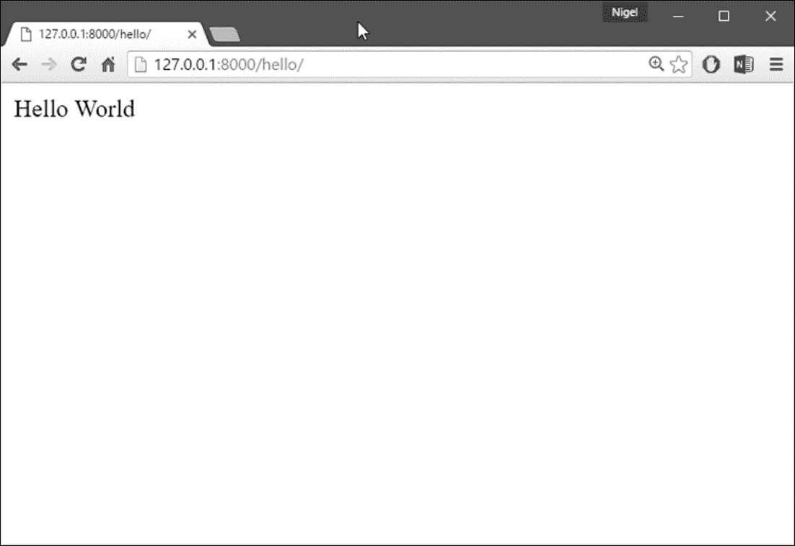
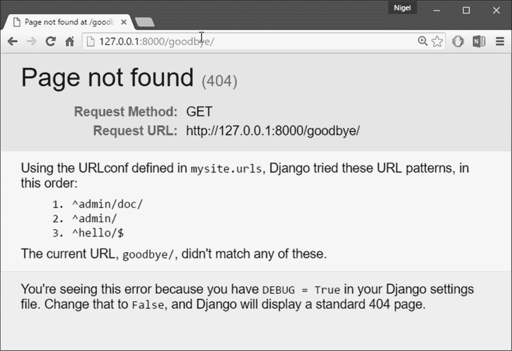
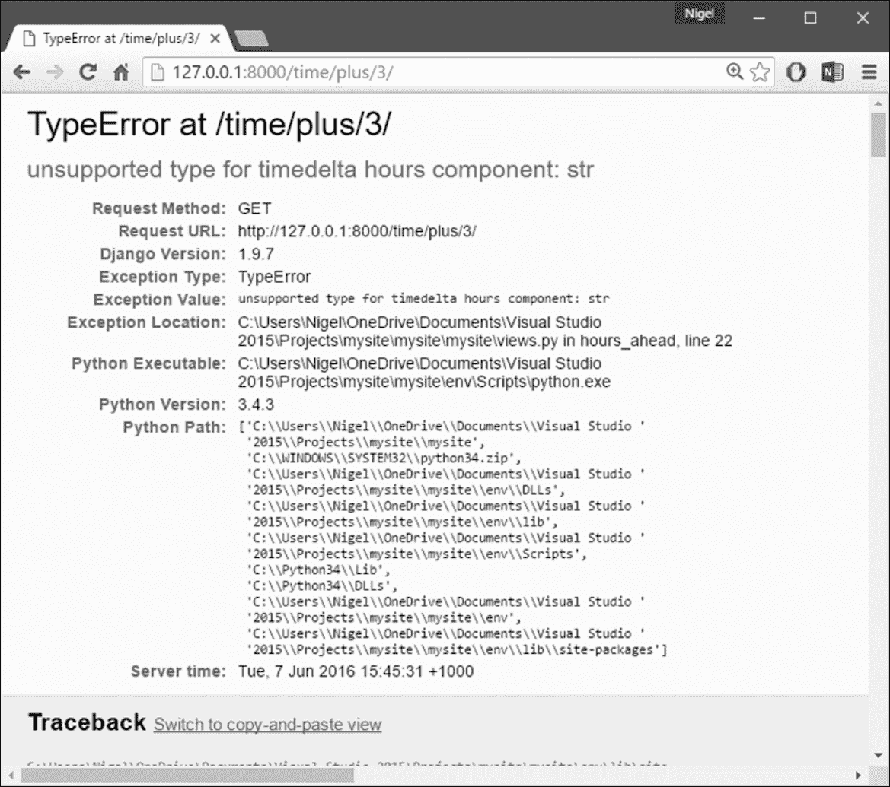

# 第二章。视图和 URLconfs

在上一章中，我解释了如何设置 Django 项目并运行 Django 开发服务器。在本章中，你将学习使用 Django 创建动态网页的基础知识。

# 你的第一个 Django 网页：Hello World

作为我们的第一个目标，让我们创建一个网页，输出那个著名的例子消息：**Hello World**。如果你要发布一个简单的**Hello World**网页而没有使用 Web 框架，你只需在一个文本文件中输入 `Hello world`，将其命名为 `hello.html`，然后上传到 Web 服务器的某个目录中。请注意，在这个过程中，你已经指定了关于该网页的两个关键信息：它的内容（字符串 `Hello world`）和它的 URL（例如 `http://www.example.com/hello.html`）。使用 Django，你以不同的方式指定相同的两个内容。页面的内容由**视图函数**生成，URL 在**URLconf**中指定。首先，让我们编写我们的 Hello World 视图函数。

## 你的第一个视图

在我们在上一章中创建的`mysite`目录中，创建一个名为`views.py`的空文件。这个 Python 模块将包含本章的视图。我们的 Hello World 视图很简单。以下是整个函数以及导入语句，你应该将其输入到`views.py`文件中：

```py
from django.http import HttpResponse 

def hello(request): 
    return HttpResponse("Hello world") 

```

让我们逐行分析这段代码：

+   首先，我们导入了`django.http`模块中的`HttpResponse`类。我们需要导入这个类，因为它在我们的代码中稍后会用到。

+   接下来，我们定义一个名为 `hello` 的函数-视图函数。

每个视图函数至少需要一个参数，按照惯例称为`request`。这是一个包含有关触发此视图的当前 Web 请求的信息的对象，是`django.http.HttpRequest`类的实例。

在这个例子中，我们并没有对 `request` 做任何操作，但它仍然必须是视图的第一个参数。请注意，视图函数的名称并不重要；它不必以某种方式命名，以便 Django 识别它。我们在这里称它为 `hello`，因为这个名称清楚地表示了视图的要点，但它也可以被命名为 `hello_wonderful_beautiful_world`，或者其他同样令人讨厌的名称。接下来的部分，“你的第一个 URLconf”，将解释 Django 如何找到这个函数。

这个函数是一个简单的一行代码：它只是返回一个用文本 `Hello world` 实例化的 `HttpResponse` 对象。

这里的主要教训是：视图只是一个以`HttpRequest`作为第一个参数并返回`HttpResponse`实例的 Python 函数。为了使 Python 函数成为 Django 视图，它必须做这两件事。（有例外情况，但我们稍后会讨论。）

## 你的第一个 URLconf

如果此时再次运行 `python manage.py runserver`，你仍然会看到**欢迎使用 Django**的消息，但没有我们的 Hello World 视图的任何痕迹。这是因为我们的`mysite`项目还不知道`hello`视图；我们需要明确告诉 Django 我们正在激活这个视图的特定 URL。继续我们之前关于发布静态 HTML 文件的类比，此时我们已经创建了 HTML 文件，但还没有将其上传到服务器上的目录中。

要将视图函数与 Django 中的特定 URL 挂钩，我们使用 URLconf。URLconf 就像是 Django 网站的目录。基本上，它是 URL 和应该为这些 URL 调用的视图函数之间的映射。这是告诉 Django 的方式，*对于这个 URL，调用这段代码，对于那个 URL，调用那段代码*。

例如，当有人访问 URL `/foo/` 时，调用视图函数 `foo_view()`，它位于 Python 模块 `views.py` 中。在上一章中执行 `django-admin startproject` 时，脚本会自动为您创建一个 URLconf：文件 `urls.py`。

默认情况下，它看起来像这样：

```py
"""mysite URL Configuration 
 The urlpatterns list routes URLs to views. For more information please 
 see:
     https://docs.djangoproject.com/en/1.8/topics/http/urls/ 
Examples:
Function views
     1\. Add an import:  from my_app import views
     2\. Add a URL to urlpatterns:  url(r'^$', views.home, name='home') Class-based views
     1\. Add an import:  from other_app.views import Home
     2\. Add a URL to urlpatterns:  url(r'^$', Home.as_view(), name='home')
Including another URLconf
     1\. Add an import:  from blog import urls as blog_urls
     2\. Add a URL to urlpatterns:  url(r'^blog/', include(blog_urls)) 
""" 
from django.conf.urls import include, url
from django.contrib import admin

 urlpatterns = [
     url(r'^admin/', include(admin.site.urls)),
 ] 

```

如果我们忽略文件顶部的文档注释，这就是一个 URLconf 的本质：

```py
from django.conf.urls import include, url
from django.contrib import admin 

urlpatterns = [
     url(r'^admin/', include(admin.site.urls)),
 ] 

```

让我们逐行分析这段代码：

+   第一行从`django.conf.urls`模块中导入了两个函数：`include`允许你包含另一个 URLconf 模块的完整 Python 导入路径，`url`使用正则表达式将浏览器中的 URL 模式匹配到 Django 项目中的模块。

+   第二行调用了`django.contrib`模块中的`admin`函数。这个函数是由`include`函数调用的，用于加载 Django 管理站点的 URL。

+   第三行是`urlpatterns`-一个简单的`url()`实例列表。

这里需要注意的主要是变量`urlpatterns`，Django 希望在你的 URLconf 模块中找到它。这个变量定义了 URL 和处理这些 URL 的代码之间的映射关系。要向 URLconf 添加 URL 和视图，只需在 URL 模式和视图函数之间添加映射。下面是如何连接我们的`hello`视图：

```py
from django.conf.urls import include, url 
from django.contrib import admin 
from mysite.views import hello 

urlpatterns = [
     url(r'^admin/', include(admin.site.urls)),
     url(r'^hello/$', hello), 
] 

```

我们在这里做了两个更改：

+   首先，我们从模块`mysite/views.py`中导入了`hello`视图，这在 Python 导入语法中转换为`mysite.views`。（这假设`mysite/views.py`在你的 Python 路径上。）

+   接下来，我们在`urlpatterns`中添加了一行`url(r'^hello/$', hello),`。这行被称为 URLpattern。`url()`函数告诉 Django 如何处理你正在配置的 URL。第一个参数是一个模式匹配字符串（一个正则表达式；稍后会详细介绍），第二个参数是用于该模式的视图函数。`url()`还可以接受其他可选参数，我们将在第七章中更深入地介绍，*高级视图和 URLconfs*。

我们在这里引入的另一个重要细节是正则表达式字符串前面的`r`字符。这告诉 Python 该字符串是一个**原始字符串**-它的内容不应解释反斜杠。

在普通的 Python 字符串中，反斜杠用于转义特殊字符，比如字符串`\n`，它是一个包含换行符的单字符字符串。当你添加`r`使其成为原始字符串时，Python 不会应用反斜杠转义，因此`r'\n'`是一个包含字面反斜杠和小写`n`的两个字符字符串。

Python 的反斜杠用法与正则表达式中的反斜杠之间存在自然冲突，因此最好在 Django 中定义正则表达式时始终使用原始字符串。

简而言之，我们只是告诉 Django，任何对 URL`/hello/`的请求都应该由`hello`视图函数处理。

值得讨论的是这个 URLpattern 的语法，因为它可能不是立即显而易见的。虽然我们想匹配 URL`/hello/`，但模式看起来与此有些不同。原因如下：

+   Django 在检查 URLpatterns 之前会从每个传入的 URL 中删除斜杠。这意味着我们的 URLpattern 不包括`/hello/`中的前导斜杠。起初，这可能看起来有点不直观，但这个要求简化了一些事情，比如在其他 URLconfs 中包含 URLconfs，我们将在第七章中介绍，*高级视图和 URLconfs*。

+   模式包括插入符（^）和美元符号（$）。这些是具有特殊含义的正则表达式字符：插入符表示*要求模式与字符串的开头匹配*，美元符号表示*要求模式与字符串的结尾匹配*。

这个概念最好通过例子来解释。如果我们使用的是模式`^hello/`（末尾没有美元符号），那么任何以`/hello/`开头的 URL 都会匹配，比如`/hello/foo`和`/hello/bar`，而不仅仅是`/hello/`。

同样，如果我们省略了初始的插入符号（即`hello/$`），Django 将匹配任何以`hello/`结尾的 URL，比如`/foo/bar/hello/`。

如果我们只是使用了`hello/`，没有插入符号或美元符号，那么包含`hello/`的任何 URL 都会匹配，比如`/foo/hello/bar`。

因此，我们同时使用插入符号和美元符号来确保只有 URL`/hello/`匹配-没有多余，也没有少了。大多数 URLpatterns 将以插入符号开头，并以美元符号结尾，但具有执行更复杂匹配的灵活性也是很好的。

也许你会想知道如果有人请求 URL`/hello`（即没有尾随斜杠），会发生什么。因为我们的 URLpattern 需要一个尾随斜杠，那个 URL 就不会匹配。然而，默认情况下，任何不匹配 URLpattern 并且不以斜杠结尾的 URL 请求都会被重定向到相同的 URL，但是以斜杠结尾（这由`APPEND_SLASH` Django 设置规定，详见附录 D，*设置*）。

关于这个 URLconf 的另一件事是，我们将`hello`视图函数作为对象传递而不调用函数。这是 Python（和其他动态语言）的一个关键特性：函数是一级对象，这意味着你可以像任何其他变量一样传递它们。很酷，对吧？

为了测试我们对 URLconf 的更改，启动 Django 开发服务器，就像你在第一章 *Django 简介和入门*中所做的那样，通过运行命令`python manage.py runserver`。（如果你让它保持运行状态，也没关系。开发服务器会自动检测 Python 代码的更改并在必要时重新加载，因此你不必在更改之间重新启动服务器。）服务器正在运行在地址`http://127.0.0.1:8000/`，所以打开一个网络浏览器，转到`http://127.0.0.1:8000/hello/`。你应该会看到文本**Hello World**-这是你的 Django 视图的输出（*图 2.1*）。



图 2.1：耶！你的第一个 Django 视图

## 正则表达式

正则表达式（或 regexes）是一种在文本中指定模式的简洁方式。虽然 Django 的 URLconfs 允许任意的正则表达式进行强大的 URL 匹配，但实际上你可能只会使用一些正则表达式符号。*表 2.1*列出了一些常见符号。

表 2.1：常见的正则表达式符号

| **符号** | **匹配** |
| --- | --- |
| `.`（点） | 任意单个字符 |
| `\d` | 任意单个数字 |
| `[A-Z]` | `A`和`Z`之间的任何字符（大写） |
| `[a-z]` | `a`和`z`之间的任何字符（小写） |
| `[A-Za-z]` | `a`和`z`之间的任何字符（不区分大小写） |
| `+` | 前一个表达式的一个或多个（例如，`\d+`匹配一个或多个数字） |
| `[^/]+` | 一个或多个字符，直到（但不包括）斜杠 |
| `?` | 前一个表达式的零个或一个（例如，`\d?`匹配零个或一个数字） |
| `*` | 前一个表达式的零个或多个（例如，`\d*`匹配零个、一个或多个数字） |
| `{1,3}` | 前一个表达式的一个到三个（包括）（例如，`\d{1,3}`匹配一个、两个或三个数字） |

有关正则表达式的更多信息，请参阅 Python 正则表达式文档，访问[`docs.python.org/3.4/library/re.html`](https://docs.python.org/3.4/library/re.html)。

## 关于 404 错误的快速说明

此时，我们的 URLconf 只定义了一个 URLpattern：处理 URL`/hello/`的 URLpattern。当你请求不同的 URL 时会发生什么？要找出来，尝试运行 Django 开发服务器，并访问诸如`http://127.0.0.1:8000/goodbye/`之类的页面。

你应该会看到一个**页面未找到**的消息（*图 2.2*）。Django 显示这个消息是因为你请求了一个在你的 URLconf 中没有定义的 URL。



图 2.2：Django 的 404 页面

这个页面的实用性不仅仅体现在基本的 404 错误消息上。它还会告诉您 Django 使用了哪个 URLconf 以及该 URLconf 中的每个模式。通过这些信息，您应该能够知道为什么请求的 URL 会引发 404 错误。

当您首次创建 Django 项目时，每个 Django 项目都处于调试模式。如果项目不处于调试模式，Django 会输出不同的 404 响应。这是敏感信息，仅供您作为 Web 开发人员使用。如果这是一个部署在互联网上的生产站点，您不希望将这些信息暴露给公众。因此，只有在您的 Django 项目处于**调试模式**时才会显示**Page not found**页面。

我将在后面解释如何关闭调试模式。现在只需知道每个 Django 项目在创建时都处于调试模式，如果项目不处于调试模式，Django 会输出不同的 404 响应。

## 关于站点根目录的一点说明

在上一节中已经解释过，如果您查看站点根目录`http://127.0.0.1:8000/`，您将看到一个 404 错误消息。Django 不会在站点根目录自动添加任何内容；该 URL 并没有特殊处理。

这取决于您将其分配给一个 URL 模式，就像 URLconf 中的每个其他条目一样。匹配站点根目录的 URL 模式有点不直观，因此值得一提。

当您准备为站点根目录实现一个视图时，使用 URL 模式`^$`，它匹配空字符串。例如：

```py
from mysite.views import hello, my_homepage_view

 urlpatterns = [
     url(r'^$', my_homepage_view),
     # ... 

```

## Django 如何处理请求

在继续我们的第二个视图函数之前，让我们暂停一下，了解一下 Django 是如何工作的。具体来说，当您在 Web 浏览器中访问`http://127.0.0.1:8000/hello/`以查看您的**Hello World**消息时，Django 在幕后做了什么？一切都始于**settings 文件**。

当您运行`python manage.py runserver`时，脚本会在内部`mysite`目录中查找名为`settings.py`的文件。该文件包含了这个特定 Django 项目的各种配置，全部都是大写的：`TEMPLATE_DIRS`、`DATABASES`等等。最重要的设置叫做`ROOT_URLCONF`。`ROOT_URLCONF`告诉 Django 应该使用哪个 Python 模块作为这个网站的 URLconf。

记得`django-admin startproject`创建了`settings.py`和`urls.py`文件吗？自动生成的`settings.py`包含一个指向自动生成的`urls.py`的`ROOT_URLCONF`设置。打开`settings.py`文件，您会看到它应该是这样的。

```py
ROOT_URLCONF = 'mysite.urls'
```

这对应于文件`mysite/urls.py`。当请求特定 URL（比如请求`/hello/`）时，Django 加载`ROOT_URLCONF`设置指向的 URLconf。然后，它按顺序检查该 URLconf 中的每个 URL 模式，逐个将请求的 URL 与模式进行比较，直到找到一个匹配的模式。

当找到匹配的 URL 模式时，它调用与该模式相关联的视图函数，并将`HttpRequest`对象作为第一个参数传递给它（我们将在后面介绍`HttpRequest`的具体内容）。正如我们在第一个视图示例中看到的，视图函数必须返回一个`HttpResponse`。

一旦这样做，Django 就会完成剩下的工作，将 Python 对象转换为适当的 Web 响应，包括适当的 HTTP 标头和正文（即网页内容）。总之：

+   一个请求进入`/hello/`。

+   Django 通过查看`ROOT_URLCONF`设置来确定根 URLconf。

+   Django 查看 URLconf 中的所有 URL 模式，找到第一个与`/hello/`匹配的模式。

+   如果找到匹配项，它会调用相关的视图函数。

+   视图函数返回一个`HttpResponse`。

+   Django 将`HttpResponse`转换为适当的 HTTP 响应，从而生成一个网页。

现在您已经了解了如何制作 Django 网页的基础知识。实际上很简单，只需编写视图函数并通过 URLconf 将其映射到 URL。

# 您的第二个视图：动态内容

我们的 Hello World 视图在演示 Django 工作基础方面很有启发性，但它并不是动态网页的一个例子，因为页面的内容始终相同。每次查看`/hello/`时，您都会看到相同的内容；它可能就像是一个静态 HTML 文件。

对于我们的第二个视图，让我们创建一个更加动态的东西-一个显示当前日期和时间的网页。这是一个不错的、简单的下一步，因为它不涉及数据库或任何用户输入-只涉及服务器内部时钟的输出。它只比 Hello World 有点更有趣，但它将演示一些新概念。这个视图需要做两件事：计算当前日期和时间，并返回包含该值的`HttpResponse`。如果您有 Python 经验，您就会知道 Python 包括一个用于计算日期的`datetime`模块。以下是如何使用它：

```py
>>> import datetime 
>>> now = datetime.datetime.now() 
>>> now 
datetime.datetime(2015, 7, 15, 18, 12, 39, 2731) 
>>> print (now) 
2015-07-15 18:12:39.002731 

```

这很简单，与 Django 无关。这只是 Python 代码。（我们想强调的是，您应该知道哪些代码只是 Python 代码，哪些是特定于 Django 的代码。当您学习 Django 时，我们希望您能够将您的知识应用到其他不一定使用 Django 的 Python 项目中。）要创建一个显示当前日期和时间的 Django 视图，我们只需要将`datetime.datetime.now()`语句连接到一个视图并返回一个`HttpResponse`。更新后的`views.py`如下所示：

```py
from django.http import HttpResponse 
import datetime 

def hello(request):
     return HttpResponse("Hello world") 

def current_datetime(request):
     now = datetime.datetime.now()
     html = "<html><body>It is now %s.</body></html>" % now
     return HttpResponse(html) 

```

让我们逐步了解我们对`views.py`所做的更改，以适应`current_datetime`视图。

+   我们在模块顶部添加了`import datetime`，这样我们就可以计算日期了。

+   新的`current_datetime`函数计算当前日期和时间，作为`datetime.datetime`对象，并将其存储为本地变量`now`。

+   视图中的第二行代码使用 Python 的**格式化字符串**功能构造了一个 HTML 响应。字符串中的`%s`是一个占位符，字符串后面的百分号表示用变量`now`的值替换后面字符串中的`%s`。`now`变量在技术上是一个`datetime.datetime`对象，而不是一个字符串，但`%s`格式字符将其转换为其字符串表示形式，类似于`"2015-07-15 18:12:39.002731"`。这将导致一个 HTML 字符串，如`"<html><body>现在是 2015-07-15 18:12:39.002731。</body></html>"`。

+   最后，视图返回一个包含生成的响应的`HttpResponse`对象-就像我们在`hello`中做的那样。

在`views.py`中添加了这个之后，将 URL 模式添加到`urls.py`中，告诉 Django 哪个 URL 应该处理这个视图。类似`/time/`这样的东西会有意义：

```py
from django.conf.urls import include, url 
from django.contrib import admin 
from mysite.views import hello, current_datetime

     urlpatterns = [
         url(r'^admin/', include(admin.site.urls)),
         url(r'^hello/$', hello),
         url(r'^time/$', current_datetime),
     ] 

```

我们在这里做了两个更改。首先，在顶部导入了`current_datetime`函数。其次，更重要的是，我们添加了一个 URL 模式，将 URL`/time/`映射到这个新视图。掌握了吗？视图编写和 URLconf 更新后，启动`runserver`并在浏览器中访问`http://127.0.0.1:8000/time/`。您应该看到当前的日期和时间。如果您没有看到本地时间，很可能是因为您的`settings.py`中的默认时区设置为`UTC`。

# URLconfs 和松散耦合

现在是时候强调 URLconfs 和 Django 背后的一个关键理念了：松散耦合的原则。简单地说，松散耦合是一种软件开发方法，它重视使各个部分可互换的重要性。如果两个代码片段松散耦合，那么对其中一个片段的更改对另一个片段几乎没有影响。

Django 的 URLconfs 是这个原则在实践中的一个很好的例子。在 Django Web 应用程序中，URL 定义和它们调用的视图函数是松散耦合的；也就是说，对于给定函数的 URL 应该是什么的决定，以及函数本身的实现，存在于两个不同的地方。

例如，考虑我们的`current_datetime`视图。如果我们想要更改应用程序的 URL——比如，将其从`/time/`移动到`/current-time/`——我们可以快速更改 URLconf，而不必担心视图本身。同样，如果我们想要更改视图函数——以某种方式改变其逻辑——我们可以这样做，而不会影响函数绑定的 URL。此外，如果我们想要在几个 URL 上公开当前日期功能，我们可以通过编辑 URLconf 轻松处理，而不必触及视图代码。

在这个例子中，我们的`current_datetime`可以通过两个 URL 访问。这是一个刻意制造的例子，但这种技术可能会派上用场：

```py
urlpatterns = [
       url(r'^admin/', include(admin.site.urls)),
       url(r'^hello/$', hello),
       url(r'^time/$', current_datetime),
       url(r'^another-time-page/$', current_datetime),
 ] 

```

URLconfs 和视图是松散耦合的实践。我将在整本书中继续指出这一重要的哲学。

# 你的第三个视图：动态 URL

在我们的`current_datetime`视图中，页面的内容——当前日期/时间——是动态的，但 URL（`/time/`）是静态的。然而，在大多数动态网络应用中，URL 包含影响页面输出的参数。例如，一个在线书店可能为每本书提供自己的 URL，如`/books/243/`和`/books/81196/`。让我们创建一个第三个视图，显示当前日期和时间偏移了一定数量的小时。目标是以这样的方式设计网站，使得页面`/time/plus/1/`显示未来一小时的日期/时间，页面`/time/plus/2/`显示未来两小时的日期/时间，页面`/time/plus/3/`显示未来三小时的日期/时间，依此类推。一个新手可能会想要为每个小时偏移编写一个单独的视图函数，这可能会导致这样的 URLconf：

```py
urlpatterns = [
     url(r'^time/$', current_datetime),
     url(r'^time/plus/1/$', one_hour_ahead),
     url(r'^time/plus/2/$', two_hours_ahead),
     url(r'^time/plus/3/$', three_hours_ahead),
] 

```

显然，这种想法是有缺陷的。这不仅会导致冗余的视图函数，而且应用程序基本上只能支持预定义的小时范围——一、两或三个小时。

如果我们决定创建一个显示未来四小时时间的页面，我们将不得不为此创建一个单独的视图和 URLconf 行，进一步增加了重复。

那么，我们如何设计我们的应用程序来处理任意小时偏移？关键是使用通配符 URLpatterns。正如我之前提到的，URLpattern 是一个正则表达式；因此，我们可以使用正则表达式模式`\d+`来匹配一个或多个数字：

```py
urlpatterns = [
     # ...
     url(r'^time/plus/\d+/$', hours_ahead),
     # ... 
] 

```

（我使用`# ...`来暗示可能已经从这个例子中删除了其他 URLpatterns。）这个新的 URLpattern 将匹配任何 URL，比如`/time/plus/2/`、`/time/plus/25/`，甚至`/time/plus/100000000000/`。想想看，让我们限制一下，使得最大允许的偏移量是合理的。

在这个例子中，我们将通过只允许一位或两位数字来设置最大的 99 小时——在正则表达式语法中，这相当于`\d{1,2}`：

```py
url(r'^time/plus/\d{1,2}/$', hours_ahead), 

```

既然我们已经为 URL 指定了一个通配符，我们需要一种方法将通配符数据传递给视图函数，这样我们就可以对任意小时偏移使用一个视图函数。我们通过在 URLpattern 中希望保存的数据周围放置括号来实现这一点。在我们的例子中，我们希望保存在 URL 中输入的任何数字，所以让我们在`\d{1,2}`周围放上括号，就像这样：

```py
url(r'^time/plus/(\d{1,2})/$', hours_ahead), 

```

如果你熟悉正则表达式，你会在这里感到很舒适；我们使用括号来从匹配的文本中捕获数据。最终的 URLconf，包括我们之前的两个视图，看起来像这样：

```py
from django.conf.urls import include, url from django.contrib import admin from mysite.views import hello, current_datetime, hours_ahead 

urlpatterns = [
     url(r'^admin/', include(admin.site.urls)),
     url(r'^hello/$', hello),
     url(r'^time/$', current_datetime),
     url(r'^time/plus/(\d{1,2})/$', hours_ahead),
 ] 

```

### 注意

如果您在其他 Web 开发平台上有经验，您可能会想：“嘿，让我们使用查询字符串参数！”-类似于`/time/plus?hours=3`，其中小时将由 URL 查询字符串（'?'后面的部分）中的`hours`参数指定。您可以在 Django 中这样做（我将在第七章中告诉您如何做），但 Django 的核心理念之一是 URL 应该是美观的。URL`/time/plus/3/`比其查询字符串对应项更清晰、更简单、更可读、更容易大声朗读，而且更漂亮。美观的 URL 是高质量 Web 应用的特征。

Django 的 URLconf 系统鼓励使用美观的 URL，因为使用美观的 URL 比不使用更容易。

处理完这些后，让我们编写`hours_ahead`视图。`hours_ahead`与我们之前编写的`current_datetime`视图非常相似，但有一个关键区别：它接受一个额外的参数，即偏移的小时数。以下是视图代码：

```py
from django.http import Http404, HttpResponse 
import datetime 

def hours_ahead(request, offset):
     try:
         offset = int(offset)
     except ValueError:
         raise Http404()
     dt = datetime.datetime.now() + datetime.timedelta(hours=offset)
     html = "<html><body>In %s hour(s), it will be  %s.
             </body></html>" % (offset, dt)
     return HttpResponse(html) 

```

让我们仔细看看这段代码。

视图函数`hours_ahead`接受两个参数：`request`和`offset`。

+   `request`是一个`HttpRequest`对象，就像`hello`和`current_datetime`中一样。我再说一遍：每个视图总是以`HttpRequest`对象作为其第一个参数。

+   `offset`是 URLpattern 中括号捕获的字符串。例如，如果请求的 URL 是`/time/plus/3/`，那么`offset`将是字符串'3'。如果请求的 URL 是`/time/plus/21/`，那么`offset`将是字符串'21'。请注意，捕获的值将始终是 Unicode 对象，而不是整数，即使字符串只由数字组成，比如'21'。

我决定将变量称为`offset`，但只要它是有效的 Python 标识符，您可以将其命名为任何您喜欢的名称。变量名并不重要；重要的是它是`request`之后的函数的第二个参数。（在 URLconf 中也可以使用关键字参数，而不是位置参数。我将在第七章中介绍这一点。）

在函数内部，我们首先对`offset`调用`int()`。这将把 Unicode 字符串值转换为整数。

请注意，如果您对无法转换为整数的值（如字符串`foo`）调用`int()`，Python 将引发`ValueError`异常。在这个例子中，如果我们遇到`ValueError`，我们会引发异常`django.http.Http404`，这将导致**404**页面未找到错误。

敏锐的读者会想：无论如何，我们怎么会到达`ValueError`的情况呢？因为我们 URLpattern-`(\d{1,2})`中的正则表达式只捕获数字，因此`offset`将始终是由数字组成的字符串？答案是，我们不会，因为 URLpattern 提供了适度但有用的输入验证级别，但我们仍然检查`ValueError`，以防这个视图函数以其他方式被调用。

实现视图函数时最好不要对其参数做任何假设。记住松耦合。

在函数的下一行中，我们计算当前的日期/时间，并添加适当数量的小时。我们已经从`current_datetime`视图中看到了`datetime.datetime.now()`；这里的新概念是，您可以通过创建`datetime.timedelta`对象并添加到`datetime.datetime`对象来执行日期/时间算术。我们的结果存储在变量`dt`中。

这行还显示了为什么我们对`offset`调用了`int()`-`datetime.timedelta`函数要求`hours`参数是一个整数。

接下来，我们构建这个视图函数的 HTML 输出，就像我们在`current_datetime`中所做的那样。这一行与上一行的一个小区别是，它使用了 Python 的格式化字符串功能，而不仅仅是一个。因此，在字符串中有两个`%s`符号和一个要插入的值的元组：`(offset, dt)`。

最后，我们返回一个 HTML 的`HttpResponse`。

有了这个视图函数和 URLconf 的编写，启动 Django 开发服务器（如果尚未运行），并访问`http://127.0.0.1:8000/time/plus/3/`来验证它是否正常工作。

然后尝试`http://127.0.0.1:8000/time/plus/5/`。

然后访问`http://127.0.0.1:8000/time/plus/24/`。

最后，访问`http://127.0.0.1:8000/time/plus/100/`来验证您的 URLconf 中的模式只接受一位或两位数字；在这种情况下，Django 应该显示**Page not found**错误，就像我们在*关于 404 错误的快速说明*部分中看到的那样。

URL `http://127.0.0.1:8000/time/plus/`（没有小时指定）也应该会引发 404 错误。

# Django 的漂亮错误页面

花点时间来欣赏我们迄今为止制作的精美 Web 应用程序-现在让我们打破它！让我们故意在我们的`views.py`文件中引入一个 Python 错误，方法是注释掉`hours_ahead`视图中的`offset = int(offset)`行：

```py
def hours_ahead(request, offset):
     # try:
 #     offset = int(offset)
 # except ValueError:
 #     raise Http404()
     dt = datetime.datetime.now() + datetime.timedelta(hours=offset)
     html = "<html><body>In %s hour(s), it will be %s.
               </body></html>" % (offset, dt)
     return HttpResponse(html) 

```

加载开发服务器并导航到`/time/plus/3/`。您将看到一个错误页面，其中包含大量信息，包括在顶部显示的**TypeError**消息：**unsupported type for timedelta hours component: str (** *图 2.3*).



图 2.3：Django 的错误页面

发生了什么？嗯，`datetime.timedelta`函数期望`hours`参数是一个整数，而我们注释掉了将`offset`转换为整数的代码。这导致`datetime.timedelta`引发了**TypeError**。这是每个程序员在某个时候都会遇到的典型小错误。这个例子的目的是演示 Django 的错误页面。花点时间来探索错误页面，并了解它提供的各种信息。以下是一些需要注意的事项：

+   在页面顶部，您将获得有关异常的关键信息：异常的类型，异常的任何参数（在这种情况下是**unsupported type**消息），引发异常的文件以及有问题的行号。

+   在关键异常信息下面，页面显示了此异常的完整 Python 回溯。这类似于您在 Python 命令行解释器中获得的标准回溯，只是更加交互式。对于堆栈中的每个级别（帧），Django 显示文件的名称，函数/方法名称，行号以及该行的源代码。

+   单击源代码行（深灰色），您将看到错误行之前和之后的几行代码，以便为您提供上下文。单击堆栈中任何帧下的**Local vars**，以查看该帧中所有局部变量及其值的表，即在引发异常的代码的确切点上。这些调试信息可以提供很大的帮助。

+   注意**切换到复制和粘贴视图**文本下的**Traceback**标题。单击这些单词，回溯将切换到一个可以轻松复制和粘贴的备用版本。当您想与其他人分享您的异常回溯以获得技术支持时，可以使用此功能-例如 Django IRC 聊天室中的友好人士或 Django 用户邮件列表中的人士。

+   在下面，**在公共网站上分享此回溯**按钮将在单击一次后为您完成此工作。单击它以将回溯发布到 dpaste（有关更多信息，请访问[`www.dpaste.com/`](http://www.dpaste.com/)），在那里您将获得一个独特的 URL，可以与其他人分享。

+   接下来，**请求信息**部分包括关于产生错误的传入 web 请求的丰富信息：`GET`和`POST`信息，cookie 值和元信息，比如 CGI 头。附录 F，*请求和响应对象*，包含了请求对象包含的所有信息的完整参考。

+   在**请求信息**部分之后，**设置**部分列出了此特定 Django 安装的所有设置。所有可用的设置都在附录 D，*设置*中有详细介绍。

在某些特殊情况下，Django 错误页面能够显示更多信息，比如模板语法错误的情况。我们稍后会讨论 Django 模板系统时再谈论这些。现在，取消注释`offset = int(offset)`行，以使视图函数再次正常工作。

如果您是那种喜欢通过精心放置`print`语句来调试的程序员，Django 错误页面也非常有用。

在视图的任何位置，临时插入`assert False`来触发错误页面。然后，您可以查看程序的本地变量和状态。以下是一个示例，使用`hours_ahead`视图：

```py
def hours_ahead(request, offset):
     try:
         offset = int(offset)
     except ValueError:
         raise Http404()
     dt = datetime.datetime.now() + datetime.timedelta(hours=offset)
     assert False
     html = "<html><body>In %s hour(s), it will be %s.
              </body></html>" % (offset, dt)
     return HttpResponse(html) 

```

最后，显而易见，这些信息中的大部分都是敏感的-它暴露了您的 Python 代码和 Django 配置的内部，并且在公共互联网上显示这些信息是愚蠢的。恶意人士可以利用它来尝试反向工程您的 Web 应用程序并做坏事。因此，只有当您的 Django 项目处于调试模式时，才会显示 Django 错误页面。我将在第十三章 *部署 Django*中解释如何停用调试模式。现在，只需知道每个 Django 项目在启动时都会自动处于调试模式即可。（听起来很熟悉吗？本章前面描述的**页面未找到**错误也是同样的工作方式。）

# 接下来呢？

到目前为止，我们一直在 Python 代码中直接编写 HTML 硬编码的视图函数。我这样做是为了在演示核心概念时保持简单，但在现实世界中，这几乎总是一个坏主意。Django 附带了一个简单而强大的模板引擎，允许您将页面的设计与底层代码分离。我们将在下一章深入探讨 Django 的模板引擎。
